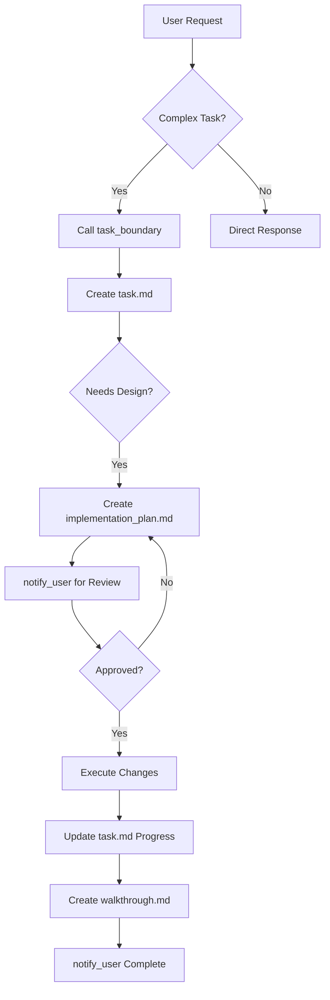

# 🌌 ANTIGRAVITY CONTEXT HANDOFF
>
> **Generated:** 2025-12-23  
> **Purpose:** Complete system knowledge transfer for session continuity

---

## 🏠 WORKSPACE OVERVIEW

**Host:** `igor-gaming-1` (Linux/WSL2)  
**Root:** `/home/gonya`  
**Tailscale IP:** `100.88.65.71`

### Directory Structure

```text
/home/gonya/
├── 00_NAV/                      # 📍 Navigation & Documentation
│   ├── NAVIGATION.md            # Quick navigation guide
│   ├── PROJECTS.yaml            # Project registry
│   ├── RULES.md                 # File organization rules
│   ├── INVENTORY.csv            # Full file inventory
│   └── MIGRATION_LOG.csv        # File migration history
│
├── 01_Projects/                 # 🚀 Active Projects (8,357 items)
│   ├── PRJ-001_HomeAssistant    # Home automation (56 items)
│   ├── PRJ-002_IoT_Devices      # Tuya, Matter, sensors (1,782 items)
│   ├── PRJ-003_Automation_Stack # n8n, NodeRed workflows (37 items)
│   ├── PRJ-004_AI_Agents        # Browser agent, LLMs (6,454 items)
│   ├── PRJ-005_Media_Center     # TV control, casting (24 items)
│   └── PRJ-006_OpenCode         # OpenCode server (paused)
│
├── 02_Shared/                   # 📦 Shared resources
├── 03_Operations/               # ⚙️ Infrastructure ops
├── 90_Inbox_ToSort/             # 📬 105 items need sorting
├── 99_Archive_Original/         # 📚 Archived content
│
├── antigravity-mcp-server/      # 🛰️ MCP Server implementation
├── hass/                        # 🏡 Home Assistant config
├── n8n/                         # 🔄 N8N workflows
└── gcloud-config/               # ☁️ Google Cloud credentials
```

---

## 🧠 ANTIGRAVITY BRAIN (Unified Knowledge Base)

**Location:** `Agent_Context/Knowledge_Base/Sessions/`

### Active Conversation Artifacts

<!-- markdownlint-disable MD013 -->
| Conversation ID | Title | Status | Key Artifacts |
|-----------------|-------|--------|---------------|
| `nodriver_im...` | **Browser Control** | ✅ Done | nodriver_daemon.py, ndc |
| `workflow_de...` | **Workflow Design** | ✅ Done | WORKFLOW_DESIGN.md |
| `arthur_tabl...` | **Arthur Tablet** | 🔄 InPrg | ADB setup, Tailscale |
| `6afbab64-f0...` | **Codex Handoff** | ✅ Done | Artifact index, handoff |
| `0866ee1f-59...` | **Unified Topology** | ✅ Done | MCP server, n8n guide |
| `a1c2070a-d3...` | **Proxmox Recon** | 🔄 InPrg | System inventory |
| `b64b29bb-d3...` | **Hybrid Cortex** | ✅ Done | RAG implementation |
| `bc334b70-71...` | **Mac Access** | ✅ Done | Host config guide |
| `b32255f1-fc...` | **Docker GPU** | ✅ Done | Workflow verification |
| `8c34a8bc-20...` | **Chrome Debug** | ✅ Done | Docker CDP setup |
| `30813860-99...` | **File Org** | ✅ Done | Migration plan |
| `2026-01-12_...` | **Mail Proctor** | ✅ Done | task.md, walkthrough |
| `2026-01-12_...` | **Sync Cycle** | ✅ Done | task.md, walkthrough |
| `2026-01-12_...` | **Comm CLI** | ✅ Done | task.md, walkthrough |
<!-- markdownlint-enable MD013 -->

### Brain Artifact Types

Each conversation folder may contain:

- **`task.md`** - Checklist tracking work progress (`[ ]` / `[/]` / `[x]`)
- **`implementation_plan.md`** - Technical design before execution
- **`walkthrough.md`** - Post-completion summary with proof of work
- **`context.md`** - Strategic context and rationale
- **Custom artifacts** - System inventories, guides, briefings

---

## 📋 ACTIVE TODOS & TASKS

### From `0866ee1f` (Unified Topology Setup) - COMPLETE ✅

```markdown
- [x] Initialize antigravity-mcp-server project
- [x] Create project structure (src/index.ts, tools/docker.ts, tools/ollama.ts)
- [x] Switch to SSE/HTTP Transport (Port 3005)
- [x] Configure N8N to talk to MCP server
- [x] Provide Copy/Paste config for OpenAI
```

### From `a1c2070a` (Proxmox Upgrade) - IN PROGRESS 🔄

```markdown
- [/] Mac Agent Handover for network bridging
- [ ] Connect to PiKVM (192.168.190.154)
- [ ] Connect to Proxmox Web UI (100.74.194.25:8006)
- [ ] Shutdown VMs and Containers
- [ ] Execute host shutdown
- [ ] Verify power state via PiKVM
```

### From `bc334b70` (Mac Service Access) - COMPLETE ✅

```markdown
- [x] Analyze current network environment
- [x] Check Tailscale IP
- [x] Provide /etc/hosts configuration for Mac
- [x] Verify connectivity from browser agent
```

### From `nodriver_implementation` (Browser Control) - COMPLETE ✅

```markdown
- [x] Research browser control options (MCP, HTTP, Socket)
- [x] Decide on Unix Socket Daemon approach
- [x] Implement nodriver_daemon.py
- [x] Implement ndc CLI client
- [x] Set up UV package management
- [x] Create start_chrome.sh and start_daemon.sh
- [x] Document with README.md, INSTALL.md
- [x] Test with Antigravity agent (all commands verified)
- [x] Create browser skills (.agent/skills/browser/*)
- [x] Fix JS-based fill, type, text, wait for SPA compatibility
```

### From `arthur_tablet_setup` (Tablet Control) - IN PROGRESS 🔄

```markdown
- [x] Enable ADB over WiFi
- [x] Configure Tailscale
- [x] Set up Family Link
- [/] Install Tasker and automation apps
- [ ] Configure Home Assistant integration
```

### From `2026-01-12_mail_processor_deployment` (Mail Processor) - COMPLETE ✅

```markdown
- [x] Configure systemd service for Mail Processor
- [x] Ensure agent registration (AmberOwl) on server
- [x] Test Telegram alerts integration
- [x] Move diagnostic scripts to `Scripts/Maintenance/Diagnostics` <!-- id: 202 -->
- [x] Clean up Workspace root directory

```

### From `2026-01-12_sync` (Maintenance & Sync) - COMPLETE ✅

```markdown
- [ ] Execute /update-progress workflow
- [ ] Execute /autosave workflow
- [ ] Execute /sync-mail workflow
- [ ] Execute /sync workflow


```

### From `2026-01-12_comm_cli_upgrade` (Comm CLI Upgrade) - COMPLETE ✅

```markdown
- [x] Implement File Reservation in SDK (US-l54)
- [x] Implement File Reservation in CLI
- [x] Verify Broadcast functionality
```

### General Outstanding Items

- **📬 96 items** in `90_Inbox_ToSort/NEEDS_REVIEW` need attention
- **PRJ-006_OpenCode** is paused, needs restart decision
- **Google Cloud credentials** pending (credentials.json not yet obtained)
- **BIOS Update (Proxmox):** Target 6203 (Stable) for ROG STRIX X370-F GAMING.
  Current 5220. USB at `/Volumes/Ventoy` (ExFAT).

---

## 🛠️ PROJECTS INVENTORY

### PRJ-001: Home Assistant Smart Home

**Status:** Active  
**Path:** `01_Projects/PRJ-001_HomeAssistant`  
**Aliases:** `hass`, `ha`, `homeassistant`  
**Keywords:** dashboard, energy, backup, zigbee, wyoming, paradox

### PRJ-002: Tuya & IoT Devices

**Status:** Active  
**Path:** `01_Projects/PRJ-002_IoT_Devices`  
**Aliases:** `tuya`, `iot`, `tinytuya`, `matter`  
**Keywords:** scan, ir, broadlink, sonoff, tasmota, matter-data

### PRJ-003: N8N & NodeRed Automation

**Status:** Active  
**Path:** `01_Projects/PRJ-003_Automation_Stack`  
**Aliases:** `n8n`, `nodered`, `automation`  
**Keywords:** workflow, flow, json, mqtt

### PRJ-004: AI Agents & LLMs

**Status:** Active  
**Path:** `01_Projects/PRJ-004_AI_Agents`  
**Aliases:** `llm`, `ai`, `ollama`, `council`  
**Keywords:** browser_agent, model, super_agent, openai, claude  
**Key Files:**

- `browser_agent.py` - Browser automation with Playwright
- `telegram_creds.json` - Telegram bot credentials
- `MISSION_STATUS.md` - Current mission tracking

### PRJ-005: Media & TV Control

**Status:** Active  
**Path:** `01_Projects/PRJ-005_Media_Center`  
**Aliases:** `tv`, `media`, `cast`, `dlna`  
**Keywords:** android_tv, panel, remote, airplay

### PRJ-006: OpenCode Server

**Status:** Paused  
**Path:** `01_Projects/PRJ-006_OpenCode`  
**Aliases:** `opencode`

---

## 🔄 HOW ANTIGRAVITY WORKS

### Modes of Operation

1. **PLANNING Mode** - Research, design, create implementation plans
2. **EXECUTION Mode** - Implement changes, write code
3. **VERIFICATION Mode** - Test, validate, create walkthroughs

### Artifact Workflow



### Key Directories

| Directory | Purpose |
|-----------|---------|
| `~/.gemini/antigravity/brain/<conv-id>/` | Session artifacts |
| `~/antigravity-mcp-server/` | MCP execution server |
| `~/00_NAV/` | Navigation and rules |
| `~/01_Projects/` | Active project work |

### MCP Server Architecture

**Location:** `/home/gonya/antigravity-mcp-server`

```text
antigravity-mcp-server/
├── src/
│   ├── index.ts          # SSE server on port 3005
│   └── tools/
│       ├── docker.ts     # Docker control (list, restart)
│       └── ollama.ts     # GPU/Ollama health check
├── dist/                 # Compiled output
├── package.json          # Dependencies
└── start_server.sh       # Launch script
```

**Transport:** SSE/HTTP on `0.0.0.0:3005`  
**Endpoint:** `http://100.88.65.71:3005/sse`

### Available MCP Tools

| Tool | Description |
|------|-------------|
| `docker_list` | List running Docker containers |
| `docker_restart` | Restart a container by name |
| `checkGpuStatus` | Check Ollama/GPU health |

---

## 🌐 NETWORK TOPOLOGY

### Tailscale Mesh

| Node | IP | OS | Status |
|------|----|----|--------|
| **igor-gaming-1** (this) | `100.88.65.71` | Linux/WSL2 | ✅ Active |
| igor-gaming | `100.127.194.111` | Windows | ✅ Active |
| macbook-air | `100.93.121.47` | macOS | ✅ Active |
| iphone-15-pro | `100.86.233.87` | iOS | ⚠️ Idle |
| pve (Proxmox) | `100.74.194.25` | Linux | ⚠️ Check |

### Running Services

| Service | Port | URL | Status |
|---------|------|-----|--------|
| Home Assistant | 8123 | `http://100.88.65.71:8123` | ✅ Running |
| N8N | 5678 | `http://100.88.65.71:5678` | ✅ Running |
| Chrome CDP | 9222 | `ws://100.88.65.71:9222` | ✅ Running |
| Antigravity MCP | 3005 | `http://100.88.65.71:3005/sse` | ✅ Running |
| Ollama | 11434 | `http://localhost:11434` | ✅ Running |

---

## 🚀 QUICK START COMMANDS

### Check System Status

```bash
# Docker containers
docker ps

# Tailscale status
tailscale status

# GPU status
nvidia-smi

# Ollama
curl http://localhost:11434/api/tags
```

### Start MCP Server

```bash
cd ~/antigravity-mcp-server && ./start_server.sh
```

### Navigate Projects

```bash
cd ~/01_Projects/PRJ-004_AI_Agents  # AI Agents
cd ~/01_Projects/PRJ-001_HomeAssistant  # Home Assistant
cd ~/antigravity-mcp-server  # MCP Server
```

---

## 📝 HANDOFF CHECKLIST

For the next session, ensure:

- [ ] Check if MCP server is running (`curl http://localhost:3005/sse`)
- [ ] Verify Docker containers are up (`docker ps`)
- [ ] Review any pending tasks in `90_Inbox_ToSort/`
- [ ] Check for Proxmox upgrade completion status
- [ ] Verify Tailscale connectivity
- [ ] **BIOS Update:** Download version 6203. Put on `/Volumes/Ventoy`.
  Alert: ASUS EZ Flash 3 may require FAT32.

---

## 📚 KEY DOCUMENTATION LINKS

| Document | Location |
|----------|----------|
| Navigation Guide | [NAVIGATION.md](file:///Users/macbook/Documents/Unified_System/Agent_Context/Knowledge_Base/Docs/NAVIGATION.md) |
| Project Registry | [PROJECTS.yaml](file:///Users/macbook/Documents/Unified_System/Agent_Context/Knowledge_Base/Docs/PROJECTS.yaml) |
| System Inventory | [system_inventory.md](file:///Users/macbook/Documents/Unified_System/Agent_Context/Knowledge_Base/Sessions/a1c2070a-d35e-41bb-8398-427c4934e58f/system_inventory.md) |
| MCP Setup Guide | [guide_n8n_setup.md](file:///Users/macbook/Documents/Unified_System/Agent_Context/Knowledge_Base/Sessions/0866ee1f-5969-46a1-9ab8-ee14130c2bc1/guide_n8n_setup.md) |
| Unified Topology Walkthrough | [walkthrough.md](file:///Users/macbook/Documents/Unified_System/Agent_Context/Knowledge_Base/Sessions/0866ee1f-5969-46a1-9ab8-ee14130c2bc1/walkthrough.md) |

---

*This document serves as a complete knowledge transfer for Antigravity agent
sessions. Refresh by running the documentation generation workflow.*
