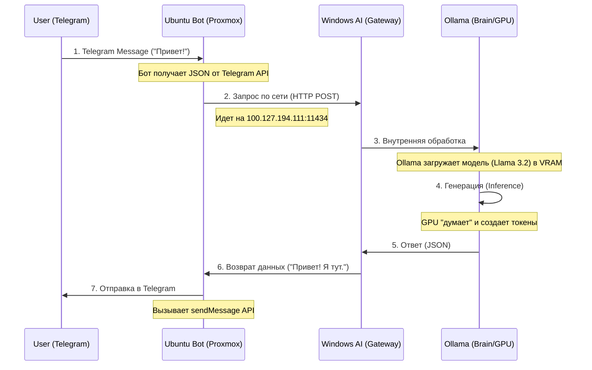

# Полный Отчет по Системе "Unified System"

## 1. Общая Концепция

Система представляет собой распределенный ИИ-кластер, где каждый узел выполняет свою роль (мозг, руки, сервер). Взаимодействие происходит через защищенную Mesh-сеть (Tailscale).

---

## 2. Схема Потоков Данных (Data Flow)

**Как происходит общение с Ботом:**

---

## 3. Узлы Системы (Hardware & Roles)

| Узел (Node) | Железо / ОС | Роль в системе | Статус |
| :--- | :--- | :--- | :--- |
| **MacBook** | macOS (Admin) | **Командный Центр**. Отсюда идет управление, написание кода, деплой. | Active |
| **Windows AI Core** | Windows 11 + NVIDIA GPU | **"Мозги" (Inference Node)**. Запускает тяжелые нейросети (Ollama). Хранит модели. | Active (Gateway Mode) |
| **Proxmox VM 106** | Ubuntu Server | **"Руки" (Service Node)**. Держит связь с Telegram 24/7. Легковесный, надежный. | Active |
| **Home Assistant** | HAOS (VM) | **Умный Дом**. Управление светом, датчиками. (Интеграция планируется). | Pending |

---

## 4. Где висят "Мозги"? (Deep Dive)

**"Мозги"** — это процесс `ollama.exe`, запущенный на Windows машине.

* **Папка хранения:** `C:\Users\gonya\.ollama\models` (сюда скачиваются веса моделей).
* **Исполнение:** В Video RAM (видеопамяти) вашей видеокарты.
* **Кто перерабатывает:**
    1. **Tokenizer**: Превращает ваш текст "Привет" в цифры `[123, 456]`.
    2. **Model Layers**: Миллиарды вычислений на GPU.
    3. **Detokenizer**: Превращает цифры обратно в текст.

---

## 5. Почему Бот "не отвечал" (Technical Root Cause)

1. **Связь**: Бот (на Ubuntu) успешно достучался до Windows (через порт 11434).
2. **Запрос**: Бот спросил: "Сгенерируй ответ на 'И что?' используя модель `llama3`".
3. **Ошибка Мозга**: Ollama на Windows ответила: *`Error: model 'llama3' not found`*. (Мозги пусты, модель не скачана).
4. **Результат**: Бот получил сообщение об ошибке, но не смог его корректно показать пользователю (или показал пустоту).

**Решение:** Мы сейчас скачиваем модель `llama3.2` на Windows. Как только она скачается (3 ГБ), мозг "оживет".

---

## 6. Планы на будущее (Roadmap)

1. **Home Assistant Integration**:
    * Бот сможет не только болтать, но и выключать свет.
    * Схема: `Telegram -> Ubuntu Bot -> HA API -> Zigbee Light`.
2. **Память (RAG)**:
    * Чтобы бот помнил контекст вечно.
    * Нужна база данных (ChromaDB/VectorDB) на Ubuntu.
3. **Голос**:
    * Отправка голосовых в Telegram -> Распознавание (Whisper на Windows) -> Текст.

---
*Generated by Antigravity Agent for User Gonya.*
