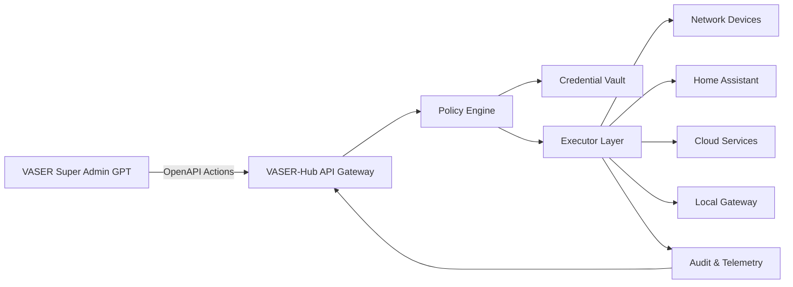

# VASER Control Hub Architecture

## Overview
VASER Control Hub ("VASER-Hub") is the unified execution layer for device administration, Home Assistant control, cloud integrations, and audit logging. It receives structured actions from the VASER Super Admin GPT and executes them with strict policy enforcement.

## Core Components
1. **API Gateway**
   - Validates OpenAPI requests and enforces authentication.
   - Applies rate limiting and request normalization.

2. **Policy Engine**
   - Determines whether a request needs explicit confirmation.
   - Enforces critical-node protections and guardrails.

3. **Credential Vault**
   - Stores SSH keys, WinRM credentials, API tokens, and OAuth refresh tokens.
   - Provides scoped, short-lived credentials to executors.

4. **Executor Layer**
   - **Network Executor** (SSH/WinRM/API)
   - **Home Assistant Executor** (service calls and scripts)
   - **Local Gateway Executor** (/local/run, /local/read, /local/write)
   - **Cloud Executors** (Calendar, Email, Storage)

5. **Telemetry & Audit**
   - Action logs, command outputs, and approval trails.
   - Health checks and runtime metrics.

## Data Flow

## Security Model
- **Zero-trust by default**: every action must be authenticated and authorized.
- **Scoped credentials**: tokens issued per action, with minimal permissions.
- **Policy enforcement**: any risky action is paused for confirmation.
- **Immutable logs**: every action stored with time, operator, and outcome.

## Operational Guarantees
- **Idempotency**: actions support request IDs to avoid duplicate execution.
- **Rollback readiness**: configuration changes require a backup reference.
- **Observability**: dashboards expose device status, task history, and alerts.

## Integration Notes
- Network devices must be onboarded with metadata tags (critical, owner, location).
- Home Assistant integration should map scripts for speech and notifications.
- Cloud connectors require OAuth tokens stored in the credential vault.
