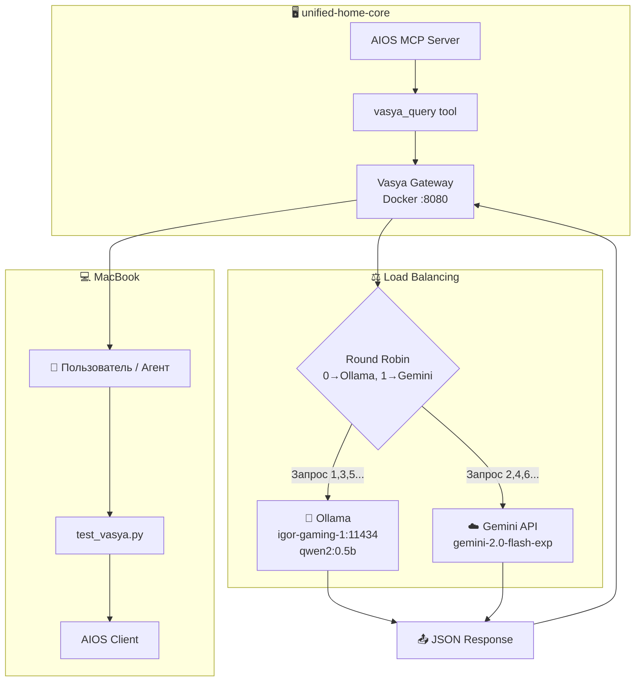

# 🤖 Vasya Gateway — AI Исследовательский Ассистент

> Load-balanced LLM шлюз с Pydantic валидацией, развёрнут на `unified-home-core`.

---

## 📊 Архитектура системы



---

## 🌐 Схема развёртывания

```text
┌─────────────────────────────────────────────────────────────────┐
│  unified-home-core (100.110.209.49)                            │
│  ┌──────────────────────────────────────────────────────────┐  │
│  │  Docker: vasya-gateway-vasya-gateway-1                   │  │
│  │  Port: 8080                                              │  │
│  │  Status: ✅ РАБОТАЕТ                                      │  │
│  │  Mode: round_robin                                       │  │
│  │  Providers: [ollama, gemini]                             │  │
│  └──────────────────────────────────────────────────────────┘  │
└─────────────────────────────────────────────────────────────────┘
                              │
                              ▼
┌─────────────────────────────────────────────────────────────────┐
│  igor-gaming-1 (Tailscale)                                     │
│  Ollama Server @ 100.88.65.71:11434                            │
│  Model: qwen2:0.5b                                              │
└─────────────────────────────────────────────────────────────────┘
```

---

## ✅ Возможности

| Функция | Описание |
| ------- | -------- |
| **LLM Research Queries** | Отправка структурированных запросов к AI моделям |
| **Load Balancing** | Round-robin между Ollama и Gemini |
| **Pydantic Validation** | Валидация JSON схемы: `{results, summary}` |
| **MCP Tool Integration** | Зарегистрирован как `vasya_query` в AIOS |
| **Docker Deployment** | Контейнеризация на `unified-home-core` |

---

## 🚀 Как пользоваться

### 1. HTTP API (напрямую)

```bash
curl -X POST http://unified-home-core:8080/generate \
  -H "Content-Type: application/json" \
  -d '{"prompt": "Найди ресурсы про Docker"}'
```

### 2. Через AIOS/MCP (Python клиент)

```python
from aios_client import AIOSClient
client = AIOSClient()
result = client.query("test_agent", "llm", {
    "messages": [{"role": "user", "content": "Use vasya_query tool"}],
    "tools": [{"type": "function", "function": {"name": "vasya_query"}}]
})
```

### 3. Тестовый скрипт

```bash
python /Users/macbook/Documents/Unified_System/Scripts/automation/test_vasya.py
```

---

## 🖥️ Доступные интерфейсы

| Интерфейс | URL/Path | Статус |
| --------- | -------- | ------ |
| **REST API** | `http://unified-home-core:8080/generate` | ✅ Активен |
| **Health Check** | `http://unified-home-core:8080/health` | ✅ Активен |
| **Swagger UI** | `http://unified-home-core:8080/docs` | ✅ Активен |
| **OpenAPI JSON** | `http://unified-home-core:8080/openapi.json` | ✅ Активен |
| **MCP Tool** | `vasya_query()` через AIOS | ✅ Зарегистрирован |

---

## 🔮 Возможные расширения

| Интерфейс | Сложность | Описание |
| --------- | --------- | -------- |
| **CLI wrapper** | Низкая | `vasya "запрос"` bash скрипт |
| **Telegram Bot** | Средняя | Команда `/vasya` в AI боте |
| **Web UI Dashboard** | Средняя | React/Vue фронтенд с историей |
| **Streaming Response** | Низкая | SSE/WebSocket для realtime |
| **Multi-turn Chat** | Средняя | Управление контекстом/историей |

---

## 📋 API Эндпоинты

| Endpoint | Method | Описание |
| -------- | ------ | -------- |
| `/generate` | POST | Отправить запрос, получить JSON |
| `/health` | GET | Статус, режим, провайдеры |
| `/docs` | GET | Swagger UI документация |
| `/openapi.json` | GET | OpenAPI спецификация |

---

## 📥 Формат запроса

```json
{
  "prompt": "ваш запрос",
  "model": "qwen2:0.5b",
  "provider": "ollama|gemini",
  "temperature": 0.7
}
```

---

## 📤 Формат ответа

```json
{
  "results": [
    {"title": "...", "url": "...", "description": "..."}
  ],
  "summary": "...",
  "provider": "ollama|gemini"
}
```

---

## 🐳 Deployment

**Расположение:** `unified-home-core:/home/gonya/projects/vasya-gateway/`

```bash
# Запуск
cd /home/gonya/projects/vasya-gateway
docker compose up -d

# Логи
docker logs vasya-gateway-vasya-gateway-1

# Проверка здоровья
curl http://localhost:8080/health
```

---

## ⚙️ Переменные окружения

| Переменная | По умолчанию | Описание |
| ---------- | ------------ | -------- |
| `OLLAMA_HOST` | 100.88.65.71 | Ollama сервер (igor-gaming-1) |
| `OLLAMA_PORT` | 11434 | Порт Ollama |
| `DEFAULT_MODEL` | qwen2:0.5b | Модель LLM по умолчанию |
| `LOAD_BALANCE_MODE` | round_robin | `round_robin` или `random` |
| `GEMINI_API_KEY` | - | API ключ Gemini |

---

## 🔌 MCP Интеграция

Зарегистрирован как AIOS tool:

```python
@mcp.tool(description="Query Vasya research assistant")
async def vasya_query(prompt: str, model: str = "qwen2:0.5b") -> str:
    ...
```

---

## 📁 Файлы проекта

| Путь | Описание |
| ---- | -------- |
| `src/main.py` | FastAPI gateway |
| `docker-compose.yml` | Конфигурация контейнера |
| `Dockerfile` | Инструкции сборки |
| `requirements.txt` | Зависимости |

---

Последнее обновление: 2025-12-26
