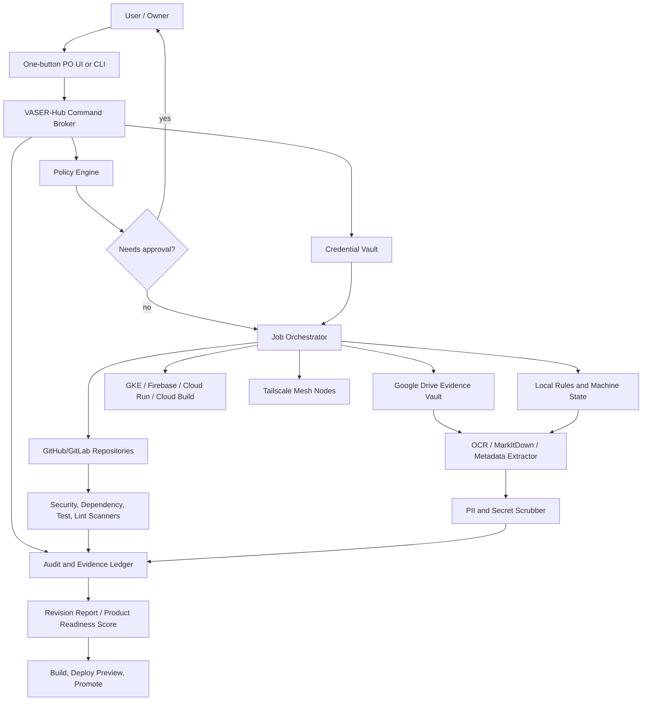

# Repository Revision and One-Button Productization Plan

Date: 2026-05-15
Branch: `cursor/repository-revision-plan-315b`
Scope: `/workspace` root repository plus declared submodules, operational docs, configs, uploaded source records, and security posture.

## 1. Executive summary

This checkout is a multi-system monorepo for a personal/enterprise AI operating environment:

- `Projects/AI_Core`: Telegram/AI assistant, Home Assistant bridge, GKE deployment, Google integrations.
- `Projects/Content_Factory`: content/video production pipeline and scheduler.
- `Projects/ChatKit_Dashboard`: Next.js dashboard and Firebase App Hosting entrypoint.
- `functions` and `unified`: Firebase Cloud Functions codebases.
- `Projects/Bybit_Bot` and `Projects/Bybit_Arb_Bot`: crypto/market automation and Kubernetes manifests.
- `Scripts`, `infra`, `docs`, `Agent_Context`, `.claude`, `skills`: orchestration, infrastructure, agent framework, runbooks, and knowledge base.
- Declared submodules: `mcp_agent_mail`, `CLIProxyAPI`, `antibridge`, `gk-cli`, `chrome-devtools-mcp`, `Wav2Lip`, and `LivePortrait`.

The repository already contains strong architectural intent: VASER-Hub as a policy-gated control plane, Tailscale mesh networking, GKE for the bot, remote/cloud execution for heavy jobs, Firebase for dashboard/functions, and a TokenBroker/vault pattern for secrets. The main gap is not ambition; it is operational control. There are critical secret-handling, dependency, CI/CD, Firebase rules, and control-plane hardening issues that must be closed before turning the system into a one-button productized operator/software package.

## 2. Evidence collected

### Repository and history

- Current base at audit start: `main`.
- Working branch created: `cursor/repository-revision-plan-315b`.
- Tracked file count: 2,483.
- Python files: 467.
- TypeScript/TSX files: 32.
- GitHub workflow files: 5.
- Recent history includes security and dependency work, for example:
  - `fix: remove exposed secrets, update cryptography>=46.0.5`
  - `security: bump next.js 16.1.1->16.1.5+`
  - `fix: comprehensive system audit - k8s, lint, security, CI/CD`

### Submodules

`git submodule update --init --recursive` succeeded. Current submodule heads:

| Path | Commit | Notes |
| --- | --- | --- |
| `Projects/AI_Core/antibridge` | `a55073e` | Node project, npm audit: 0 prod vulnerabilities. |
| `Projects/AI_Core/gk-cli` | `5e5eeeb` | GitKraken CLI docs/tooling. |
| `Projects/Content_Factory/src/lip_sync/Wav2Lip` | `bac9a81` | Python requirements present. |
| `Projects/Content_Factory/src/live_portrait` | `60d7501` | Python requirements present. |
| `infra/cliproxyapi/src` | `d47b7dc` | External CLI proxy source. |
| `tools/chrome-devtools-mcp` | `d459266` | Node project, npm audit: 0 prod vulnerabilities. |

### Dependency audit results

`npm audit --omit=dev --json` was run where lockfiles were present:

| Component | Production vulnerabilities |
| --- | --- |
| `Projects/ChatKit_Dashboard` | 4 total: 2 moderate, 1 high, 1 critical |
| `functions` | 31 total: 12 low, 4 moderate, 13 high, 2 critical |
| `unified` | 15 total: 9 low, 2 moderate, 3 high, 1 critical |
| `Projects/antigravity-vscode` | 0 |
| `Projects/AI_Core/antibridge` | 0 |
| `tools/chrome-devtools-mcp` | 0 |

`Agent_Context/Knowledge_Base/mcp-server` and `tools/devtools-mcp` in the root tree do not have lockfiles, so `npm audit` cannot produce a reliable result there until package locks are generated.

Python dependency manifests are mostly broad or unpinned, especially in `Projects/Content_Factory/requirements.txt`, `Projects/Bybit_Arb_Bot/requirements.txt`, and `infra/docker/services.requirements.txt`. `pip-audit` was not available in this environment, so Python CVE verification remains a required follow-up gate.

### Uploaded records

The uploaded PDFs were read as source records where possible. They include:

- Road/toll invoice containing personal identifiers and vehicle/customer data.
- Suspended scaffold daily safety inspection form with site/equipment/workflow data.
- Password-protected Mercantile PDF; contents could not be read without a password.
- A pitch deck PDF with no extractable text in the reader.
- Telecom invoice containing personal identifiers and billing data.
- `Vibranium`/`Sovereign Core` pitch material describing digital sovereignty, local-first AI, blind cloud storage, PII scrubbing, cryptographic notarization, isolated agent sandboxes, Tailscale mesh, budget guards, and enterprise/consumer positioning.

Important handling rule: these records should not be committed to Git. They belong in an encrypted evidence vault or restricted Google Drive folder with metadata-only references in the repository.

## 3. Critical findings

### 3.1 Tracked credential files

Tracked credential-named files exist, including:

- `config/google_drive_credentials.json`
- `config/gmail_credentials.json`
- `Projects/AI_Core/gmail_credentials.json`
- `Projects/AI_Core/config/gmail_credentials.json`

Risk: leaked OAuth/client material, persistent exposure through Git history, account/API abuse.

Required action:

1. Rotate the corresponding Google OAuth clients/secrets in Google Cloud.
2. Replace tracked credential files with `.example` templates.
3. Remove sensitive blobs from Git history with `git filter-repo` or BFG.
4. Add CI secret scanning and local pre-commit scanning.

### 3.2 Empty secret baseline

`.secrets.baseline` exists but is empty. This creates a false sense of coverage.

Required action:

- Rebuild the baseline using `detect-secrets scan --all-files`, review findings, and enforce it in CI.
- Add `gitleaks detect --redact` as a blocking gate.

### 3.3 Firebase rules are expired and unsafe by design

`firestore.rules` contains a catch-all allow rule that expired on 2026-03-16:

- Before expiry, it would allow global read/write.
- After expiry, client traffic is denied.

Required action:

- Replace with collection-specific rules based on `request.auth`, owner/role checks, and schema validation.
- Add emulator-based rules tests.

### 3.4 MCP/control-plane endpoint hardening

`Agent_Context/Knowledge_Base/mcp-server/src/index.ts` exposes control-plane actions with:

- Default API key fallback.
- API key printed to logs.
- Permissive CORS.
- `/message` path that logs unauthorized access but continues to handle the request.
- Docker tooling via `/var/run/docker.sock` in `src/tools/docker.ts`.

Required action:

- Fail startup if `MCP_API_KEY` is absent or default.
- Never log API keys.
- Return immediately on unauthorized requests.
- Bind to localhost/Tailscale-only interfaces by default.
- Avoid raw Docker socket mounts; use a restricted proxy or remove restart capability from externally reachable services.

### 3.5 TokenBroker fallback key and plaintext compatibility

`Projects/AI_Core/src/token_broker.py` has a hard-coded fallback master key and accepts unencrypted vault data. Similar logic exists in utility copies.

Required action:

- Fail closed if the master key is absent.
- Migrate old unencrypted vaults once, then reject plaintext vaults.
- Rotate/re-encrypt existing vault contents after removing fallback behavior.

### 3.6 PR preview workflow deploys PR code with GCP/GKE capability

`.github/workflows/preview.yaml` grants `id-token: write`, authenticates to Google, builds/pushes an image, and deploys to GKE on `pull_request`.

Required action:

- Gate preview deploys with environment approval and trusted actor checks.
- Restrict Workload Identity Federation provider conditions by repo, branch/event, workflow, and actor.
- Avoid deploying arbitrary fork/PR code with production service accounts.

### 3.7 Public AI chat endpoint cost and abuse risk

`Projects/ChatKit_Dashboard/src/app/api/chat/route.ts` accepts POST requests, uses `gpt-4o`, and has no visible auth, rate limit, size validation, or quota guard.

Required action:

- Add authentication/session checks.
- Add per-user/IP quotas and request-size validation.
- Default to a cheaper model or route through TokenBroker budget policy.

## 4. Other high-priority issues

- Containers and Kubernetes manifests lack consistent non-root users, read-only root filesystems, dropped Linux capabilities, seccomp profiles, and image digests.
- Some Kubernetes and Docker files model credentials as mounted JSON files or ConfigMaps rather than Workload Identity, Secret Manager, External Secrets, or Kubernetes Secrets.
- `OAUTHLIB_INSECURE_TRANSPORT=1` appears in deployed context and should be local-dev only.
- Several scripts use unsafe shell/SSH patterns, including `shell=True`, environment-derived commands, `StrictHostKeyChecking=no`, and temporary secret files.
- `docker-compose.unified.yml` references `Projects/Crypto_Bot/main.py`, but this checkout has `Projects/Bybit_Bot` and `Projects/Bybit_Arb_Bot`, not `Projects/Crypto_Bot`.
- `SYSTEM_MAP.md` references `Scripts/Production_Factory/` and `Scripts/Orchestration/full_sync.sh`, but the live pipeline is under `Projects/Content_Factory` and current orchestration scripts under `Scripts/Orchestration`.
- Root docs and stats are partially stale compared with the current module set.

## 5. Target architecture

The productized architecture should use VASER-Hub as the safe control plane and treat every repo, Drive folder, local machine, and service as a governed resource.



### Core components

1. **One-button interface**
   - Minimal web button in ChatKit Dashboard, Telegram command, GitHub Actions `workflow_dispatch`, or local `make po-release`.
   - Starts a controlled VASER-Hub workflow, not arbitrary shell commands.

2. **VASER-Hub command broker**
   - Validates requests against OpenAPI contracts.
   - Emits a `request_id` for every action.
   - Routes work to safe adapters only.

3. **Policy engine**
   - Allows read-only inventory and report generation automatically.
   - Requires confirmation for secret rotation, production deploy, destructive filesystem operations, Docker restarts, and Kubernetes namespace deletion.

4. **Credential vault**
   - Google Secret Manager or SOPS/age for repo-managed config.
   - External Secrets Operator for Kubernetes.
   - No plaintext credential JSON in Git.

5. **Evidence and fact ledger**
   - Stores metadata and hashes for PDFs, logs, invoices, screenshots, and local records.
   - Stores sensitive originals in restricted Drive/vault storage only.
   - Stores non-sensitive summaries in Git reports.

6. **Scanner pipeline**
   - Secret scan: `gitleaks`, `detect-secrets`.
   - Dependency scan: `npm audit`, `pip-audit`, `osv-scanner`, Dependabot/Renovate.
   - Container/IaC scan: `trivy fs`, `trivy config`, `kube-score` or Polaris.
   - Code scan: Semgrep, Ruff, ESLint, TypeScript, pytest.

7. **Deployment pipeline**
   - Build immutable images.
   - Sign/provenance with `cosign`/SLSA where practical.
   - Deploy previews only after policy checks.
   - Promote to production only after approval and green gates.

## 6. Google Drive and local rules model

### Google Drive structure

Use a dedicated Shared Drive or owner-restricted folder:

```text
Unified-System-Control/
  00_Inbox/
    uploads/
    unsorted/
  10_Records/
    invoices/
    inspections/
    contracts/
    screenshots/
  20_Knowledge/
    architecture/
    pitch-decks/
    requirements/
  30_Audit/
    scan-results/
    dependency-reports/
    security-reports/
  40_Releases/
    release-notes/
    build-artifacts/
    deployment-logs/
  90_Archive/
```

### Drive rules

- Originals with personal, financial, or credential content stay in Drive/vault only.
- Git stores only metadata: file hash, category, source, date, extracted non-sensitive facts, and review status.
- Every Drive file gets labels:
  - `classification`: public, internal, confidential, restricted.
  - `source_type`: invoice, inspection, pitch, log, credential, config, screenshot.
  - `retention`: short, operational, compliance.
  - `pii`: yes/no.
- `restricted` files require explicit approval before AI processing.
- Password-protected files are logged as unreadable until the password is supplied through the vault, not chat or Git.

### Local rules

- `.env`, credential JSON, tokens, service account files, browser sessions, local DBs, and PDFs remain ignored.
- Add explicit ignores for:
  - `**/gmail_credentials.json`
  - `**/google_drive_credentials.json`
  - `**/client_secret*.json`
  - `**/credentials.json`
- Local secrets live under `~/.config/unified-system/` or Secret Manager, never under repo paths.
- Local execution must write audit JSONL to `Local_Dev/Audit/` or a configured log sink, not mixed into source directories.
- Any local adapter that can write, restart, deploy, or delete requires policy confirmation.

## 7. Step-by-step implementation plan

### Step 0: Freeze and backup

Tools:
- GitHub/GitLab branch protection
- Google Drive export
- `git bundle`
- Tailscale ACL console

Actions:
1. Freeze direct pushes to `main`.
2. Export current Drive evidence folders.
3. Create a repo backup bundle.
4. Snapshot current GKE/Firebase/Tailscale configs.

### Step 1: Secret containment

Tools:
- Google Cloud Console
- Google Secret Manager
- `gitleaks`
- `detect-secrets`
- `git filter-repo` or BFG

Actions:
1. Rotate Google OAuth and service-account credentials found in tracked credential files.
2. Remove credential files from Git and replace them with `.example` templates.
3. Rewrite Git history for exposed secret blobs.
4. Add local pre-commit scanning and CI secret scanning.
5. Verify no credential JSON remains tracked.

### Step 2: Dependency and supply-chain gates

Tools:
- `npm audit`
- `pip-audit`
- `osv-scanner`
- Dependabot or Renovate
- Trivy

Actions:
1. Generate missing lockfiles for Node packages that are built or deployed.
2. Fix critical/high npm vulnerabilities in `functions`, `unified`, and `Projects/ChatKit_Dashboard`.
3. Add Python lockfiles or hash-checked requirements for deployable services.
4. Add `pip-audit` and `osv-scanner` to CI.
5. Fail CI on critical/high vulnerabilities unless explicitly waived.

### Step 3: Firebase and public endpoint hardening

Tools:
- Firebase Emulator Suite
- Firebase rules tests
- Next.js middleware
- TokenBroker budget policy

Actions:
1. Replace expired Firestore catch-all rules with collection-specific rules.
2. Add emulator tests for positive/negative access cases.
3. Add auth, rate limits, request limits, and model budget controls to ChatKit `/api/chat`.
4. Validate Firebase Functions build and deploy gates.

### Step 4: Control-plane hardening

Tools:
- VASER-Hub policy engine
- Express middleware
- Tailscale ACLs
- Docker socket proxy or removed Docker socket

Actions:
1. Make MCP servers fail closed when API keys are missing/default.
2. Stop logging API keys.
3. Enforce authorization before every tool execution path.
4. Restrict CORS and bind control-plane services to localhost/Tailscale only.
5. Remove raw Docker socket access from externally reachable containers.

### Step 5: Kubernetes and Docker hardening

Tools:
- Trivy config
- kube-score or Polaris
- Kustomize
- External Secrets Operator
- Workload Identity

Actions:
1. Add non-root users to Dockerfiles where practical.
2. Add `securityContext`, dropped capabilities, and seccomp to Kubernetes manifests.
3. Replace mutable `latest` tags with immutable tags or digests.
4. Move secrets out of ConfigMaps and mounted JSON files.
5. Restrict egress and RBAC to least privilege.

### Step 6: Google Drive ingestion and fact ledger

Tools:
- Google Drive API
- MarkItDown/OCR
- PII scrubber
- SQLite/Postgres fact ledger
- SHA-256 hashing

Actions:
1. Create the Drive folder structure.
2. Configure a service account with least-privilege access to the Shared Drive.
3. Build an ingestion job:
   - Read new files from `00_Inbox`.
   - Hash each file.
   - Extract text/OCR when allowed.
   - Classify and scrub PII.
   - Store metadata and facts in the ledger.
   - Move originals to governed folders.
4. Add a review queue for password-protected or restricted files.

### Step 7: One-button workflow

Tools:
- GitHub Actions `workflow_dispatch`
- ChatKit Dashboard button
- Telegram command
- VASER-Hub API
- Docker/GKE/Firebase deploy tools

Actions:
1. Create one canonical workflow, for example `po-release`.
2. The button triggers:
   - Repo sync and submodule update.
   - Secret scan.
   - Dependency scan.
   - Lint/type/test.
   - IaC/container scan.
   - Drive evidence ingestion.
   - Report generation.
   - Preview deployment.
   - Approval request.
   - Production promotion if approved.
3. Every step writes JSON audit events with `request_id`.
4. Failed gates stop the workflow and produce remediation tasks.

### Step 8: Product packaging

Tools:
- Docker Compose profiles
- Helm/Kustomize
- Firebase Hosting/App Hosting
- GitHub Releases
- SBOM generation (`syft`)

Actions:
1. Define a minimal product SKU:
   - `core`: VASER-Hub, vault, policy, audit.
   - `home`: Home Assistant and local gateway adapters.
   - `factory`: Content Factory.
   - `enterprise`: Drive ingestion, compliance reports, multi-node mesh.
2. Generate SBOMs for all images.
3. Publish release notes, architecture docs, and install/run commands.
4. Store release artifacts in Drive `40_Releases` and GitHub Releases.

## 8. Immediate remediation backlog

1. Rotate and remove tracked Google/Gmail credential JSON files.
2. Fix `.secrets.baseline` and add blocking secret scanning.
3. Replace expired `firestore.rules`.
4. Harden MCP auth paths and remove API key logging.
5. Add auth/rate limiting to ChatKit `/api/chat`.
6. Fix critical/high npm vulnerabilities in `functions`, `unified`, and ChatKit.
7. Generate lockfiles for deployable Node packages without them.
8. Add Python vulnerability scanning and lock strategy.
9. Remove hard-coded TokenBroker fallback key and plaintext vault compatibility.
10. Reconcile stale docs and compose references:
    - `Scripts/Production_Factory/`
    - `Scripts/Orchestration/full_sync.sh`
    - `Projects/Crypto_Bot/main.py`

## 9. Definition of done for "one-button PO"

The system is ready for one-button productization when:

- No real secrets or personal records are tracked in Git.
- Secret, dependency, IaC, and container scans are green or have approved waivers.
- Firebase rules pass emulator tests.
- Public endpoints require authentication and quotas.
- VASER-Hub enforces policy before every privileged action.
- Google Drive ingestion stores sensitive originals outside Git and records only metadata/facts.
- CI can build, test, scan, produce a report, deploy preview, request approval, and promote release from one controlled workflow.
- Every operation has structured audit logs tied to a `request_id`.

