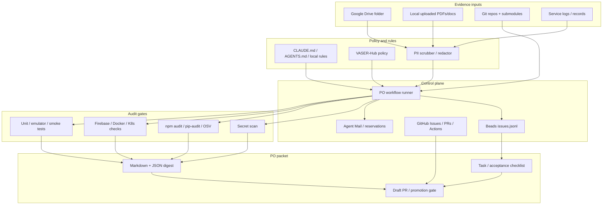

# Repository Revision and PO One-Button Architecture

Date: 2026-05-15
Branch: `cursor/repository-revision-plan-a0ed`

## Executive summary

This revision reviewed the current `/workspace` repository, registered submodules, uploaded documents, project rules, build manifests, dependency surfaces, Firebase/Docker/Kubernetes configuration, and existing operational runbooks. The repo is a broad monorepo for a distributed AI/home/automation/content system. The strongest existing assets are the documented AI agent framework, VASER-Hub security model, Beads task store, TokenBroker concept, Docker Compose surfaces, Firebase configuration, GKE runbook, and the `unified.py` command center.

The most urgent gaps are security and operational hygiene:

1. Firestore rules contain an expired open-world trial rule and now deny all client access after 2026-03-16.
2. Git tracks credential-like and PII-like files, including Gmail/Google credential JSON and email dumps.
3. `hooks/hooks_manager.py` exposes unauthenticated hook execution and runs configured commands through `shell=True`.
4. `Projects/AI_Core/src/api_proxy.py` fails open when no API gateway token is configured.
5. Docker Compose injects the root `.env` into multiple services and publishes dashboard/MCP ports.
6. Kubernetes manifests use ConfigMaps/hostPath for sensitive or host-coupled material.
7. Node audits found critical/high vulnerabilities in Firebase functions, unified functions, and the ChatKit dashboard.
8. Python dependency auditing is blocked by missing `python3-venv`; no-resolver audit mode still found a vulnerable FastAPI pin in the Python microservice template and many unpinned requirements.
9. Several submodules are registered but not initialized in this checkout, so their code could not be deeply audited locally.
10. Uploaded PDFs include personal invoices/records and product claims; they must be handled as sensitive evidence inputs, not committed source.

## Scope and evidence reviewed

### Repository and submodules

Primary remote:

- `https://github.com/Unified-system-Core/Unified_System_Core`

Registered submodules from `.gitmodules`:

| Path | Remote | Local status observed |
| --- | --- | --- |
| `External_Tools/Stack/mcp_agent_mail` | `https://github.com/Dicklesworthstone/mcp_agent_mail.git` | Declared, not listed in `git submodule status` output |
| `infra/cliproxyapi/src` | `https://github.com/router-for-me/CLIProxyAPI` | Uninitialized |
| `Projects/AI_Core/antibridge` | `https://github.com/Unified-system-Core/antibridge.git` | Uninitialized |
| `Projects/AI_Core/gk-cli` | `https://github.com/gitkraken/gk-cli.git` | Uninitialized |
| `tools/chrome-devtools-mcp` | `https://github.com/ChromeDevTools/chrome-devtools-mcp.git` | Uninitialized |
| `Projects/Content_Factory/src/lip_sync/Wav2Lip` | `https://github.com/Rudrabha/Wav2Lip.git` | Uninitialized |
| `Projects/Content_Factory/src/live_portrait` | `https://github.com/KwaiVGI/LivePortrait.git` | Uninitialized |

Main project areas observed:

- `Projects/AI_Core/`: Telegram AI bot, Home Assistant bridge, multi-model inference, Firestore/SQLite persistence, Kubernetes manifests.
- `Projects/Content_Factory/`: AI video/content production pipeline with TokenBroker references and external model integrations.
- `Projects/ChatKit_Dashboard/`: Next.js dashboard and chat route.
- `Projects/Bybit_Bot/` and `Projects/Bybit_Arb_Bot/`: trading bot services and Docker/Kubernetes surfaces.
- `functions/` and `unified/`: Firebase Functions codebases.
- `Scripts/`: orchestration, security, maintenance, integrations, Gmail/mail automation.
- `Agent_Context/`, `.claude/agents/`, `skills/`, `.beads/`: agent knowledge, task store, and orchestration conventions.
- `infra/`, `docker-compose.yml`, `firebase.json`, `Projects/AI_Core/k8s/`: runtime/deployment surfaces.

### Uploaded document facts

The uploaded documents were treated as sensitive evidence. Personal identifiers are intentionally summarized, not reproduced.

| File | Extracted fact summary | Handling note |
| --- | --- | --- |
| `332716927-1233802008_32e5.pdf` | Highway/road-service invoice in Hebrew. Total due/charged amount shown as ILS 45.30 including VAT for 2 trips. Contains customer, address, vehicle, invoice, and account identifiers. | Sensitive personal/financial record. Do not commit raw copy. |
| `6030591241116463145-...pdf` | Hebrew daily inspection/checklist for suspended/scaffold platform at a site named "Beyond"; includes equipment/model references, date 2024-09-25, and many yes/no safety checks. | Operational safety record; may contain worker/site identifiers. |
| `Mercantile_20230430_0115171864_8369.pdf` | Could not be read: password protected. | Requires password/OCR workflow outside repo. |
| `The_Sovereign_Core_-_Pitch_Deck_3811.pdf` | PDF conversion produced blank/image-only pages. | Requires OCR/image extraction before fact checking. |
| `89404160_28_1_1_7fa5.pdf` | Cellcom invoice in Hebrew. Total shown as ILS 9.90 including VAT, account/customer metadata and email present. | Sensitive personal/telecom billing record. |
| `Vibranium_Presentation_ac30.pdf` | Product/pitch deck claims: "Sovereign Core", "Vibranium & U-Core", digital sovereignty, blind cloud storage, local orchestrator, isolated agent swarm, PII scrubber, RSA-4096/HMAC-SHA256, cost-control/fuel budget, claimed 30% OPEX reduction, enterprise and home-plug product paths. | Treat business claims as unverified until evidence-backed. |

## Verified security and vulnerability findings

### Critical / immediate containment

| Finding | Evidence | Risk | Action |
| --- | --- | --- | --- |
| Firestore trial/open rule expired into deny-all | `firestore.rules:5-15` allows read/write before `2026-03-16` | Before expiry: public read/write. After expiry: client outage. | Replace with resource-specific authenticated rules, run emulator tests, then deploy rules only. |
| Tracked credentials and private records | `git ls-files` shows `Projects/AI_Core/.env.igor`, Gmail/Google credential JSON files, `src/emails_4_months.json`, `src/latest_emails.json` | Secret exposure and PII retention in Git history. | Remove from index, rotate all exposed credentials, update `.gitignore`, purge or treat history as compromised. |
| Unauthenticated hook execution | `hooks/hooks_manager.py:156-164`, `:280-314` | Remote command execution if reachable. | Bind localhost by default, require HMAC/mTLS/API key, replace `shell=True`, validate hook types. |
| API gateway fails open | `Projects/AI_Core/src/api_proxy.py:65-80` | Sensitive API routes become unauthenticated when token missing. | Fail closed in production; require token for `/v1/chat/completions`, `/v1/execute`, `/v1/alert`. |

### High priority

| Finding | Evidence | Risk | Action |
| --- | --- | --- | --- |
| Dashboard chat route has no auth/rate limit | `Projects/ChatKit_Dashboard/src/app/api/chat/route.ts:7-39` | Internet-facing OpenAI spend abuse and infrastructure prompt leakage. | Add auth, rate limiting, request schema limits, and server-only prompt config. |
| Docker Compose broad secret injection | `docker-compose.yml:21-99` uses root `.env` across services and publishes ports 3005/8000 | Least-privilege and exposure gaps. | Split service env files; publish only through authenticated reverse proxy or local binding. |
| K8s ConfigMap and hostPath usage | `Projects/AI_Core/k8s/deployment.yaml` uses credential ConfigMaps and hostPath | Secrets visibility and node coupling. | Move credentials to Kubernetes Secrets/CSI, prefer PVCs, restrict hostPath. |
| MCP file conversion path exposure | MarkItDown MCP surface accepts file paths for conversion | Arbitrary readable-file exposure to MCP clients if reachable. | Sandbox to an allowlisted documents directory and authenticate MCP transport. |
| Generated build artifacts present in workspace scans | `Projects/ChatKit_Dashboard/.next/` appeared in scans | Noise, possible leakage of build/runtime assumptions. | Ensure generated artifacts are ignored and not used as source of truth. |

### Medium / hygiene

- `check_secrets.py` prints matched secret values and should not be used in CI until it redacts matches.
- `.secrets.baseline` is empty, so secret scanning is not currently an effective gate.
- Anonymous/email-password Firebase Auth are enabled in `firebase.json`; ensure rules and App Check match the intended exposure.
- Several scripts bind `0.0.0.0`; this can be valid for internal services but must be paired with auth, firewall, and network policy.
- Many Python requirements use `>=` or no pinning, preventing deterministic vulnerability audits.
- `SYSTEM_MAP.md` references paths that appear drifted or missing in this checkout, such as `Scripts/Orchestration/full_sync.sh`, `Scripts/Production_Factory/`, and `Agent_Workflows/`.

## Dependency audit results

### Node/npm

Commands run:

- `npm audit --omit=dev --audit-level=moderate` in `functions/`
- `npm audit --omit=dev --audit-level=moderate` in `unified/`
- `npm audit --omit=dev --audit-level=moderate` in `Projects/ChatKit_Dashboard/`
- `npm audit --omit=dev --audit-level=moderate` in `Projects/antigravity-vscode/`
- Same command attempted in `Agent_Context/Knowledge_Base/mcp-server/` and `tools/devtools-mcp/`, but both lack lockfiles.

Results:

| Package root | Result |
| --- | --- |
| `functions/` | 31 vulnerabilities: 12 low, 4 moderate, 13 high, 2 critical. Includes critical `handlebars` and `protobufjs`; high OpenTelemetry/Genkit/Firebase transitive issues, `fast-uri`, `fast-xml-parser`, `node-forge`, `path-to-regexp`, `minimatch`. Some issues have no fix available through current transitive tree. |
| `unified/` | 15 vulnerabilities: 9 low, 2 moderate, 3 high, 1 critical. Includes critical `protobufjs` and high `fast-xml-parser`, `node-forge`, `path-to-regexp`. |
| `Projects/ChatKit_Dashboard/` | 4 vulnerabilities: 2 moderate, 1 high, 1 critical. Includes critical `protobufjs`, high `next`, moderate `postcss`. |
| `Projects/antigravity-vscode/` | 0 vulnerabilities reported. |
| `Agent_Context/Knowledge_Base/mcp-server/` | Audit blocked: no lockfile. |
| `tools/devtools-mcp/` | Audit blocked: no lockfile. |

Recommended Node path:

1. Run `npm audit fix` in `unified/` and `Projects/ChatKit_Dashboard/`; review lockfile diffs.
2. For `functions/`, upgrade Genkit/Firebase transitive dependencies where possible and track remaining "no fix available" advisories as accepted risk or replace the dependency path.
3. Add lockfiles or deliberately mark lockless MCP packages as templates/prototypes excluded from production.
4. Add CI gates per package root with path filters.

### Python

`pip-audit` was installed at user level for this pass because no Python audit runner was present. Full resolver mode is blocked by missing `python3-venv` in the image. No-dependency/no-pip mode produced:

| Requirements file | Result |
| --- | --- |
| `templates/python-microservice/requirements.txt` | Found `fastapi 0.104.1` vulnerability `PYSEC-2024-38`; fixed in `0.109.1`. |
| `LLM_Council/requirements.txt` | Audit blocked by non-exact pin `openai>=1.40.0`. |
| `Projects/Bybit_Bot/requirements.txt` | Audit blocked by non-exact pin `ccxt>=4.2.0`. |
| `Scripts/monitoring/requirements.txt` | Audit blocked by non-exact pin `google-cloud-monitoring>=2.0.0`. |
| `Projects/Content_Factory/requirements.txt` | Audit blocked by non-exact pin `openai>=1.0.0`. |
| `Scripts/openai_mcp_server/*.txt` | Audit blocked by non-exact pins. |
| `Projects/Copilot_SDK_Experiment/requirements.txt` | Audit blocked by unpinned `github-copilot-sdk`. |
| `Projects/Bybit_Arb_Bot/requirements.txt` | Audit blocked by unpinned `aiohttp`. |
| `Projects/AI_Core/requirements*.txt` | Audit blocked by non-exact pins such as `python-telegram-bot>=20.7` and `faster-whisper>=0.8.2`. |

Recommended Python path:

1. Add `python3-venv` to the agent image or project bootstrap.
2. Generate lockfiles with `uv` or `pip-tools` for each deployable Python service.
3. Run `pip-audit --locked` or `pip-audit -r` with dependency resolution in CI.
4. Upgrade template FastAPI to at least `0.109.1`.

## Target architecture for PO one-button operation

The target is an auditable PO workflow where a single button can ingest evidence, apply local rules, run checks, create/update the task record, and produce a promotion-ready packet without exposing secrets or private data.



### System of record

- Primary code truth: GitHub repository and PRs.
- Backlog truth: Beads `.beads/issues.jsonl` with `sync-branch: beads-sync`.
- Human-readable audit: `Reports/`.
- Agent/rules truth: `CLAUDE.md`, `AGENTS.md`, `.claude/agents/`, `docs/agent-guidelines/`.
- Secret truth: TokenBroker or cloud secret manager, never raw `.env` in Git.
- Evidence truth: Google Drive folder and local upload cache, with derived redacted summaries only committed.

## Step-by-step configuration plan

### 1. Contain current security risks

Tools:

- `git ls-files`
- `gitleaks` or `detect-secrets`
- Firebase emulator and rules tests
- Kubernetes Secret/CSI tooling
- TokenBroker

Steps:

1. Rotate every credential ever present in tracked credential files or Git history.
2. Remove credential/PII files from Git index with `git rm --cached`, not by deleting local-only secrets.
3. Add explicit ignores for `.env.*`, `.env.igor`, Gmail/Google credential JSON, email dumps, browser/session exports, and generated `.next/`.
4. Replace `firestore.rules` with authenticated/resource-specific rules and add emulator tests.
5. Harden `hooks/hooks_manager.py` and `api_proxy.py` to fail closed.

### 2. Normalize evidence ingestion from Google Drive and local uploads

Tools:

- Google Drive API service account or OAuth app
- MarkItDown or equivalent converter
- OCR for image-only PDFs
- PII redaction layer
- `Reports/` digest writer

Configuration:

1. Create a dedicated Google Drive folder for PO evidence.
2. Grant the service account read-only access to that folder only.
3. Store credentials in TokenBroker or cloud secret manager; never in repo.
4. Download documents to a local ignored cache, for example `Local_Dev/Media/po_evidence/`.
5. Convert supported documents to text.
6. Run PII redaction before agent analysis.
7. Save only redacted summaries/manifests to `Reports/`.

### 3. Make local rules machine-readable

Tools:

- Existing `CLAUDE.md` / `AGENTS.md`
- Proposed future file: `config/po_rules.yaml`
- Agent framework under `.claude/agents/`

Configuration:

1. Define rule precedence:
   - System/developer instructions
   - Workspace rules
   - Project `AGENTS.md`
   - User task
   - Evidence-specific constraints
2. Convert stable rules into a small YAML policy:
   - language/output protocol
   - no-secret-echo policy
   - commit/PR policy
   - audit gates
   - allowed deployment actions
3. Keep free-form docs as source explanation, but make the PO button consume the YAML.

### 4. Build the audit gate set

Tools:

- `npm audit`
- `pip-audit`
- `osv-scanner`
- `gitleaks` or `detect-secrets`
- Firebase emulator tests
- Docker Compose config validation
- Kubernetes validators such as `kubeconform` and `conftest`
- GitHub Actions `workflow_dispatch`

Checks:

1. Git status and submodule initialization.
2. Tracked sensitive path scan.
3. Secret value scan with redacted output.
4. Dependency audit for every package root with lockfiles.
5. Python lockfile audit once lockfiles/venv are available.
6. Firebase rules tests.
7. Docker Compose exposure/env check.
8. K8s hostPath/ConfigMap/secret policy check.
9. Project-specific unit/smoke tests.

### 5. Implement the one-button PO runner

Recommended interface:

```bash
python3 unified.py po
```

or:

```bash
python3 Scripts/Orchestration/po_workflow.py --mode report
```

Runner stages:

1. `sync`: fetch Git, initialize submodules, sync Beads, optionally sync Agent Mail.
2. `ingest`: pull Google Drive evidence and local upload manifests into ignored cache.
3. `redact`: produce redacted text summaries and fact tables.
4. `audit`: run secret, dependency, Firebase, Docker, and K8s gates.
5. `plan`: map findings to Beads/GitHub tasks with acceptance criteria.
6. `packet`: write `Reports/PO_PACKET_<timestamp>.md` and a machine-readable JSON digest.
7. `promote`: create/update a draft PR only when required gates pass or when PO explicitly accepts risk.

### 6. Wire the cloud button

Tools:

- GitHub Actions `workflow_dispatch`
- GitHub environments and required reviewers
- GitHub PR checks
- Firebase/GKE deploy workflows

Configuration:

1. Add `.github/workflows/po-packet.yml` with manual inputs:
   - evidence folder id
   - mode: `report`, `staging`, `promote`
   - risk acceptance id, optional
2. Run the PO runner in report/staging mode by default.
3. Upload the PO packet as an Actions artifact.
4. Require manual environment approval before deploy/promote.
5. Post the packet into the draft PR body or attach it to the Beads task.

## Proposed PO acceptance checklist

Before pressing "promote":

- [ ] No raw secrets or PII are printed in logs or committed.
- [ ] Firestore rules pass emulator tests and deny unauthenticated writes.
- [ ] Credential/PII files are removed from Git tracking and credentials rotated.
- [ ] Hook/API gateway endpoints fail closed without configured auth.
- [ ] Node and Python dependency audits either pass or have documented risk acceptance.
- [ ] Docker/K8s exposure checks pass.
- [ ] Submodules are initialized and pinned to reviewed SHAs.
- [ ] Google Drive evidence is summarized through the redaction pipeline.
- [ ] Beads task and PR share the same task ID and acceptance criteria.
- [ ] PO packet is attached to the PR or stored under `Reports/`.

## Immediate backlog

| Priority | Work item | Suggested owner/tool |
| --- | --- | --- |
| P0 | Rotate and remove tracked credentials/PII from Git tracking | Security hardening agent + human credential owner |
| P0 | Replace Firestore rules and add emulator tests | Firebase/functions owner |
| P0 | Harden hooks manager auth/bind/shell execution | Security hardening agent |
| P0 | Make API proxy fail closed for protected routes | AI Core owner |
| P1 | Split Docker Compose env files and restrict published ports | DevOps agent |
| P1 | Move K8s credentials from ConfigMap/hostPath to Secrets/PVC/CSI | DevOps agent |
| P1 | Upgrade vulnerable Node dependency trees | Implementer + CI |
| P1 | Add Python venv/lockfile support and full pip-audit | Env setup + Python owners |
| P2 | Create Google Drive evidence ingestion/redaction workflow | Architecture + implementer |
| P2 | Add `unified.py po` / `po_workflow.py` one-button runner | Orchestration owner |

## Environment setup note

The current cloud image lacks several useful audit tools:

- `python3-venv`
- `uv`
- `ruff`
- `firebase`
- `docker`
- `bd`
- `gitleaks`
- `trufflehog`
- `detect-secrets`

For future agents, add these through the Cursor environment setup flow so audits do not need ad hoc user-level installs. Suggested environment setup prompt:

> Configure the Unified_System_Core cloud agent image for repository audits. Install python3-venv, uv, ruff, firebase-tools, Docker CLI, bd/Beads CLI, gitleaks, trufflehog, detect-secrets, osv-scanner, kubeconform, conftest, and ensure /home/ubuntu/.local/bin is on PATH. Keep secrets out of the image and verify `npm`, `python3`, and `git` remain available.

## Open limitations

- Submodule code was not deeply audited because registered submodules are uninitialized in this checkout.
- The Mercantile PDF is password protected.
- One pitch-deck PDF is image-only/blank after text extraction and requires OCR.
- Dependency audits depend on lockfile quality; lockless/unpinned packages remain partially unaudited.
- No Google Drive folder or local PO rules file was provided yet, so the Drive/rules design is a target plan rather than a completed integration.
