# Revision Report: Repository Audit, Google Drive Intake, Local Rules, and One-Button PO Flow

Date: 2026-05-15 UTC
Repository: `Unified-system-Core/Unified_System_Core`
Reviewed commit: `1a6d6cb9816b138a9765cc78e75f443e893c4ced`
Branch for this report: `cursor/revision-google-drive-po-plan-0c58`

## 1. Executive summary

This revision reviewed the monorepo structure, declared submodules, uploaded source documents, Firebase/GCP configuration, Docker/Kubernetes surfaces, GitHub Actions, security-sensitive records, and dependency vulnerabilities.

The system is a multi-plane personal/business automation platform:

- AI control plane: `Projects/AI_Core`
- Content production plane: `Projects/Content_Factory`
- Web/Firebase plane: `Projects/ChatKit_Dashboard`, `functions`, `unified`, `dataconnect`
- Trading/crypto plane: `Projects/Bybit_Bot`, `Projects/Bybit_Arb_Bot`
- Orchestration plane: `Scripts/Orchestration`, root `docker-compose.yml`, GKE/Firebase workflows
- Security/control-plane docs: VASER-Hub policy and product documents

The strongest recommendation is to pause any new "one-button" automation that can mutate infrastructure, trade, publish, or upload until the critical secret, rules, and deployment issues below are addressed. The proposed Google Drive + local rules + PO workflow is designed to be safe-by-default: read-only ingestion first, redaction and classification before external calls, policy evaluation before generation, and explicit approval before any publication or order creation.

## 2. Scope and methods

### 2.1 Repositories and submodules

The workspace is a single top-level Git repository with these declared submodules:

| Path | Remote |
| --- | --- |
| `External_Tools/Stack/mcp_agent_mail` | `github.com/Dicklesworthstone/mcp_agent_mail` |
| `infra/cliproxyapi/src` | `github.com/router-for-me/CLIProxyAPI` |
| `Projects/AI_Core/antibridge` | `github.com/Unified-system-Core/antibridge` |
| `Projects/AI_Core/gk-cli` | `github.com/gitkraken/gk-cli` |
| `tools/chrome-devtools-mcp` | `github.com/ChromeDevTools/chrome-devtools-mcp` |
| `Projects/Content_Factory/src/lip_sync/Wav2Lip` | `github.com/Rudrabha/Wav2Lip` |
| `Projects/Content_Factory/src/live_portrait` | `github.com/KwaiVGI/LivePortrait` |

The local submodule status showed the listed submodules as not initialized in this workspace snapshot, so the audit covers their declared boundaries and manifests in the parent repo, not their full checked-out upstream source.

### 2.2 Commands and tools used

- Git inventory: `git rev-parse`, `git remote -v`, `git submodule status --recursive`
- File inventory: dependency/config glob searches and targeted file reads
- Secret/safety patterns: ripgrep searches for token/credential markers, unsafe shell usage, open rules, Docker socket mounts, unpinned `latest` images, and permissive network policies
- Node dependency audit:
  - `npm audit --omit=dev --json` in `Projects/ChatKit_Dashboard`
  - `npm audit --omit=dev --json` in `functions`
  - `npm audit --omit=dev --json` in `unified`
  - `npm audit --omit=dev --json` in `Projects/antigravity-vscode`
- Python dependency audit:
  - Installed user-local `pip-audit==2.10.0`
  - Installed OS package `python3.12-venv` because temporary audit virtualenvs failed without it
  - Ran `pip-audit -r <requirements.txt> --format json` across the main Python requirement files
- Uploaded document extraction: PDF text extraction via the workspace file reader

## 3. Uploaded documents and records

Uploaded documents were treated as private source records. This report intentionally avoids copying personal addresses, document IDs, bank details, or credential-like content.

| File | Extraction status | Safe summary |
| --- | --- | --- |
| `332716927-1233802008_57d0.pdf` | Text extracted | Israeli road/toll invoice containing personal billing details and vehicle-related charge summary. |
| `6030591241116463145-...367c.pdf` | Text extracted | Daily suspended scaffold inspection form with safety checklist fields. |
| `Mercantile_20230430_0115171864_cbac.pdf` | Password protected | Bank document could not be extracted without a password. Treat as confidential financial record. |
| `The_Sovereign_Core_-_Pitch_Deck_b17b.pdf` | Pages detected but no text extracted | Likely image-based pitch deck; requires OCR. |
| `89404160_28_1_1_14e3.pdf` | Text extracted | Telecom invoice containing personal billing and account details. |
| `Vibranium_Presentation_50c8.pdf` | Text extracted | Russian-language Sovereign Core/Vibranium pitch content about local AI control, blind cloud storage, cryptographic notarization, agent sandboxes, PII scrubbing, and Tailscale mesh scaling. |

Implications for the target architecture:

1. The ingestion pipeline must support OCR for image-only PDFs.
2. Password-protected documents must be queued for manual password entry or excluded.
3. PII redaction must run before documents are used in prompts, tickets, PO generation, or external model calls.
4. Each ingested document needs metadata: source, owner, classification, extracted text hash, redaction status, and retention policy.

## 4. Verified architecture map

### 4.1 Runtime planes

| Plane | Main paths | Current role |
| --- | --- | --- |
| AI bot/control | `Projects/AI_Core`, `infra/k8s`, `Projects/AI_Core/k8s` | Telegram bot, Home Assistant bridge, multi-LLM council, GKE deployment, local/remote command paths. |
| Content factory | `Projects/Content_Factory` | AI content production, scheduler, social uploaders, generated media outputs. |
| Web/Firebase | `Projects/ChatKit_Dashboard`, `functions`, `unified`, `dataconnect`, `firebase.json`, `firestore.rules` | Dashboard, Firebase functions, Data Connect, Hosting/App Hosting, Auth/Firestore. |
| Trading | `Projects/Bybit_Bot`, `Projects/Bybit_Arb_Bot` | Bybit execution/risk services and funding arbitrage experiment. |
| Orchestration | `Scripts/Orchestration`, root `docker-compose.yml` | Mail intelligence, Gmail agent, factory scheduler service, MarkItDown MCP service. |
| Policy/product docs | `docs/architecture`, `docs/security`, `docs/product`, `docs/openapi` | VASER-Hub architecture, action approval rules, product plan, OpenAPI contracts. |

### 4.2 Existing VASER-Hub model

The repository already contains the right conceptual model for a safe one-button workflow:

- Command Broker: normalize action requests and route them to adapters.
- Credential Vault: hold scoped Google, SSH, Home Assistant, and API credentials.
- Policy/Safety Layer: require confirmation for state-changing actions.
- Adapters: Google Drive, local gateway, Home Assistant, SSH, APIs.
- Observability: append-only audit logs with correlation IDs.

The Google Drive + local rules + PO system should reuse this model rather than introduce a parallel control plane.

## 5. Security and vulnerability findings

### 5.1 Critical findings

| Severity | Finding | Evidence paths | Required action |
| --- | --- | --- | --- |
| Critical | Committed credentials, OAuth secrets, bot/session material, and token-bearing logs are present. | Examples include `config/gmail_credentials.json`, `config/google_drive_credentials.json`, `Projects/AI_Core/gmail_credentials.json`, `Projects/Content_Factory/insta_session.json`, `Projects/Content_Factory/src/uploaders/.threads_state.json`, `Reports/*.err`, and token utility scripts. | Revoke/rotate secrets, remove files from current tree, purge history with `git filter-repo` or BFG, and move runtime secrets to Secret Manager/TokenBroker/Kubernetes Secrets. |
| Critical | Firestore rules are globally permissive until an expired date. This creates either public access if previously deployed or total client denial after expiry. | `firestore.rules:5-15` | Replace with deny-by-default per-collection rules and emulator tests. |
| Critical | Trading code can execute live Bybit actions without enough fail-closed controls. | `Projects/Bybit_Arb_Bot/Dockerfile`, `Projects/Bybit_Arb_Bot/src/main.py`, `Projects/Bybit_Arb_Bot/src/pipeline/exchange_connector.py`, `Projects/Bybit_Bot/services/execution/orders.py`, `Projects/Bybit_Bot/services/risk/guardian.py` | Default to testnet/paper mode, require `LIVE_TRADING=true`, consume only risk-approved streams, implement real leader election, and add kill switches/manual approval. |

### 5.2 High findings

| Severity | Finding | Evidence paths | Required action |
| --- | --- | --- | --- |
| High | Broad Tailscale ACL grants all-to-all network access and broad root SSH paths. | `infra/tailscale/policy.jsonl` | Replace `*` grants with tagged least-privilege grants and require check/elevated approval for root access. |
| High | Bot/admin command surfaces can reset code, restart services, or run shell strings. | `Projects/AI_Core/src/ai_telegram_bot_v2.py`, `Projects/AI_Core/src/google_auth.py`, shell pattern scan results | Restrict to owner/protected roles, remove `shell=True`, use argv-safe APIs or brokered adapters, and audit every action. |
| High | CI/CD deploys with non-blocking scans and PR preview deploy credentials. | `.github/workflows/deploy.yaml`, `.github/workflows/preview.yaml` | Fail builds on critical/high vulnerabilities, pin actions by SHA, restrict OIDC conditions, and gate preview deploys. |
| High | Docker/Kubernetes defaults include root users, `latest` images, Docker socket mounts, ConfigMap-mounted credentials, and insecure OAuth transport. | Root Dockerfiles/compose, `Projects/AI_Core/k8s/deployment-gke.yaml`, `Projects/AI_Core/docker-compose.yml`, `infra/cliproxyapi/docker-compose.yml` | Pin images by digest, run non-root, remove Docker socket mounts, use Secrets, and disable insecure OAuth outside local dev. |

### 5.3 Medium findings

| Severity | Finding | Evidence paths | Required action |
| --- | --- | --- | --- |
| Medium | Operational records and logs include sensitive personal or infrastructure metadata. | `Reports/email_actions.json`, `Projects/AI_Core/src/latest_emails.json`, device inventory CSVs, uploaded PDFs | Classify records, move private records out of Git, redact logs, and define retention. |
| Medium | Some debug/public services bind broadly or include insecure defaults. | `Scripts/Integrations/whatsapp_bot.py`, deployment compose examples | Bind to localhost/private networks, require auth, and document production-safe defaults. |

## 6. Dependency audit results

### 6.1 Node

| Project | Command | Result |
| --- | --- | --- |
| `Projects/ChatKit_Dashboard` | `npm audit --omit=dev --json` | 4 vulnerabilities: 1 critical, 1 high, 2 moderate. Main packages: `protobufjs`, `next`, `@protobufjs/utf8`, `postcss`. |
| `functions` | `npm audit --omit=dev --json` | 31 vulnerabilities: 2 critical, 13 high, 4 moderate, 12 low. Main packages: `handlebars`, `protobufjs`, Genkit/Firebase/OpenTelemetry transitive dependencies. |
| `unified` | `npm audit --omit=dev --json` | 15 vulnerabilities: 1 critical, 3 high, 2 moderate, 9 low. Main packages: `protobufjs`, `fast-xml-parser`, `node-forge`, `path-to-regexp`, `uuid`. |
| `Projects/antigravity-vscode` | `npm audit --omit=dev --json` | 0 production vulnerabilities reported. |

### 6.2 Python

| Requirements file | Result |
| --- | --- |
| `Projects/AI_Core/requirements.txt` | 105 dependencies, 0 vulnerabilities reported. |
| `Projects/AI_Core/requirements_voice.txt` | 63 dependencies, 0 vulnerabilities reported. |
| `Projects/Content_Factory/requirements.txt` | 105 dependencies, 1 vulnerable package: `Pillow 11.3.0`, 6 CVEs; fixed by `12.2.0` for all listed issues. |
| `Projects/Bybit_Bot/requirements.txt` | 59 dependencies, 0 vulnerabilities reported. |
| `Projects/Bybit_Arb_Bot/requirements.txt` | 27 dependencies, 0 vulnerabilities reported. |
| `LLM_Council/requirements.txt` | 47 dependencies, 0 vulnerabilities reported. |
| `Scripts/openai_mcp_server/requirements.txt` | 75 dependencies, 0 vulnerabilities reported. |
| `Scripts/openai_mcp_server/requirements_simple.txt` | 17 dependencies, 0 vulnerabilities reported. |
| `Scripts/monitoring/requirements.txt` | 22 dependencies, 0 vulnerabilities reported. |
| `templates/python-microservice/requirements.txt` | 40 dependencies, 2 vulnerable packages: `fastapi 0.104.1`, `starlette 0.27.0`. Fix to at least `fastapi 0.109.1` and `starlette 0.47.2`. |
| `Projects/Copilot_SDK_Experiment/requirements.txt` | 8 dependencies, 0 vulnerabilities reported. |

Important limitation: many Python requirements are loose ranges or unpinned. The audit resolves current package candidates, but reproducible vulnerability management requires lockfiles.

## 7. Target architecture: Google Drive + local rules + one-button PO

### 7.1 Goal

Create a safe "press one button" workflow that turns documents, repository facts, local rules, and user intent into a PO package. In this report, "PO" is treated as a configurable output type: product offer, project order, purchase order, or product-owner handoff. The same pipeline can generate different templates once the output schema is selected.

### 7.2 Architecture diagram

```mermaid
flowchart LR
  User[User: Telegram/Dashboard/GitHub workflow_dispatch]
  Broker[VASER Command Broker]
  Policy[Local Rules + Approval Policy]
  Vault[TokenBroker / Secret Manager]
  Drive[Google Drive Adapter]
  Ingest[Document Intake Worker]
  OCR[OCR + MarkItDown + PDF Parser]
  Redact[PII Scrubber]
  Facts[Fact Store: Firestore/Data Connect/SQLite]
  RepoAudit[Repo Audit Collectors]
  Composer[PO Composer]
  Review[Human Review + Approval]
  Output[Drive Folder: DOCX/PDF/PPTX/Markdown + Audit JSONL]

  User --> Broker
  Broker --> Policy
  Policy --> Vault
  Vault --> Drive
  Drive --> Ingest
  Ingest --> OCR
  OCR --> Redact
  Redact --> Facts
  RepoAudit --> Facts
  Facts --> Composer
  Composer --> Review
  Review --> Output
  Broker --> Output
```



### 7.3 Core components

| Component | Recommended tool | Why |
| --- | --- | --- |
| User trigger | Telegram bot command, ChatKit dashboard button, or GitHub `workflow_dispatch` | Gives a true one-button entry point while preserving auditability. |
| Command broker | Existing VASER-Hub pattern | Centralizes validation, roles, risk tiers, and correlation IDs. |
| Google Drive adapter | Google Drive API with OAuth desktop flow for personal use or service account for shared folders | Reads source files and writes generated PO artifacts. |
| Local rules engine | YAML/JSON rules plus optional OPA/Rego for high-risk decisions | Keeps business logic local, versioned, reviewable, and testable. |
| Document parsing | MarkItDown MCP, Python PDF text extraction, OCR fallback via Tesseract or Google Document AI | Covers text PDFs, office docs, and image-only scans. |
| PII scrubber | Local deterministic redaction first; optional LLM after redaction | Protects private records before external model calls. |
| Fact store | Firestore/Data Connect for shared state; SQLite fallback for local dev | Matches existing AI Core persistence pattern. |
| Output generation | Markdown templates first; then DOCX/PDF/PPTX via Pandoc/LibreOffice or Google Docs export | Keeps MVP simple and allows later branded exports. |
| Audit logging | Append-only JSONL in `Reports/audit/` and mirrored to Firestore/Drive | Enables incident review and reproducibility. |
| Security scanning | `gitleaks`, `trufflehog`, `npm audit`, `pip-audit`, Dependabot/GitHub Advanced Security if available | Blocks repeated credential/vulnerability regressions. |

### 7.4 Data model

Minimum records:

```json
{
  "document_id": "drive-file-id-or-local-hash",
  "source": "google_drive|local_upload|repo",
  "classification": "public|internal|confidential|restricted",
  "content_type": "invoice|inspection|pitch_deck|bank_record|repo_audit|other",
  "owner": "user-or-service",
  "extracted_text_sha256": "hash",
  "redaction_status": "pending|redacted|not_required|blocked",
  "rules_version": "git-sha-or-semver",
  "retention_policy": "short|standard|legal_hold",
  "created_at": "utc-timestamp",
  "updated_at": "utc-timestamp"
}
```

Minimum PO output:

```json
{
  "po_id": "po-YYYYMMDD-shortid",
  "po_type": "product_offer|project_order|purchase_order|product_owner_handoff",
  "inputs": ["document_id", "repo_audit_id"],
  "summary": "human-readable summary",
  "facts": [],
  "risks": [],
  "actions": [],
  "approvals": [],
  "artifact_paths": [],
  "audit_correlation_id": "uuid"
}
```

## 8. Step-by-step implementation plan

### Phase 0: Safety gate before automation

1. Rotate and revoke all exposed tokens, OAuth secrets, session cookies, bot tokens, and credentials.
2. Remove secret/session/log files from the current tree and purge Git history.
3. Add `.gitignore` rules for:
   - `*.env`, `.env.*`
   - `*credentials*.json`
   - `*token*.json`
   - `*session*.json`
   - `.threads_state.json`
   - runtime `Reports/*.err`, `Reports/*.log`
4. Replace Firestore rules with deny-by-default rules and add emulator tests.
5. Disable or isolate live trading until testnet and explicit approval gates exist.
6. Replace all-to-all Tailscale ACLs with tagged least-privilege grants.

### Phase 1: Repository hardening and audit automation

1. Add or enable secret scanners:
   - Tool: `gitleaks detect --redact`
   - Tool: `trufflehog git file://. --only-verified`
   - CI gate: fail on verified secrets.
2. Add dependency scanning:
   - Node: `npm audit --omit=dev --audit-level=high`
   - Python: `pip-audit -r <requirements.txt>`
   - CI gate: fail on critical/high for release branches.
3. Update known vulnerable packages:
   - ChatKit/Functions/Unified: update vulnerable transitive stacks and lockfiles.
   - Content Factory: pin `Pillow>=12.2.0`.
   - Python microservice template: update `fastapi>=0.109.1`, `starlette>=0.47.2`.
4. Pin Docker base/tool images by digest and remove Docker socket mounts where possible.

### Phase 2: Google Drive source intake

1. Create a Google Cloud project or use the existing project after secret cleanup.
2. Enable APIs:
   - Google Drive API
   - Google Docs API, if writing Google Docs directly
   - Google Cloud Vision or Document AI, only if local OCR is insufficient
3. Create authentication:
   - Personal OAuth client for user-owned Drive folders, or
   - Service account for shared Drive folders
4. Store credentials only in Secret Manager/TokenBroker:
   - `GOOGLE_DRIVE_CLIENT_SECRET`
   - `GOOGLE_DRIVE_REFRESH_TOKEN`
   - `GOOGLE_DRIVE_SHARED_FOLDER_ID`
5. Add a Drive adapter with these operations:
   - `drive.list(folder_id)`
   - `drive.download(file_id)`
   - `drive.upload(folder_id, artifact)`
   - `drive.export_google_doc(file_id, mime_type)`
6. Add an ingest manifest:
   - local path: `config/drive_sources.yaml`
   - fields: folder id, allowed mime types, classification defaults, retention, OCR policy.

### Phase 3: Local rules

1. Create a versioned local rules directory:
   - `config/local_rules/document_classification.yaml`
   - `config/local_rules/po_generation.yaml`
   - `config/local_rules/security_policy.yaml`
   - `config/local_rules/retention.yaml`
2. Rules should define:
   - Which documents may be used for which PO type.
   - Which fields must be redacted.
   - Which actions are read-only and which require approval.
   - Output template selection.
   - Minimum evidence requirements.
3. Add unit tests for rules:
   - confidential bank PDF never leaves local processing
   - image-only deck routes to OCR
   - missing required facts blocks PO generation
   - state-changing outputs require approval

### Phase 4: Document parsing and fact extraction

1. Use MarkItDown MCP for common document conversion.
2. Use local PDF text extraction for text PDFs.
3. Use OCR fallback for image-only PDFs:
   - local: Tesseract
   - cloud fallback: Google Document AI with restricted datasets
4. Add deterministic PII scrubber:
   - email, phone, address, IDs, account numbers, vehicle numbers, API keys, OAuth tokens.
5. Store both:
   - raw extracted text hash
   - redacted text used for AI/model calls
6. Never commit raw source records or raw extracted PII to Git.

### Phase 5: PO composer

1. Define PO templates:
   - `templates/po/product_offer.md`
   - `templates/po/project_order.md`
   - `templates/po/purchase_order.md`
   - `templates/po/product_owner_handoff.md`
2. Composer inputs:
   - source document summaries
   - repository audit facts
   - selected local rules
   - risk register
   - requested output type
3. Composer output:
   - Markdown as canonical artifact
   - optional PDF/DOCX/PPTX export
   - audit JSONL event
4. Include mandatory sections:
   - scope
   - source facts
   - assumptions
   - risks
   - step-by-step execution checklist
   - owner/approver
   - generated artifacts

### Phase 6: One-button trigger

Recommended trigger order:

1. MVP: GitHub Actions `workflow_dispatch`
   - Inputs: `drive_folder_id`, `po_type`, `rules_version`, `dry_run=true`
   - Output: generated artifact uploaded to workflow artifacts and Drive.
2. Product trigger: ChatKit dashboard button
   - Button: "Build PO"
   - Shows dry-run preview, blocked facts, and approval state.
3. Operator trigger: Telegram bot command
   - `/po build <folder_alias> <po_type>`
   - Always starts in dry-run.
   - Requires exact approval phrase before Drive upload or external publication.

Approval phrase:

```text
APPROVE VASER ACTION <action_id>
```

Protected-action phrase:

```text
APPROVE VASER PROTECTED ACTION <action_id>
```

### Phase 7: Observability, logs, and retention

Every run must write an append-only event:

```json
{
  "timestamp": "utc",
  "correlation_id": "uuid",
  "requester": "telegram-user|dashboard-user|github-actor",
  "action": "po.build",
  "risk_tier": "tier0|tier1|protected",
  "input_refs": [],
  "rules_version": "git-sha",
  "policy_decision": "allow|deny|approval_required",
  "outputs": [],
  "redactions": {"count": 0, "types": []},
  "result": "success|failed|blocked"
}
```

Retention:

- Hot operational logs: 30-90 days.
- PO artifacts and audit records: project-specific retention.
- Raw confidential uploads: do not retain in Git; keep only in Drive/Vault according to classification.

## 9. Immediate backlog

### Blockers

1. Secret rotation and Git history cleanup.
2. Firestore rules rewrite and emulator tests.
3. Tailscale ACL least-privilege rewrite.
4. Trading code live-mode safety gates.
5. CI secret/dependency scanners with blocking thresholds.

### PO architecture implementation tasks

1. Add `config/drive_sources.yaml` and `config/local_rules/*.yaml`.
2. Add `Scripts/Orchestration/drive_ingest.py`.
3. Add `Scripts/Orchestration/document_redactor.py`.
4. Add `Scripts/Orchestration/po_composer.py`.
5. Add `templates/po/*.md`.
6. Add GitHub `workflow_dispatch` dry-run action.
7. Add Telegram `/po build` command only after policy gates exist.
8. Add ChatKit dashboard button after API endpoint and auth are ready.

## 10. Verification checklist

Before declaring the system production-ready:

- `gitleaks detect --redact` returns no verified secrets.
- `trufflehog git file://. --only-verified` returns no verified secrets.
- `npm audit --omit=dev --audit-level=high` passes for ChatKit, Functions, and Unified.
- `pip-audit` passes for all Python requirement files.
- Firebase emulator tests prove unauthenticated access is denied.
- Tailscale policy check passes with no `* -> *` broad grant.
- Docker images run as non-root where possible.
- Trading services refuse production endpoints unless `LIVE_TRADING=true` and approval is logged.
- PO dry-run works on a non-sensitive Drive folder.
- Confidential/password-protected documents are blocked or held for manual processing.
- Every generated PO has an audit correlation ID and source evidence list.

## 11. Environment setup note for future cloud agents

This audit had to install:

- `pip-audit` in the user Python environment
- `python3.12-venv` via apt

To avoid repeating this in future cloud-agent runs, configure the Cursor environment startup/base image with:

```text
Install Python audit dependencies for Unified_System_Core cloud agents:
apt-get update && apt-get install -y python3.12-venv
python3 -m pip install --user pip-audit
Ensure /home/ubuntu/.local/bin is on PATH.
Optionally install gitleaks, trufflehog, firebase-tools, and uv for repository security and Firebase validation.
```

