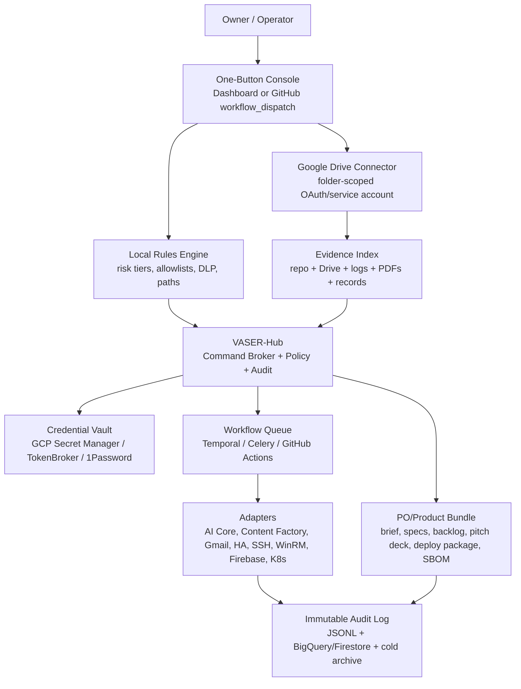

# Unified System Core Revision and One-Button Productization Plan

Date: 2026-05-15  
Scope: `/workspace` repository, declared submodules, local reports/log indexes, Firebase/Docker/Kubernetes/GitHub Actions configuration, and uploaded PDFs.

## 1. Executive Summary

Unified System Core is a monorepo for a personal/business AI operating system. The strongest product thread is a sovereign control plane: VASER-Hub, AI Core, Agent Mail, Content Factory, Google/cloud productivity connectors, and local infrastructure adapters.

The system is valuable but not yet safe to package as a one-button product. The first blocker is security hygiene: credential-looking files are tracked, Docker build contexts can include secrets, several control endpoints are optional-auth or webhook-only, Firestore rules are expired/open-bootstrap style, Node dependency audits show high/critical vulnerabilities, and Python dependency audits cannot be completed cleanly because requirements are not locked.

Recommended product direction: make VASER-Hub the front door and turn the rest of the repository into adapters and workflows behind a policy engine, vault, audit log, and packaging pipeline. The "one button" should trigger a gated productization workflow that scans inputs, applies local rules, indexes Google Drive/local documents, generates the product artifact set, runs security checks, and publishes a signed deployment bundle.

## 2. Repository Inventory

| Area | Purpose | Evidence |
| --- | --- | --- |
| AI Core | Telegram bot, multi-model AI, Home Assistant, Calendar, Linear, Alice, local/dashboard commands | `Projects/AI_Core/README.md`, `Projects/AI_Core/AGENTS.md` |
| VASER-Hub | Control-plane architecture for GPT-originated actions, policy, vault, audit | `docs/architecture/vaser-hub.md`, `docs/security/vaser-action-approval-policy.md` |
| Content Factory | Autonomous content/video generation pipeline | `Projects/Content_Factory/README.md` |
| ChatKit Dashboard | Next/Firebase App Hosting dashboard | `Projects/ChatKit_Dashboard/package.json`, `firebase.json` |
| Firebase backend | Functions, Data Connect, Firestore, Realtime DB, Hosting, Auth emulators | `firebase.json`, `functions/package.json`, `unified/package.json` |
| Bybit bots | Trading/arb automation services and K8s/cloud build assets | `Projects/Bybit_Bot/`, `Projects/Bybit_Arb_Bot/` |
| Orchestration | Mail/Gmail agents, GKE secret sync, deploy/sync scripts | `Scripts/Orchestration/` |
| Reports and records | Prior audits, business plans, logs, generated reports | `Reports/`, `Management/` |
| Agent/knowledge layer | Agent context, MCP servers, skills, coordination docs | `Agent_Context/`, `.agent/`, `.claude/` |

Declared submodules in `.gitmodules`:

1. `External_Tools/Stack/mcp_agent_mail`
2. `infra/cliproxyapi/src`
3. `Projects/AI_Core/antibridge`
4. `Projects/AI_Core/gk-cli`
5. `tools/chrome-devtools-mcp`
6. `Projects/Content_Factory/src/lip_sync/Wav2Lip`
7. `Projects/Content_Factory/src/live_portrait`

`git submodule status` showed the listed submodules with a leading `-`, meaning they are declared but not initialized in this checkout. A full "all repositories" audit must initialize or separately clone them before release.

## 3. Uploaded Document Findings

| File | Status | Extracted facts |
| --- | --- | --- |
| `332716927-1233802008_9d2c.pdf` | Readable Hebrew PDF | Toll/road invoice style document; contains personal billing data. Treat as sensitive PII/financial record. |
| `6030591241116463145-...pdf` | Readable Hebrew PDF | Work-site/mechanical scaffold inspection checklist. Treat as operational/safety record. |
| `89404160_28_1_1_b120.pdf` | Readable Hebrew PDF | Telecom invoice style document; contains personal billing data. Treat as sensitive PII/financial record. |
| `Mercantile_20230430_0115171864_89c2.pdf` | Encrypted | Could not be decrypted with an empty password. Needs owner-provided password or bank export re-download. |
| `The_Sovereign_Core_-_Pitch_Deck_5ee7.pdf` | 13 pages, image-only/no extractable text | Needs OCR before factual extraction. |
| `Vibranium_Presentation_0fb2.pdf` | Readable | Defines "The Sovereign Core / Vibranium & U-Core": digital sovereignty, "blind cloud", local compute orchestrator, isolated agent swarm, PII scrubber before external calls, RSA/HMAC cryptographic controls, and fuel-budget safeguards for agents. |

## 4. Product Facts Verified from Repository Docs

- UniFight/Unified System Core is framed as a "Life & Business Operating System" and digital sovereignty platform for unifying local hardware, cloud, mobile, desktop, and AI workflows (`Reports/UNIFIGHT_CORE_MASTER_PLAN_AND_PITCH.md`).
- VASER is the "Super Admin" / control hub with action brokerage, credential vaulting, policy enforcement, adapters, observability, and audit logs (`docs/architecture/vaser-hub.md`).
- Target users include tech-savvy homeowners, small teams, smart-home providers, ops/automation teams, and product/PM teams (`docs/product/vaser_product_plan.md`, `docs/product/vaser_roadmap_and_presentation.md`).
- Roadmap already exists: MVP action gateway/inventory/vault/policy; beta cloud productivity/audit analytics/presentation generation; launch multi-tenant RBAC/package/onboarding/marketplace connectors.
- Safety model already exists: read-only actions can be automatic; state-changing/destructive actions require explicit confirmation; protected nodes require elevated confirmation and backup proof (`docs/security/vaser-action-approval-policy.md`).
- Content Factory is a revenue/media pipeline; Agent Mail is positioned as autonomous lead/intake workforce; Family Swarm is positioned as a resource pooling/economic engine.

## 5. Security and Vulnerability Register

Severity reflects packaging risk, not exploit confirmation.

| Severity | Finding | Evidence | Required action |
| --- | --- | --- | --- |
| Critical | Tracked credential-looking files and token utilities exist in Git | `Projects/AI_Core/.env.igor`, `config/gmail_credentials.json`, `config/google_drive_credentials.json`, `Projects/AI_Core/gmail_credentials.json`, `Agent_Context/Knowledge_Base/Configs/tailscale_auth_key_temp*.txt`, `test_keys_vault.json`, `Scripts/Utilities/add_tg_token.py`, token broker utilities | Revoke/rotate all exposed secrets, purge from Git history, move to Secret Manager/TokenBroker, add blocking secret scanning. Do not print or reuse old values. |
| Critical | Docker service image can copy repo-wide secrets into images | `infra/docker/Dockerfile.services` uses `COPY . .`; root `.dockerignore` does not exclude `.env*`, credential JSON, token files | Replace broad copy with allowlisted paths; expand `.dockerignore`; scan images with Trivy secret scanner before push. |
| High | Firestore rules are unsafe/expired bootstrap rules | `firestore.rules` allows global read/write until `2026-03-16`; after that client access likely denies all | Replace with per-collection owner/admin rules and emulator tests. |
| High | Control API auth is optional | `Projects/AI_Core/src/api_proxy.py` returns success from `require_api_key` if no token is configured; `/v1/execute` accepts client-supplied `user_id`; binds to `0.0.0.0` | Make auth mandatory; bind user identity to token/server-side session; default-bind localhost behind gateway. |
| High | Alice/webhook and tunnel control surfaces need verification | `Projects/AI_Core/src/alice_skill.py`, `Scripts/automation/alice-tunnel.service` | Verify Yandex/Cloudflare request signatures and limit tunnel exposure. |
| High | K8s credential and pod hardening gaps | `Projects/AI_Core/k8s/deployment-gke.yaml` mounts Google/Gmail credentials from ConfigMaps and sets `OAUTHLIB_INSECURE_TRANSPORT=1` | Use Kubernetes Secrets or Workload Identity; remove insecure OAuth flag; add restricted `securityContext`; narrow RBAC/egress. |
| High | Watchtower and Docker socket exposure | `infra/cliproxyapi/docker-compose.yml` mounts `/var/run/docker.sock`; exposes `8317`; auto-updates containers | Remove Watchtower from production or pin signed digests; enable TLS/auth; bind privately. |
| Medium | Node production dependency vulnerabilities | `npm audit --omit=dev`: `functions` 31 total, 2 critical/13 high; `unified` 15 total, 1 critical/3 high; `Projects/ChatKit_Dashboard` 4 total, 1 critical/1 high | Upgrade direct deps, regenerate lockfiles, add Dependabot and blocking `npm audit` in CI. |
| Medium | Python requirements are not auditable/reproducible | `pip-audit --no-deps --disable-pip` fails because requirements use broad/unpinned ranges; full audit also blocked by missing `python3.12-venv` in this environment | Generate locked requirements with hashes; install `python3.12-venv` in agent image; run `pip-audit` against lockfiles. |
| Medium | CI security scans are not consistently blocking | `.github/workflows/deploy.yaml` uses `continue-on-error: true` and `fail-build: false`; Trivy in `build.yml` runs only for PR/dry-run and uses `aquasecurity/trivy-action@master` | Pin actions, scan pushed images, fail on high/critical unless waived, add CodeQL/Semgrep/gitleaks. |
| Medium | Privacy/PII tracked in operational artifacts | `Reports/email_actions.json`, conversation exports, uploaded invoices, personal records | Classify, encrypt, relocate to private storage, add DLP scanning before commits. |

## 6. Target Architecture



Key principle: GPT/agents never receive raw secrets. They send structured intents to VASER-Hub. VASER-Hub validates policy, fetches scoped credentials from the vault, dispatches adapters, and writes immutable audit events.

## 7. Step-by-Step Plan: Tools, Configuration, and Outputs

### Phase 0 - Containment and Evidence Freeze

| Step | Tool | Configure | Output |
| --- | --- | --- | --- |
| 0.1 | `gitleaks` or `trufflehog` | Scan repository and history; fail on detected secrets; redact reports | Secret inventory without values |
| 0.2 | Provider consoles | Revoke/rotate Telegram, Google OAuth/service accounts, Tailscale, GitHub/API, Bybit, Content Factory provider tokens | Clean credential baseline |
| 0.3 | `git-filter-repo` or BFG | Remove secret files from history after rotation | Sanitized Git history |
| 0.4 | GCP Secret Manager + TokenBroker | Store all runtime credentials by environment and adapter; disable hardcoded fallbacks | Central vault source of truth |

### Phase 1 - Reproducible Audit Baseline

| Step | Tool | Configure | Output |
| --- | --- | --- | --- |
| 1.1 | `npm audit --omit=dev` | Run for `functions`, `unified`, `Projects/ChatKit_Dashboard`, `Projects/antigravity-vscode` | Node vulnerability gate |
| 1.2 | `pip-tools` + `pip-audit` | Convert broad Python requirements to locked, hashed files | Auditable Python dependencies |
| 1.3 | `syft` + `grype` or Trivy | Generate SBOM and vulnerability report for Docker images | Signed SBOM and image risk report |
| 1.4 | CodeQL + Semgrep + Ruff + pytest | Add GitHub Actions jobs; fail on high-confidence security issues | CI quality gate |
| 1.5 | Dependabot/Renovate | Enable for npm, pip, Docker, GitHub Actions | Automated dependency PRs |

### Phase 2 - Secure Control Plane

| Step | Tool | Configure | Output |
| --- | --- | --- | --- |
| 2.1 | FastAPI/VASER-Hub | Mandatory auth middleware, RBAC/ABAC, correlation IDs | Safe command broker |
| 2.2 | OPA or Cedar policy | Encode `docs/security/vaser-action-approval-policy.md` as machine-enforced policies | Default-deny action guard |
| 2.3 | Vault adapter | GCP Secret Manager first; TokenBroker local fallback; no plaintext repo credentials | Scoped secret retrieval |
| 2.4 | Audit logger | Append-only JSONL locally plus Firestore/BigQuery sink | Immutable action log |
| 2.5 | API Gateway/Cloudflare Access/Tailscale Serve | Expose only authenticated endpoints; keep dangerous adapters private | Controlled ingress |

### Phase 3 - Google Drive and Local Rules Integration

| Step | Tool | Configure | Output |
| --- | --- | --- | --- |
| 3.1 | Google Cloud Console | Enable Drive API; create service account or OAuth client; use least scopes: `drive.metadata.readonly` for inventory, `drive.readonly` for ingestion, `drive.file` only for files the app creates | Drive credentials in vault |
| 3.2 | Drive connector | Folder allowlist, MIME allowlist, file-size limits, OCR queue for image PDFs, dedupe by file ID/checksum | Safe Drive ingestion |
| 3.3 | Local rules file | Create `config/local_rules.yaml` with allowed roots, denied globs, PII classes, risk tiers, approval requirements, retention | Deterministic local policy |
| 3.4 | DLP/OCR | Use Google Document AI or Tesseract for image PDFs; use Google DLP or Presidio for PII detection | Classified document index |
| 3.5 | Vector/index store | Use SQLite/Postgres + embeddings only after PII scrub; store source hash and access policy | Searchable evidence index |

Suggested `local_rules.yaml` shape:

```yaml
version: 1
default_policy: deny
allowed_roots:
  - /workspace/Reports
  - /workspace/docs
  - /workspace/Projects
denied_globs:
  - "**/.env*"
  - "**/*credential*.json"
  - "**/*token*"
  - "**/*secret*"
  - "**/*.pem"
pii:
  classify: true
  redact_before_llm: true
actions:
  read_only:
    approval: none
  state_changing:
    approval: "APPROVE VASER ACTION <action_id>"
  protected:
    approval: "APPROVE VASER PROTECTED ACTION <action_id>"
    require_backup_younger_than_hours: 24
retention:
  hot_days: 90
  cold_days: 1095
```

### Phase 4 - One-Button Productization

Interpretation: "PO" is treated here as a productized offering/software package. If PO means purchase order, the same architecture can generate procurement artifacts instead.

| Step | Tool | Configure | Output |
| --- | --- | --- | --- |
| 4.1 | `vaserctl` CLI | `vaserctl po build --rules config/local_rules.yaml --drive-folder <id> --target product_bundle/` | Local one-command build |
| 4.2 | GitHub Actions `workflow_dispatch` | Button inputs: Drive folder ID, product profile, output format, release draft yes/no | Cloud one-button build |
| 4.3 | Product generator | Templates for PRD, architecture, risk register, pitch deck, backlog, deployment guide | Product/PO artifact set |
| 4.4 | Package builder | Docker Compose/Helm/Firebase bundle, `.env.example`, SBOM, signed provenance | Deployable release bundle |
| 4.5 | Dashboard button | Web UI calls VASER-Hub `/productize` action; action runs only after policy checks | Non-technical "press one button" UX |

Minimum artifacts from the one-button run:

1. `product_brief.md`
2. `technical_architecture.md`
3. `security_risk_register.md`
4. `implementation_backlog.json`
5. `pitch_deck.pptx` or `pitch_deck.pdf`
6. `deployment_bundle.zip`
7. `sbom.spdx.json`
8. `audit_log.jsonl`

## 8. Immediate Backlog

1. Rotate and purge committed secrets.
2. Fix `.dockerignore` and remove repo-wide `COPY . .` from production Dockerfiles.
3. Replace Firestore rules and add emulator tests.
4. Make AI Core API auth mandatory and remove client-supplied identity trust.
5. Lock and audit Node/Python dependencies.
6. Initialize submodules and run separate audits for each declared repository.
7. OCR the image-only Sovereign Core deck and decrypt/re-export the Mercantile PDF if it must be part of the product knowledge base.
8. Implement `local_rules.yaml` and VASER policy enforcement.
9. Build `vaserctl po build` and matching GitHub Actions `workflow_dispatch`.
10. Add a dashboard button only after the CLI/workflow path is deterministic and auditable.

## 9. Verification Commands Used in This Revision

- `git submodule status`
- `git ls-files | rg -i '...'` for sensitive path inventory
- `npm audit --omit=dev --json` for Node projects
- `python3 -m pip_audit ...` attempts for Python requirements
- `pypdf` extraction for uploaded PDFs
- Direct reads of `firebase.json`, `firestore.rules`, `.dockerignore`, Dockerfiles, K8s manifests, GitHub Actions, VASER/product docs, and AI Core control API files

## 10. Environment Note

`pip-audit` was installed in the agent user environment to run this revision. Full Python dependency auditing needs `python3.12-venv` in the base image and locked requirements files; otherwise dependency resolution fails before vulnerability evaluation.
