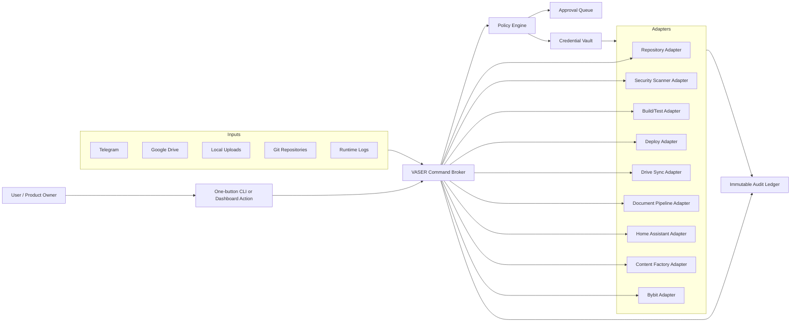

# Unified System revision and one-button architecture plan

Date: 2026-05-15
Branch: `cursor/system-revision-architecture-94fb`
Base: `main`

## 1. Purpose

This report is a first-pass revision of the Unified System Core repository and
the uploaded documents. It records confirmed facts, security findings, log
signals, and a target architecture for turning the system into a controlled
one-button operating/product workflow.

The report intentionally does not print secret values, personal identifiers, or
full document contents. Several files contain sensitive material and require
rotation and history cleanup before any production rollout.

## 2. Scope and evidence

Reviewed sources:

- Root navigation and architecture: `README.md`, `SYSTEM_MAP.md`,
  `SYSTEM_LOGIC.md`, `STATUS_NOW.md`, `RUNBOOK_GKE_CLOUD_FACTORY_CRYPTO_HA.md`.
- Security and deployment: `SECURITY.md`, `.gitignore`, `.gitmodules`,
  `docker-compose.yml`, `firebase.json`, `.github/workflows/*.yml`,
  `Projects/AI_Core/k8s/*`, `Projects/Bybit_Bot/k8s/*`, Dockerfiles.
- Applications: `Projects/AI_Core`, `Projects/Content_Factory`,
  `Projects/Bybit_Bot`, `Projects/ChatKit_Dashboard`, `functions`, `unified`,
  `Scripts`, `infra`, and selected reports/logs.
- Uploaded PDFs in the Cursor upload area:
  - Road/transport invoice PDF with personal billing data.
  - Scaffolding daily safety checklist PDF.
  - Cellcom invoice PDF with personal billing data.
  - One password-protected bank PDF that could not be parsed without a password.
  - Sovereign Core / Vibranium pitch material; one deck was text-extractable,
    one appeared image-only/empty to the text extractor.

Commands/checks run:

- Git inventory: tracked file count, recent commits, submodule status.
- Secret indicator search by path only; no secret values included here.
- `npm audit --omit=dev --audit-level=high --json` for:
  `Projects/ChatKit_Dashboard`, `functions`, `unified`,
  `Projects/antigravity-vscode`.
- `pip-audit --local` for the current Python environment.
- Attempted `pip-audit -r` for Python requirement files; blocked by missing
  `python3.12-venv`/`ensurepip` in this cloud image.
- GitHub repository metadata via `gh repo view`; Dependabot alert API returned
  403 for this integration.

Limitations:

- Six tracked gitlinks are uninitialized in this checkout, so their contents
  were not audited locally:
  `Projects/AI_Core/antibridge`, `Projects/AI_Core/gk-cli`,
  `Projects/Content_Factory/src/lip_sync/Wav2Lip`,
  `Projects/Content_Factory/src/live_portrait`, `infra/cliproxyapi/src`,
  `tools/chrome-devtools-mcp`.
- `.gitmodules` also references `External_Tools/Stack/mcp_agent_mail`, but that
  path is not present in this checkout's tracked gitlinks.
- Google Drive was not connected from this environment. Google Drive rules below
  are therefore architecture/configuration requirements, not a live Drive scan.

## 3. Confirmed repository facts

### 3.1 Repository shape

- Main repository: `Unified-system-Core/Unified_System_Core`, private GitHub
  repo, default branch `main`.
- Tracked files in the checkout: 2,483.
- Primary domains:
  - `Projects/AI_Core`: Telegram AI bot and personal control plane.
  - `Projects/Content_Factory`: autonomous content/video pipeline.
  - `Projects/Bybit_Bot` and `Projects/Bybit_Arb_Bot`: crypto trading bots.
  - `Projects/ChatKit_Dashboard`: Next.js dashboard.
  - `functions` and `unified`: Firebase/Genkit/Data Connect functions.
  - `Scripts`: orchestration, automation, security, reporting, integrations.
  - `infra`, `.github`, `firebase.json`: deployment and CI/CD surfaces.
  - `Reports`: audit history and runtime logs.

### 3.2 Runtime topology already described by the repo

The current intended topology is hybrid:

1. Telegram user commands enter `Projects/AI_Core`.
2. AI Core runs in GKE for bot/control-plane tasks.
3. Heavy jobs run on a Cloud Server or local node:
   - Content Factory render/scheduler.
   - Bybit bot processes under PM2/Kubernetes.
4. Home Assistant is controlled through HA REST.
5. Tailscale mesh connects personal/cloud/local machines.
6. Google/Firebase services are used for Firestore, functions, app hosting,
   Data Connect, monitoring, and deployment.

Evidence:

- `README.md` describes the Tailscale node map and AI bot integrations.
- `RUNBOOK_GKE_CLOUD_FACTORY_CRYPTO_HA.md` describes the GKE bot -> SSH cloud
  factory -> PM2 crypto -> HA REST flows.
- `docs/architecture/vaser-hub.md` describes the intended VASER control hub:
  command broker, credential vault, policy layer, adapters, and audit pipeline.

### 3.3 One-button foundations already exist

The repo already has the building blocks for a one-button workflow:

- `unified.py`: master controller for status, factory, mail, sync, brief, and
  dashboard actions.
- `Scripts/Orchestration/vibranium-sync.sh`: powerful multi-step sync/deploy
  script that lints, commits, syncs, updates remote state, applies Kubernetes,
  and restarts Compose.
- `.github/workflows/build.yml` and `.github/workflows/deploy.yaml`: container
  build, SBOM/scan, attestation, and GKE deployment.
- `docker-compose.yml`: local/container service composition.

These should be reused, but not exposed as an unrestricted one-button deploy
until the critical security gates below are closed.

## 4. Security and vulnerability findings

Severity is based on immediate blast radius, likelihood, and deployment impact.

### 4.1 Critical: tracked secret and credential artifacts

Tracked files include credential/session-looking artifacts:

- `Projects/AI_Core/.env.igor`
- `Projects/AI_Core/config/gmail_credentials.json`
- `Projects/AI_Core/gmail_credentials.json`
- `config/gmail_credentials.json`
- `config/google_drive_credentials.json`
- `Projects/Content_Factory/insta_session.json`
- `Projects/Content_Factory/src/uploaders/.threads_state.json`

Required action:

1. Revoke/rotate all credentials represented by these files.
2. Replace committed files with templates only.
3. Remove the sensitive files from Git history with `git filter-repo` or BFG.
4. Add pre-commit and CI secret scanning with redacted output.

### 4.2 Critical: sensitive logs and records are tracked

Tracked logs/records include runtime output and personal data:

- `Reports/*.err`
- `Reports/email_actions.json`
- `Projects/AI_Core/src/emails_4_months.json`
- `Projects/AI_Core/src/latest_emails.json`
- `Scripts/openai_data_integration/data/raw/conversations.json`

Confirmed log signals:

- `Reports/content_factory.err`: repeated `ModuleNotFoundError: No module named
  'schedule'`, meaning the factory runtime did not have installed dependencies.
- `Reports/mail_processor.err`: repeated MCP mail registration/connectivity
  failures, including 403 and connection reset states.
- `Reports/bot_igor.err` and `Reports/bot_kostya.err`: duplicate Telegram
  polling conflicts, dashboard port conflicts, pending tasks on shutdown,
  unclosed database resource warnings, and sensitive runtime output.

Required action:

1. Rotate secrets that appeared in logs.
2. Purge logs and personal records from Git history.
3. Store logs in Cloud Logging or an encrypted local log store, not Git.
4. Add structured redaction filters for Telegram tokens, OAuth tokens, API keys,
   emails, addresses, phone numbers, and national IDs.

### 4.3 High: Docker image build context can include secrets

`infra/docker/Dockerfile.services` copies the entire repository:

```text
COPY . .
```

If the build context includes credentials, reports, raw exports, or local state,
they can be baked into layers.

Required action:

- Add a strict root `.dockerignore` excluding at minimum:
  `.env*`, `**/*credentials*.json`, `**/*token*.json`, `Reports/`,
  `Agent_Context/`, `Scripts/openai_data_integration/data/raw/`,
  social session files, local DBs, media, and caches.
- Prefer minimal build contexts per service.
- Verify images with `trivy fs`, `trivy image`, and layer inspection.

### 4.4 High: Kubernetes credential handling and pod hardening gaps

Findings:

- `Projects/AI_Core/k8s/deployment-gke.yaml` mounts Google/Gmail credential
  material through ConfigMaps.
- The same manifest sets `OAUTHLIB_INSECURE_TRANSPORT=1`.
- Several manifests lack container hardening controls:
  `runAsNonRoot`, `allowPrivilegeEscalation: false`,
  `readOnlyRootFilesystem`, dropped Linux capabilities, and seccomp profiles.
- Network policy allows broad egress to `0.0.0.0/0` on 80/443.
- Some Bybit Kubernetes config uses plaintext database credentials in manifests.

Required action:

- Move credential material to Secret Manager or Kubernetes Secrets.
- Remove insecure OAuth transport from production.
- Add pod/container security contexts and namespace policies.
- Use egress allowlists for known providers or route all egress through a
  monitored egress gateway.

### 4.5 High: dependency vulnerabilities

Node audit results:

| Package area | Result |
| --- | --- |
| `Projects/ChatKit_Dashboard` | 4 total advisories: 1 critical, 1 high, 2 moderate. Critical `protobufjs`; high `next`. |
| `functions` | 31 total advisories with production deps: 2 critical, 13 high, 4 moderate, 12 low. Affected areas include Genkit, OpenTelemetry, `fast-uri`, `fast-xml-parser`. |
| `unified` | 15 total advisories with production deps: 1 critical, 3 high, 2 moderate, 9 low. Affected areas include `protobufjs`, `fast-xml-parser`, `node-forge`, `path-to-regexp`. |
| `Projects/antigravity-vscode` | 0 advisories in the audited lockfile. |

Python audit:

- `pip-audit --local` found 27 known vulnerabilities in 9 installed packages in
  the cloud image, including `ansible`, `ansible-core`, and an older installed
  `cryptography`.
- Repo requirements audit could not complete because this image lacks
  `python3.12-venv`/`ensurepip`.
- Python requirement files include many unpinned dependencies, especially in
  `Projects/Content_Factory/requirements.txt`.

Required action:

- Run `npm audit fix` or targeted upgrades in the Node packages, then build/test.
- Pin Python dependency ranges through lockfiles (`uv.lock` per app or a
  generated constraints file).
- Install `python3-venv` in the cloud agent image and run `pip-audit -r` for all
  requirements files in CI.

### 4.6 High: CI/CD preview deploy risk

`.github/workflows/preview.yaml` authenticates to Google, pushes preview images,
and applies Kubernetes resources for pull requests. This is powerful and should
be restricted to trusted code paths.

Required action:

- Use GitHub environments with required reviewers for preview deploy.
- Restrict OIDC deploy permissions to trusted branches or explicitly approved
  PRs.
- Make security scans blocking, not `continue-on-error`.
- Pin GitHub actions and avoid mutable `@master` actions for security steps.

### 4.7 High: public-facing dashboard/API spend risk

`Projects/ChatKit_Dashboard/src/app/api/chat/route.ts` should be reviewed and
hardened before any public exposure. The security pass identified missing
application auth/rate limits/body-size limits as a quota and prompt-abuse risk.

Required action:

- Add auth, per-user/IP quotas, request-size limits, model allowlists, and abuse
  logging.

### 4.8 High: uploaded document handling and MarkItDown risk

Uploaded document handling needs a trust boundary. The current system accepts
document text into context and LLM flows without a complete sanitization layer.
The MarkItDown MCP-style converter must not be allowed to read arbitrary local
paths.

Required action:

- Accept uploads only into an allowlisted staging directory.
- Validate MIME type and file size.
- Scan for malware and prompt-injection markers.
- Run PII detection/redaction before the LLM sees content.
- Keep raw files encrypted with retention rules.
- Restrict MarkItDown to upload IDs, not arbitrary filesystem paths.

### 4.9 Medium: Firebase rules are broad/stale

`firestore.rules` uses a broad read/write rule with an expiry date. Before
expiry this is too open; after expiry it can break clients unexpectedly.

Required action:

- Replace with authenticated, user-scoped rules.
- Add emulator tests for allow/deny paths.

### 4.10 Medium: current `check_secrets.py` prints secret values

The helper prints matched secret values directly. That creates a second leak
path through terminal logs, CI logs, and reports.

Required action:

- Replace it with a scanner that reports file path, rule ID, and match type only.
- Use `gitleaks detect --redact` or `trufflehog --json` with redaction.

## 5. Uploaded document assessment

The uploaded documents should be treated as personal/confidential records:

- Invoices include personal billing details.
- The safety checklist includes workplace details and signatures/names.
- The bank PDF is password-protected and was not inspected.
- The pitch material is marked confidential and describes Sovereign Core /
  Vibranium concepts around local AI, "blind cloud", PII scrubbing, RSA/HMAC,
  agent sandboxes, and cost/budget controls.

Recommended handling:

1. Store raw PDFs only in an encrypted `incoming/raw` area.
2. Extract text into `incoming/extracted` with source metadata and hash.
3. Run PII/DLP redaction before indexing.
4. Classify as `personal`, `financial`, `worksite`, or `confidential_pitch`.
5. Only sanitized summaries should enter the knowledge base or LLM context.
6. Bank/password-protected PDFs should be queued as `needs_user_password` and
   never brute-forced.

## 6. Target architecture

### 6.1 Core principle

Move from "many powerful scripts" to a controlled operating system:

- One ingress.
- One policy layer.
- One credential vault.
- One audit ledger.
- Many adapters.
- Explicit data classifications.
- Reproducible one-button workflows with dry-run and approval gates.

### 6.2 Proposed logical architecture



### 6.3 Data zones

| Zone | Purpose | Storage | Rules |
| --- | --- | --- | --- |
| `raw` | Original uploaded/Drive files | Encrypted bucket or encrypted local folder | No LLM access; retention clock starts immediately |
| `quarantine` | Unknown or untrusted files | Isolated folder/bucket prefix | Scan before moving |
| `extracted` | OCR/text output | Encrypted storage | Include file hash and source metadata |
| `sanitized` | PII-redacted text | Knowledge base staging | Allowed for LLM/context |
| `indexed` | Vector/search index | Firestore/Data Connect/vector DB | Only sanitized records |
| `audit` | Action and decision records | Append-only logs | No raw secrets; redacted identifiers |
| `release` | Build artifacts | GHCR/GAR, signed images | SBOM, vulnerability gate, provenance |

### 6.4 Control-plane components

1. `one_button` command
   - Thin CLI/dashboard wrapper.
   - Calls VASER Broker with a typed action: `revise`, `sync_drive`, `scan`,
     `build`, `deploy`, `publish_report`, `factory_run`.

2. VASER Broker
   - Validates JSON schema.
   - Assigns `request_id`.
   - Routes to adapters.

3. Policy Engine
   - Allows safe read-only scans automatically.
   - Requires approval for deploys, external publishing, trading operations,
     secret rotation, delete actions, and history rewrites.

4. Credential Vault
   - Preferred: GCP Secret Manager for cloud; TokenBroker for local.
   - Secrets are referenced by name, never copied into Git or reports.

5. Audit Ledger
   - JSONL/Cloud Logging format:
     `request_id`, actor, action, target, policy decision, artifact hashes,
     result, redacted error, timestamp.

6. Adapters
   - Repository: Git status, submodule init, branch/commit/PR.
   - Security: gitleaks/trufflehog, npm audit, pip-audit, trivy, conftest.
   - Build/test: pytest, ruff, mypy, npm test/build, Firebase emulator tests.
   - Deploy: GitHub Actions, Cloud Build, kubectl, Firebase CLI.
   - Drive: Google Drive API sync with DLP/retention rules.
   - Document pipeline: OCR/MarkItDown in a sandbox, PII scrubber, indexer.

## 7. Google Drive and local rules design

### 7.1 Google Drive folder contract

Recommended Drive folders:

```text
Unified_System/
  00_inbox/
  01_quarantine/
  02_raw_encrypted/
  03_extracted/
  04_sanitized/
  05_indexed_exports/
  06_reports/
  07_release_artifacts/
  99_archive/
```

Rules:

- `00_inbox`: human drop zone only.
- `01_quarantine`: automatic move on first sync.
- `02_raw_encrypted`: original files, encrypted, no LLM access.
- `03_extracted`: OCR/text extraction outputs with hashes.
- `04_sanitized`: PII-redacted text only.
- `05_indexed_exports`: knowledge-base export files only.
- `06_reports`: audit reports and status summaries.
- `07_release_artifacts`: SBOMs, signed image digests, release notes.
- `99_archive`: retention-controlled archive.

### 7.2 Local rules contract

Recommended local rules file:

```yaml
version: 1
roots:
  repo: /workspace
  drive_mount: /mnt/google-drive/Unified_System
  inbox: /mnt/google-drive/Unified_System/00_inbox
  quarantine: /mnt/google-drive/Unified_System/01_quarantine
  raw: /mnt/google-drive/Unified_System/02_raw_encrypted
  sanitized: /mnt/google-drive/Unified_System/04_sanitized
  reports: /workspace/Reports
classification:
  default: untrusted
  pii_patterns: enabled
  financial_documents: restricted
  confidential_pitch: restricted
actions:
  delete: approval_required
  deploy: approval_required
  publish_external: approval_required
  scan_readonly: auto_allowed
retention:
  raw_days: 90
  logs_days: 30
  reports_days: 365
```

### 7.3 Tools to configure

| Need | Tool | Configuration |
| --- | --- | --- |
| Drive sync | Google Drive API service account or OAuth client | Scope to one Drive folder; store credentials in Secret Manager; never commit JSON credentials |
| DLP/PII | Google Cloud DLP or Presidio | Detect emails, phones, addresses, IDs, cards, tokens; output redacted text |
| OCR/text extraction | MarkItDown, Tesseract, Google Document AI | Run in sandbox; input by file ID only; no arbitrary path reads |
| Malware scan | ClamAV or cloud scanning API | Scan quarantine before extraction |
| Secrets scan | gitleaks/trufflehog | Redacted output; pre-commit and CI |
| Dependency scan | npm audit, pip-audit, OSV-Scanner | Blocking high/critical in CI |
| Container scan | Trivy/Grype | Block critical/high except approved waivers |
| K8s policy | conftest/OPA or Kyverno | Deny ConfigMap secrets, hostPath, root containers, broad egress |
| Audit | Cloud Logging + JSONL local fallback | Correlation IDs and redaction |

## 8. Step-by-step implementation plan

### Phase 0: Stop current leakage

1. Revoke/rotate all credentials represented by tracked `.env`, credential JSON,
   session JSON, and runtime log files.
2. Disable or replace any exposed Telegram/OAuth/API tokens.
3. Freeze external deploys until rotation is complete.
4. Preserve forensic copies outside Git if needed, then remove sensitive files
   from Git history.

Tools:

- GCP Secret Manager, Telegram BotFather, Google Cloud Console, GitHub token
  settings, Instagram/Threads session reset, `git filter-repo` or BFG.

### Phase 1: Repository cleanup and guardrails

1. Replace committed credentials/logs/raw data with `.example` templates.
2. Expand `.gitignore` and add `.dockerignore`.
3. Replace `check_secrets.py` with redacted scanner output.
4. Add pre-commit hooks:
   - `ruff`
   - secret scan
   - YAML/JSON validation
5. Add CI gates:
   - secret scan
   - npm audit
   - pip-audit
   - Trivy filesystem scan
   - K8s policy scan

Tools:

- gitleaks/trufflehog, pre-commit, ruff, npm audit, pip-audit, trivy, conftest.

### Phase 2: Dependency and runtime hardening

1. Upgrade Node packages in `Projects/ChatKit_Dashboard`, `functions`, and
   `unified`.
2. Generate Python lock/constraints files for AI Core, Content Factory, and
   Bybit apps.
3. Install `python3-venv` in the cloud agent base image so `pip-audit -r` works.
4. Add Docker non-root users and minimal build contexts.
5. Add Kubernetes security contexts and remove ConfigMap-based secrets.

Tools:

- npm, pip-audit, uv or pip-tools, Docker Buildx, Trivy, kubectl, Secret Manager.

### Phase 3: Google Drive and local rules pipeline

1. Create Drive folder contract from section 7.
2. Store Drive credentials in Secret Manager.
3. Build a `DriveSyncAdapter`:
   - read folder delta
   - hash files
   - move new files to quarantine
   - scan malware
   - extract text
   - redact PII
   - write sanitized output
   - log audit record
4. Add local rules YAML.
5. Add dry-run mode and approval-required delete mode.

Tools:

- Google Drive API, Cloud DLP/Presidio, MarkItDown/Tesseract, JSONL audit logs.

### Phase 4: VASER one-button broker

1. Define actions:
   - `revise_system`
   - `scan_security`
   - `sync_drive`
   - `build_all`
   - `deploy_preview`
   - `deploy_prod`
   - `publish_report`
   - `factory_run`
2. Implement command schema validation.
3. Add policy decisions:
   - read-only scans: auto.
   - report generation: auto.
   - deploy/delete/secret rotation/trading: approval required.
4. Emit one audit record per action.
5. Wire the broker to `unified.py` or a new `Scripts/Orchestration/one_button.py`.

Tools:

- Pydantic for schemas, FastAPI/CLI for command entry, Cloud Logging/JSONL for
  audit, Secret Manager/TokenBroker for secrets.

### Phase 5: Product/PO packaging

Interpretation: "PO" can mean a productized offering or packaged software
workflow. The repo should expose one safe front door:

```bash
python unified.py po --mode revise --dry-run
python unified.py po --mode ship --approve <approval-id>
```

The button should produce:

1. Repository/security revision report.
2. Drive/local-rule sync report.
3. Dependency and container scan report.
4. Build artifacts and SBOM.
5. Deployment preview URL or GKE namespace.
6. Final go/no-go summary.

The dashboard equivalent can be a single "Run PO Revision" button that calls
the same broker action and shows the audit ledger.

## 9. Immediate prioritized backlog

1. Rotate/revoke exposed credentials and purge sensitive files from Git history.
2. Add `.dockerignore` and stop copying full repo into service images.
3. Upgrade vulnerable Node dependencies and add blocking audit gates.
4. Replace ConfigMap credentials with Secrets/Secret Manager.
5. Remove tracked runtime logs and raw personal records.
6. Add Drive/local rules YAML and quarantined document pipeline.
7. Harden preview deploy workflow with environment approvals.
8. Add auth/rate limits to ChatKit API.
9. Add K8s security contexts and egress policy.
10. Convert `vibranium-sync.sh` behavior into a brokered one-button workflow
    with dry-run and approval gates.

## 10. Acceptance criteria for "press one button"

The one-button workflow is ready only when:

- No credentials, sessions, logs, raw emails, or personal PDFs are tracked by Git.
- Secret scanning passes with redacted output in pre-commit and CI.
- Node/Python dependency scans pass high/critical gates or have approved waivers.
- Docker images are built from minimal contexts and scan clean.
- K8s manifests pass policy checks for secrets, root users, hostPath, and egress.
- Drive sync processes only allowlisted folders and produces sanitized records.
- All actions produce audit records with correlation IDs.
- Destructive/deploy/trading actions require approval.
- A dry-run report can be generated without changing external systems.

