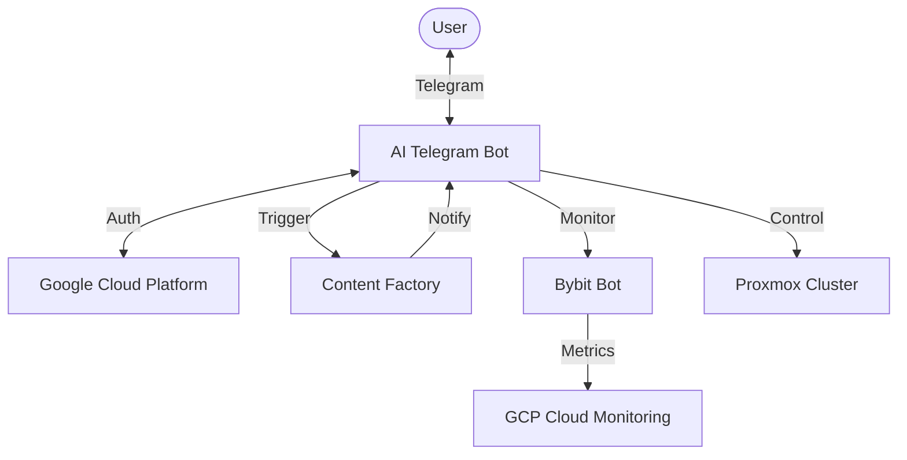

# 🧠 Unified System Core: Central Logic & Architecture

## 🌐 Overview

The **Unified System Core** is an autonomous multi-agent ecosystem
designed for high-frequency trading, content production,
and personal optimization.

## 🧱 Core Components

### 1. 🤖 AI Core (Master Orchestrator)

- **Repo:** `Projects/AI_Core`
- **Primary Agent:** `ai_telegram_bot_v2.py`
- **Functions:**
  - Central UI/UX for the system via Telegram.
  - User Authentication (GCP/Google Auth).
  - Resource Management (Proxmox Controller).
  - Swarm Orchestration (Gemini Token Pool).
- **Status:** Operational. Fixed `unified_monitoring` heartbeat.

### 2. 📈 Bybit Bot (Financial Engine)

- **Repo:** `Projects/Bybit_Bot`
- **Stack:** Python, Redis, TimescaleDB, Kubernetes.
- **Functions:**
  - High-frequency ingestion of market data.
  - Alpha-strategy execution.
  - Risk & Compliance guardrails.
- **Status:** Running in GKE (namespace: `trading`). Binary Authorization active.

### 3. 🏭 Content Factory (Creative Engine)

- **Repo:** `Projects/Content_Factory`
- **Pipelines:**
  - `daily_researcher.py`: Autonomous news research -> Script generation.
  - `orchestrator_v3_no_face.py`: Video assembly (Audio -> Image -> Video).
- **Logic:** Connected to AI Core for manual triggers and status updates.
- **Status:** Operational. Produces 9:16 viral content.

### 4. 🏘️ Home Assistant (Environment Control)

- **Repo:** `Home_Assistant_Config`
- **Focus:** Home automation and hardware monitoring.

## 📊 System Integration Map

## 📋 Ongoing Governance

- **Sync:** Automated via `git push origin main`.
- **Deployment:** Managed via `cloudbuild.yaml` and `k8s/` manifests.
- **Monitoring:** Integrated via `unified_monitoring` to Google Cloud Dashboards.

---

## 🧩 Task Systemization (2026-02-14)

- **Unified summary:** `Management/UNIFIED_TASKS_SUMMARY_2026-02-14.md`
- **Raw extraction:** `Management/UNIFIED_TASKS_2026-02-14.md`
- **Code TODOs snapshot:** `Management/CODE_TODOS_2026-02-14.md`

> Эти файлы агрегируют задачи со всей системы и дают приоритизацию по доменам.

---

### System Info

Created: 2026-02-14 | Antigravity AI
