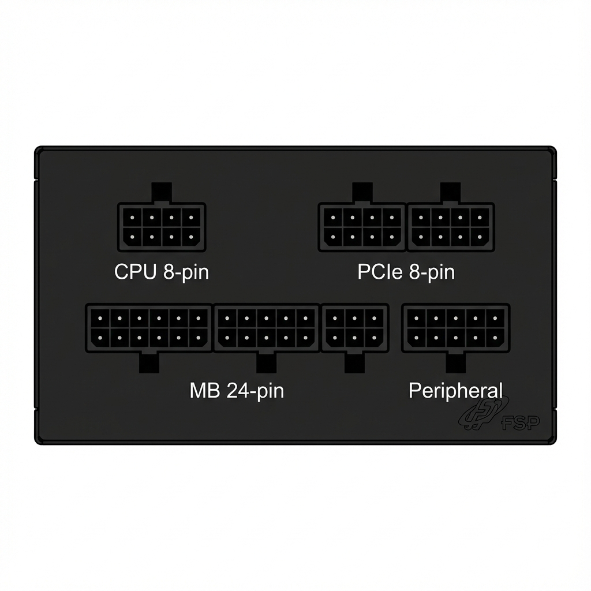
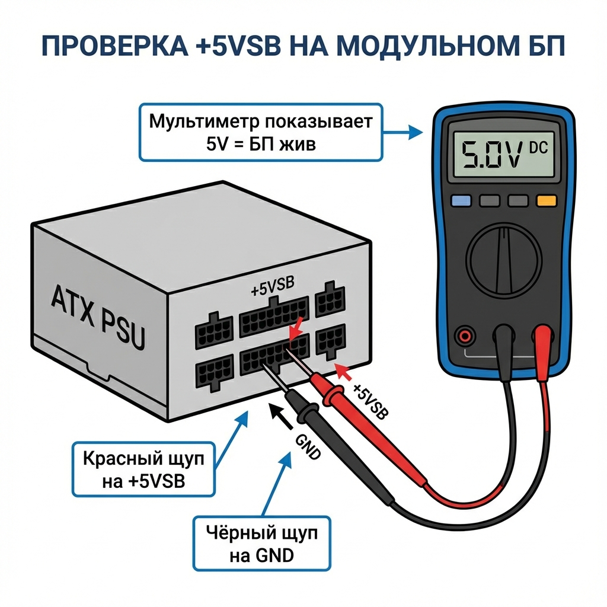
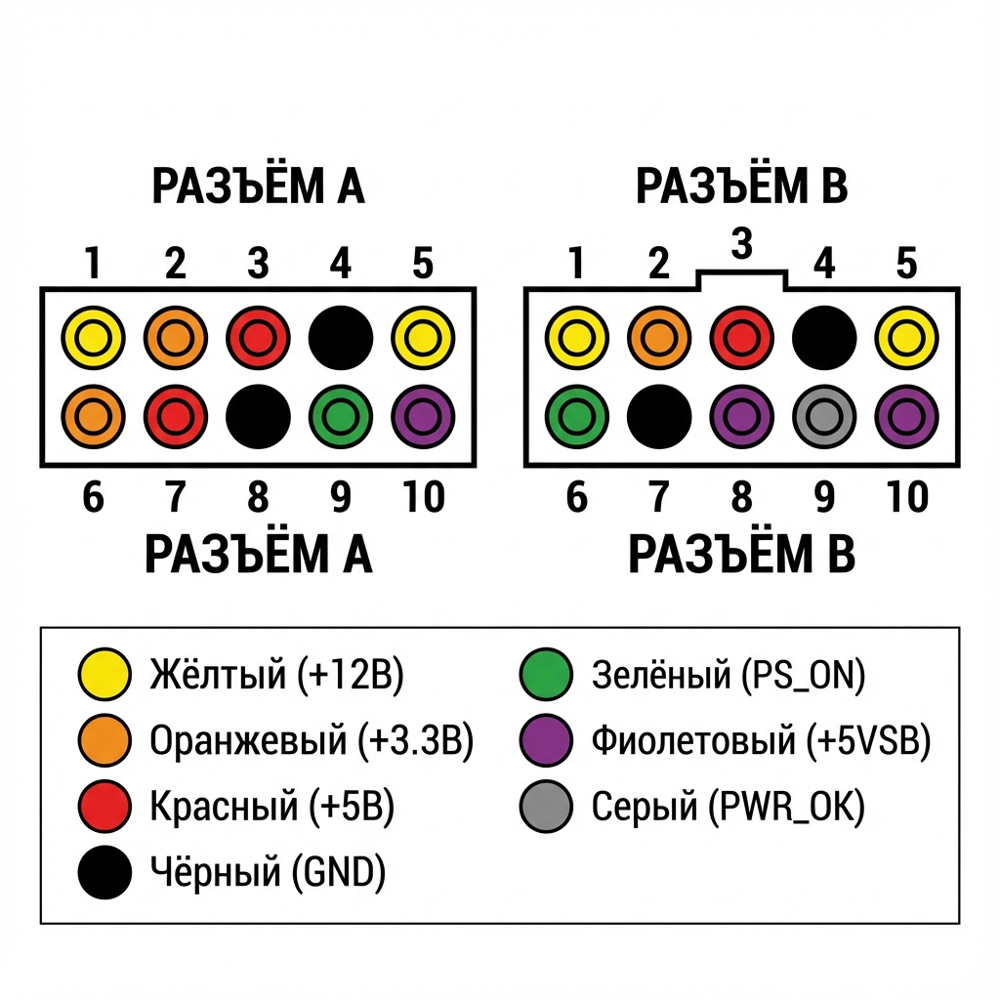
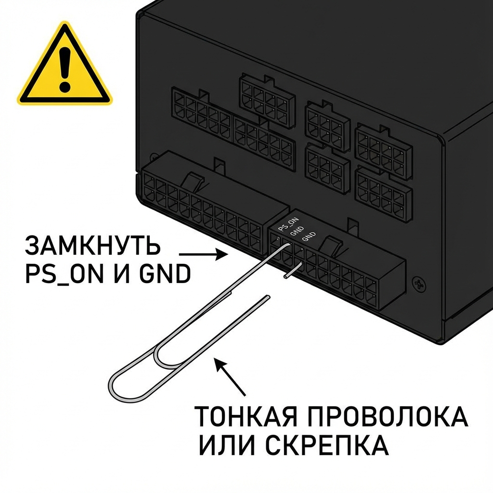

# 🔌 Руководство по проверке модульного БП FSP DAGGER Pro 850W

> **Твоя ситуация:** БП включён в сеть, вентилятор НЕ крутится, пробки не выбивает.
> Это может означать: БП в режиме ожидания (standby) ИЛИ неисправен.

---

## ⚠️ МЕРЫ БЕЗОПАСНОСТИ

> **ВНИМАНИЕ!** Работа с БП может быть опасна!

1. ⚡ **Высокие напряжения** сохраняются в конденсаторах даже после отключения
2. 🔌 При измерениях **НЕ отключай** БП от сети (иначе +5VSB не будет)
3. 🖐️ **НЕ касайся** голых контактов пальцами
4. 🔧 Используй **тонкие щупы** мультиметра

---

## 📋 Что понадобится

- 🔧 **Мультиметр** (любой цифровой)
- 📎 **Тонкая проволока** или разогнутая скрепка
- 📝 Эта инструкция

---

## 🔍 Особенности модульного БП

У FSP DAGGER Pro 850W **все кабели съёмные** и на самом БП только разъёмы **без цветовой маркировки проводов**.



### Расположение разъёмов на БП

| Разъём | Назначение | Расположение |
|--------|------------|--------------|
| **MB 24-pin** | Материнская плата | Нижняя часть (2× 10-пин) |
| **CPU 8-pin** | Питание процессора | Верхняя часть |
| **PCIe 8-pin** | Видеокарта (×2) | Средняя часть |
| **Peripheral 5-pin** | SATA/Molex | Правая сторона |

---

# � ПОШАГОВАЯ ПРОВЕРКА БП

---

## Шаг 1️⃣: Проверка дежурного напряжения (+5V Standby)

**Это первый и самый важный тест!**

> +5V Standby (дежурное напряжение) присутствует **ВСЕГДА**, когда БП подключён к сети, даже если компьютер выключен!



### Инструкция

1. **Оставь БП включённым в сеть** (выключатель на БП в положении ON)
2. **Настрой мультиметр:**
   - Режим: **DCV** (постоянное напряжение)
   - Диапазон: **20V** (или авто)
3. **Найди на MB разъёме БП:**
   - 🟣 **+5VSB** (Standby) — обычно пин 9 на 24-pin разъёме
   - ⚫ **GND** (земля) — несколько контактов
4. **Измерь:**
   - 🖤 Чёрный щуп → на GND контакт
   - ❤️ Красный щуп → на +5VSB контакт

### Результат

| Показание | Значение |
|-----------|----------|
| **~5V (4.75-5.25V)** | ✅ БП ЖИВ! Дежурная линия работает |
| **0V или очень мало** | ❌ БП неисправен (дежурка мертва) |

---

## Шаг 2️⃣: Распиновка MB разъёма на БП (PSU-side)

Для проверки напряжений напрямую на разъёме БП нужно знать, какой контакт за что отвечает.



### Стандартная распиновка 24-pin ATX (на стороне кабеля)

```
┌─────────────────────────────────────────┐
│  24-pin ATX разъём (вид со стороны защёлки)  │
├────┬────┬────┬────┬────┬────┬────┬────┬────┬────┬────┬────┤
│ 1  │ 2  │ 3  │ 4  │ 5  │ 6  │ 7  │ 8  │ 9  │ 10 │ 11 │ 12 │
│3.3V│3.3V│GND │ 5V │GND │ 5V │GND │PWR │5VSB│12V │12V │3.3V│
│ 🟠 │ 🟠 │ ⚫ │ 🔴 │ ⚫ │ 🔴 │ ⚫ │ ⬜ │ 🟣 │ 🟡 │ 🟡 │ 🟠 │
├────┼────┼────┼────┼────┼────┼────┼────┼────┼────┼────┼────┤
│ 13 │ 14 │ 15 │ 16 │ 17 │ 18 │ 19 │ 20 │ 21 │ 22 │ 23 │ 24 │
│3.3V│-12V│GND │PS_ON│GND │GND │GND │ NC │ 5V │ 5V │ 5V │GND │
│ 🟠 │ 🔵 │ ⚫ │ 🟢 │ ⚫ │ ⚫ │ ⚫ │ ⬛ │ 🔴 │ 🔴 │ 🔴 │ ⚫ │
└────┴────┴────┴────┴────┴────┴────┴────┴────┴────┴────┴────┘
```

### Ключевые пины для тестирования

| Пин | Напряжение | Цвет | Функция |
|-----|------------|------|---------|
| **9** | +5V Standby | 🟣 Фиолетовый | Дежурное питание (всегда есть) |
| **16** | PS_ON | 🟢 Зелёный | Сигнал включения БП |
| **10, 11** | +12V | 🟡 Жёлтый | Основное питание |
| **4, 6, 21-23** | +5V | 🔴 Красный | Периферия |
| **1, 2, 12, 13** | +3.3V | 🟠 Оранжевый | RAM, чипсет |
| **3, 5, 7, 15, 17-19, 24** | GND | ⚫ Чёрный | Земля |

---

## Шаг 3️⃣: Принудительный запуск БП (без кабелей)

> ⚠️ **ВАЖНО:** На модульном БП пины на разъёме могут иметь **другую нумерацию**, чем на кабеле! Нужно найти PS_ON и GND.



### Как найти нужные пины на модульном разъёме

**Метод 1: По позиции**

- На MB 24-pin разъёме БП обычно 2 разъёма по 10 пинов
- PS_ON и GND обычно находятся на **втором (нижнем)** разъёме

**Метод 2: С помощью мультиметра**

1. **Найди GND:** Он соединён с корпусом БП. Проверь мультиметром в режиме прозвонки — какой контакт звонится на корпус = это GND
2. **Найди PS_ON:** Обычно рядом с GND

### Инструкция запуска

1. **Отключи БП от сети**
2. **Найди PS_ON и GND** на MB-разъёме БП
3. **Замкни их тонкой проволокой** или скрепкой
4. **Подключи БП к сети** и включи выключатель
5. **Наблюдай:**

| Результат | Значение |
|-----------|----------|
| ✅ Вентилятор крутится | БП включается |
| ⚠️ Вент не крутится, но напряжения есть | Zero-RPM режим (нормально для этого БП!) |
| ❌ Ничего не происходит | БП неисправен |

> **Примечание:** FSP DAGGER Pro 850W имеет **полу-безвентиляторный режим** — вентилятор НЕ крутится при нагрузке менее 20%! Это **НОРМАЛЬНО!**

---

## Шаг 4️⃣: Измерение всех напряжений

После запуска БП (если он включился) проверь все напряжения:


### Процедура

1. 🖤 **Чёрный щуп** → на любой GND контакт
2. ❤️ **Красный щуп** → поочерёдно на другие контакты
3. **Записывай** показания:

### Таблица допустимых напряжений


| Линия | Номинал | Минимум | Максимум | Статус |
|-------|---------|---------|----------|--------|
| +12V | **12V** | 11.4V | 12.6V | ☐ |
| +5V | **5V** | 4.75V | 5.25V | ☐ |
| +3.3V | **3.3V** | 3.135V | 3.465V | ☐ |
| +5VSB | **5V** | 4.75V | 5.25V | ☐ |
| -12V | **-12V** | -11.4V | -12.6V | ☐ |

> **Отклонение более ±5%** = БП неисправен!

---

## 🔧 Метод поиска GND (земли) на модульном разъёме

Если не знаешь какой контакт — земля:

### Способ 1: Прозвонка на корпус

1. Переведи мультиметр в режим **прозвонки** (диод/зуммер)
2. Один щуп приложи к **металлическому корпусу БП**
3. Вторым щупом тыкай по контактам разъёма
4. **Пищит** = это GND ✅

### Способ 2: Измерение относительно корпуса

1. Режим мультиметра: **DCV 20V**
2. Чёрный щуп на корпус БП
3. Красный щуп на контакты
4. Показывает **0V** = это GND ✅
5. Показывает **~5V** = это +5VSB

---

## � Алгоритм диагностики при КЗ

```
     🔌 БП включён в сеть
              ↓
     Измерь +5VSB (дежурку)
              ↓
    ┌─────────┴─────────┐
    │                   │
  ~5V?                0V?
    │                   │
    ↓                   ↓
  БП жив!          БП МЁРТВ
    │            (замена/гарантия)
    ↓
  Замкни PS_ON + GND
              ↓
    ┌─────────┴─────────┐
    │                   │
 Включился?      Не включился
    │                   │
    ↓                   ↓
Измерь все        Защита сработала
напряжения        или неисправен
    ↓
В норме (±5%)?
    │
    ├── ДА → БП рабочий! Проблема в комплектующих
    │
    └── НЕТ → БП неисправен
```

---

## 🛡️ Защиты FSP DAGGER Pro 850W

| Защита | Описание | Что делает |
|--------|----------|------------|
| **SCP** | Short-Circuit Protection | При КЗ мгновенно отключается |
| **OCP** | Over-Current Protection | При превышении тока отключается |
| **OVP** | Over-Voltage Protection | При скачке напряжения отключается |
| **OTP** | Over-Temperature Protection | При перегреве отключается |
| **OPP** | Over-Power Protection | При превышении мощности отключается |

> 💡 **Важно:** При срабатывании защиты БП просто выключается. После устранения причины и переподключения к сети — должен снова работать.

---

## 📞 Гарантия

FSP DAGGER Pro 850W имеет **10-летнюю гарантию**.

Если подтвердится неисправность БП:

1. Сохрани чек/гарантийный талон
2. Обратись к продавцу или в сервисный центр FSP

---

## 📝 Чек-лист диагностики

```
☐ Шаг 1: Проверил +5VSB: _______ V (норма 4.75-5.25V)
   └── Результат: ☐ Есть / ☐ Нет

☐ Шаг 2: Нашёл GND на разъёме методом прозвонки
   └── Найден: ☐ Да / ☐ Нет

☐ Шаг 3: Замкнул PS_ON + GND
   └── БП включился: ☐ Да / ☐ Нет
   └── Вентилятор: ☐ Крутится / ☐ Не крутится (Zero-RPM норма)

☐ Шаг 4: Измерил напряжения:
   └── +12V: _______ V (норма 11.4-12.6V)
   └── +5V:  _______ V (норма 4.75-5.25V)
   └── +3.3V: _______ V (норма 3.135-3.465V)

☐ Итоговый вердикт:
   ☐ БП рабочий
   ☐ БП неисправен → гарантия
```

---

## ⚡ Твоя ситуация — что делать сейчас

1. **БП включён, вент не крутится, пробки не выбивает**
   → Это может быть **нормально** (Zero-RPM режим)

2. **Первое действие:**
   → Измерь **+5V Standby** на MB-разъёме
   → Если ~5V — БП жив!

3. **Если +5VSB есть:**
   → Замкни PS_ON + GND
   → Проверь все напряжения

4. **Если +5VSB нет:**
   → БП мёртв → гарантия

---

*Документ создан: 2026-01-05*
*FSP DAGGER Pro 850W — модульный БП SFX формата*
*Гарантия: 10 лет*
