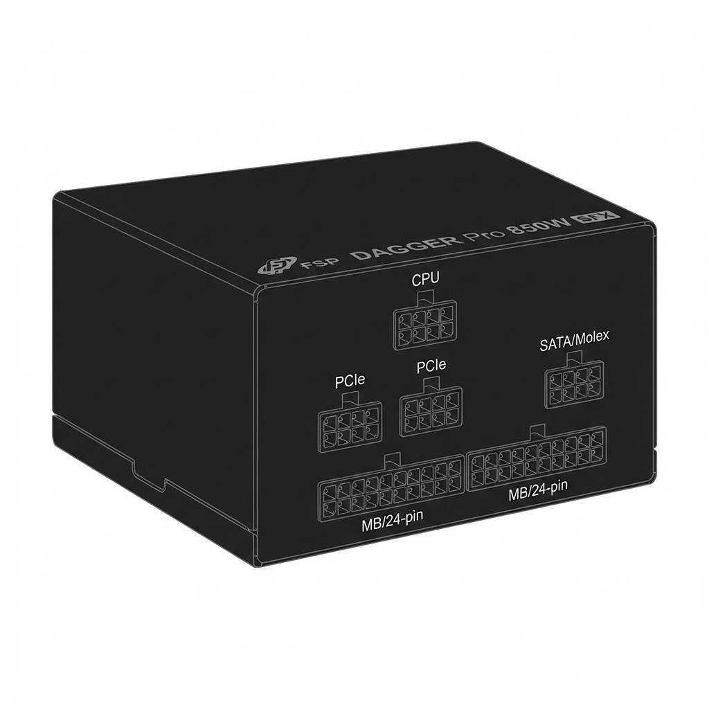
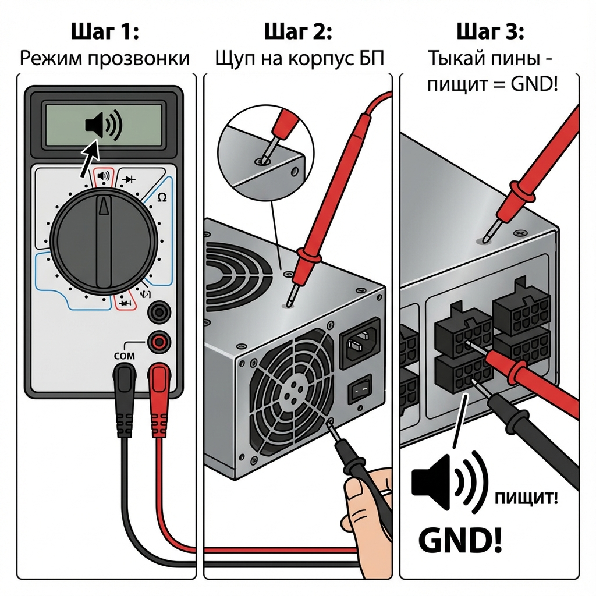
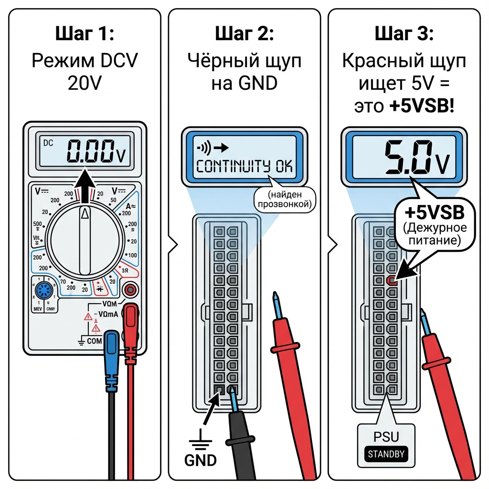
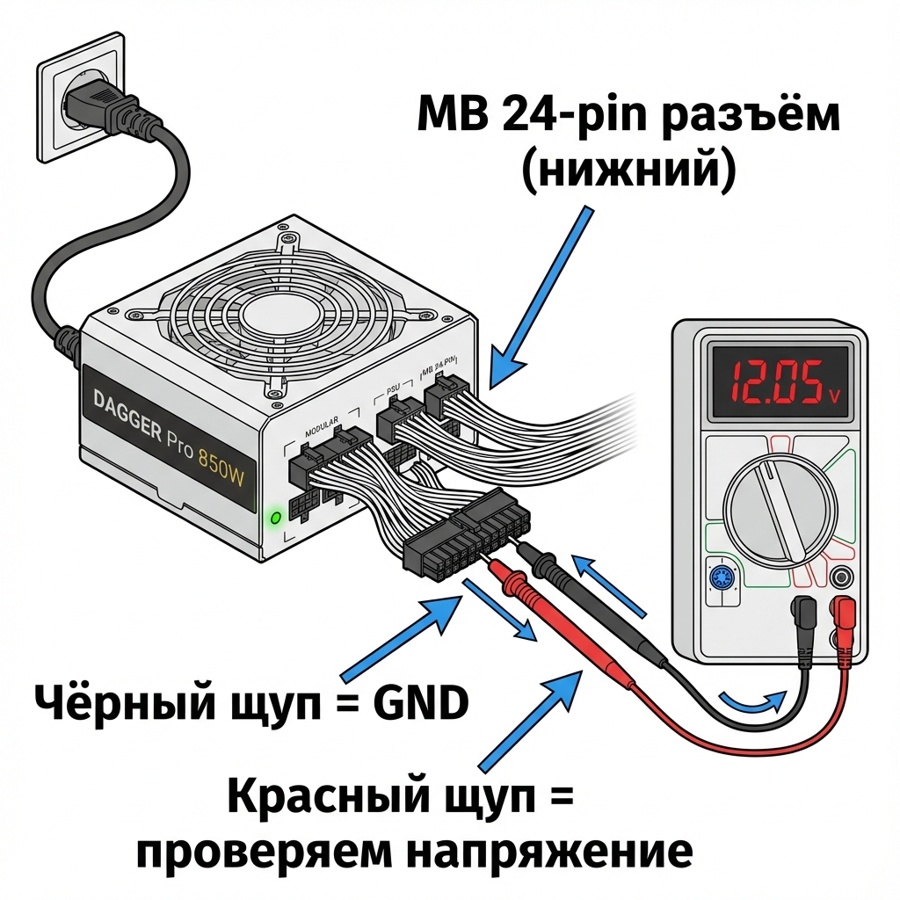
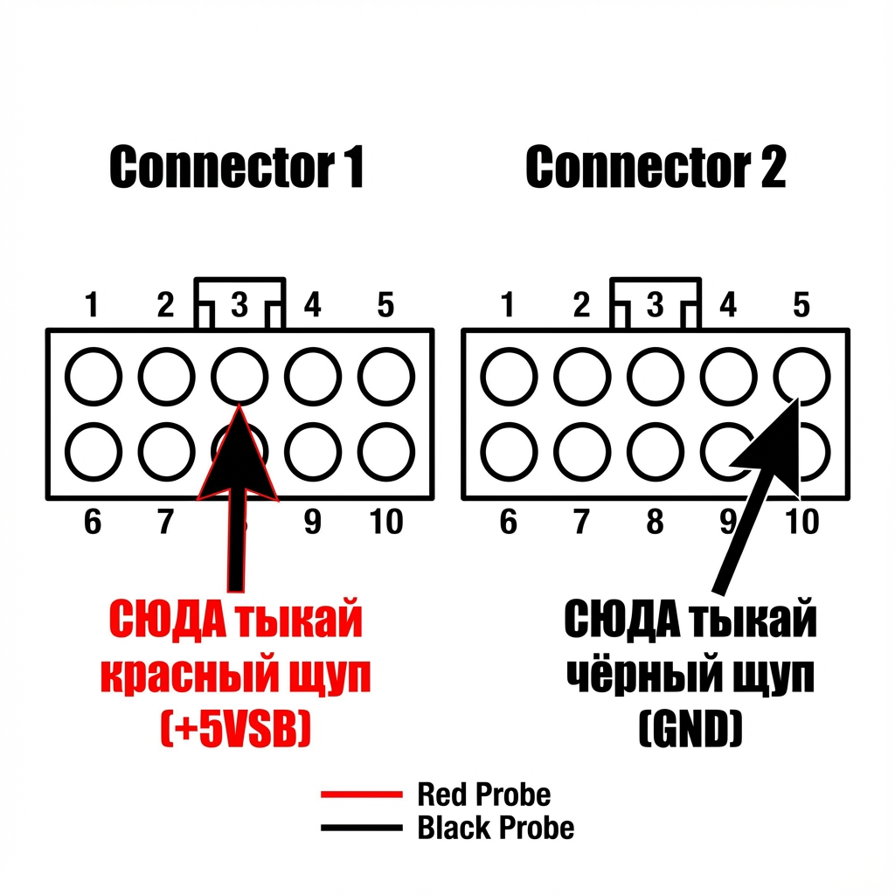

# 🔌 ВИЗУАЛЬНАЯ ИНСТРУКЦИЯ: Проверка БП DAGGER Pro 850W

> **Проблема:** На разъёмах БП нет цветных проводов и обозначений — только чёрные порты!
> **Решение:** Находим нужные пины методом прозвонки мультиметром!

---

## 📍 ГДЕ НА БП НАХОДЯТСЯ РАЗЪЁМЫ



### Расположение разъёмов

```
┌─────────────────────────────────────────────────┐
│                   DAGGER Pro 850W                │
│                                                  │
│   ┌────────┐                         ┌─────┐    │
│   │  CPU   │ ← 8 пинов (верх)        │SATA │    │
│   │ 8-pin  │                         │5-pin│    │
│   └────────┘                         └─────┘    │
│                                                  │
│   ┌────────┐  ┌────────┐                        │
│   │ PCIe   │  │ PCIe   │ ← 8 пинов (середина)   │
│   │ 8-pin  │  │ 8-pin  │                        │
│   └────────┘  └────────┘                        │
│                                                  │
│   ┌──────────────────────┐ ← MB 24-pin (НИЗ)    │
│   │  MB 10-pin │ MB 10-pin │  ◄── СЮДА ТЫКАТЬ!  │
│   └──────────────────────┘                      │
│                                                  │
└─────────────────────────────────────────────────┘
```

> **⚠️ РАБОТАЕМ С НИЖНИМ РАЗЪЁМОМ — MB 24-pin (два разъёма по 10 пинов)!**

---

# 🎯 ПОШАГОВАЯ ВИЗУАЛЬНАЯ ИНСТРУКЦИЯ

---

## ШАГ 1: Находим GND (землю) прозвонкой

**Проблема:** Пины не подписаны, какой из них GND?
**Решение:** GND соединён с корпусом БП — найдём его прозвонкой!



### Делай так

```
╔═══════════════════════════════════════════════════════════════╗
║  ШАГ 1.1: Переключи мультиметр в режим ПРОЗВОНКИ              ║
║           (значок диода или звуковой волны)                   ║
╠═══════════════════════════════════════════════════════════════╣
║  ШАГ 1.2: Один щуп прижми к КОРПУСУ БП (металл!)             ║
║           ↓                                                   ║
║         ┌─────┐                                               ║
║         │ БП  │ ←── металлический корпус                     ║
║         └─────┘                                               ║
╠═══════════════════════════════════════════════════════════════╣
║  ШАГ 1.3: Вторым щупом тыкай пины в MB-разъёме               ║
║                                                               ║
║         ○ ○ ○ ○ ○   ○ ○ ○ ○ ○                                ║
║         ○ ○ ○ ○ ○   ○ ○ ○ ○ ○                                ║
║                ↑                                              ║
║         Тыкай сюда по очереди!                               ║
║                                                               ║
║         ПИЩИТ = это GND! ✅ Запомни этот пин!                ║
║         Молчит = это НЕ GND, пробуй другой                   ║
╚═══════════════════════════════════════════════════════════════╝
```

> **💡 Подсказка:** На MB-разъёме обычно несколько GND пинов — они все будут пищать!

---

## ШАГ 2: Находим +5V Standby (дежурку)

**Теперь знаем где GND — ищем +5VSB!**

> ⚠️ **БП ДОЛЖЕН БЫТЬ ВКЛЮЧЁН В СЕТЬ!** (выключатель ON)



### Делай так

```
╔═══════════════════════════════════════════════════════════════╗
║  ШАГ 2.1: Переключи мультиметр в режим DCV (постоянное V)    ║
║           Диапазон: 20V (или авто)                           ║
╠═══════════════════════════════════════════════════════════════╣
║  ШАГ 2.2: ЧЁРНЫЙ щуп — на GND (который нашли в шаге 1)       ║
║                                                               ║
║         ○ ○ ○ ●← ○   ○ ○ ○ ○ ○     ● = GND (чёрный щуп)     ║
║         ○ ○ ○ ○ ○   ○ ○ ○ ○ ○                                ║
╠═══════════════════════════════════════════════════════════════╣
║  ШАГ 2.3: КРАСНЫЙ щуп — тыкай остальные пины по очереди      ║
║                                                               ║
║         ○ ○ ○ ● ○   ○ ○ ○ ○ ○                                ║
║         ○ ○ ★ ○ ○   ○ ○ ○ ○ ○     ★ = тыкаем красным        ║
║                                                               ║
║  ИЩЕМ:                                                        ║
║  • Показывает ~5V → это +5VSB! ✅ БП ЖИВ!                    ║
║  • Показывает ~12V → это +12V линия                          ║
║  • Показывает ~3.3V → это +3.3V линия                        ║
║  • Показывает 0V → это GND или незадействованный             ║
╚═══════════════════════════════════════════════════════════════╝
```

### Что означает результат

| Нашёл ~5V? | Результат |
|------------|-----------|
| **ДА, есть ~5V** | ✅ **БП ЖИВ!** Дежурная линия работает! |
| **НЕТ, всё 0V** | ❌ БП мёртв или не включён в сеть |

---

## ШАГ 3: Полная проверка напряжений



### Карта MB 24-pin разъёма на БП



### Какие напряжения должны быть

```
ТЫКАЕМ КРАСНЫМ ЩУПОМ (чёрный на GND):

┌────────────────────────────────────────────────┐
│  Мультиметр показывает:    Это:               │
├────────────────────────────────────────────────┤
│  ~5V (4.75-5.25V)     →   +5V или +5VSB      │
│  ~12V (11.4-12.6V)    →   +12V               │
│  ~3.3V (3.1-3.5V)     →   +3.3V              │
│  0V                   →   GND или пустой      │
│  -12V                 →   -12V (минус!)       │
└────────────────────────────────────────────────┘
```

---

## ШАГ 4: Запуск БП (если +5VSB есть, но вент не крутится)

> +5VSB есть, но хочешь проверить включается ли БП полностью?

### Нужно замкнуть PS_ON + GND

```
╔═══════════════════════════════════════════════════════════════╗
║  КАК НАЙТИ PS_ON:                                             ║
║                                                               ║
║  1. БП выключён из сети!                                     ║
║  2. Мультиметр в режиме прозвонки                            ║
║  3. Тыкаем пины — ищем тот, что НЕ звонится (не GND)        ║
║     и рядом с несколькими GND                                ║
║  4. Это скорее всего PS_ON                                   ║
║                                                               ║
║  ИЛИ просто:                                                 ║
║  • Замыкай разные НЕ-GND пины с GND по очереди              ║
║  • Включай БП в сеть                                         ║
║  • Когда замкнёшь правильные — вент закрутится!             ║
╚═══════════════════════════════════════════════════════════════╝
```

> **⚠️ FSP DAGGER Pro 850W:** Вентилятор может НЕ крутиться при нагрузке <20%! Это **Zero-RPM режим** — это нормально! Проверяй напряжения!

---

# 📊 ТАБЛИЦА РЕЗУЛЬТАТОВ

Заполни после проверки:

```
┌─────────────────────────────────────────────────────────────┐
│ РЕЗУЛЬТАТЫ ПРОВЕРКИ БП DAGGER Pro 850W                      │
├─────────────────────────────────────────────────────────────┤
│                                                             │
│ ☐ ШАГ 1: GND найден методом прозвонки на корпус           │
│                                                             │
│ ☐ ШАГ 2: +5V Standby = _______ V                          │
│          (норма: 4.75 - 5.25V)                             │
│          Результат: ☐ ЕСТЬ / ☐ НЕТ                        │
│                                                             │
│ ☐ ШАГ 3: Другие напряжения:                               │
│          +12V  = _______ V (норма: 11.4 - 12.6V)          │
│          +5V   = _______ V (норма: 4.75 - 5.25V)          │
│          +3.3V = _______ V (норма: 3.1 - 3.5V)            │
│                                                             │
│ ☐ ИТОГ:                                                    │
│   ☐ БП рабочий (все напряжения в норме)                   │
│   ☐ БП неисправен → гарантия 10 лет FSP                   │
│                                                             │
└─────────────────────────────────────────────────────────────┘
```

---

# 🚨 БЫСТРЫЙ ЧЕКЛИСТ

```
1. Мультиметр → режим прозвонки
2. Щуп на корпус БП
3. Тыкай пины → пищит = GND ✅
4. Мультиметр → режим DCV 20V
5. Чёрный щуп на GND
6. Красный щуп тыкай другие пины
7. Нашёл ~5V = БП ЖИВ! ✅
8. Нашёл ~12V, ~3.3V = линии работают! ✅
9. Всё 0V = БП мёртв ❌
```

---

## ⚡ ТВОЯ СИТУАЦИЯ

**Сейчас у тебя:**

- БП включён ✓
- Вент не крутится
- Пробки не выбивает ✓

**Что делать:**

1. **Сначала** → Найди GND прозвонкой на корпус
2. **Потом** → Ищи +5VSB (~5V) красным щупом
3. **Если есть ~5V** → БП жив, Zero-RPM режим
4. **Если 0V везде** → БП мёртв, на гарантию

---

*Гарантия FSP DAGGER Pro: 10 лет*
*Документ: 2026-01-05*
