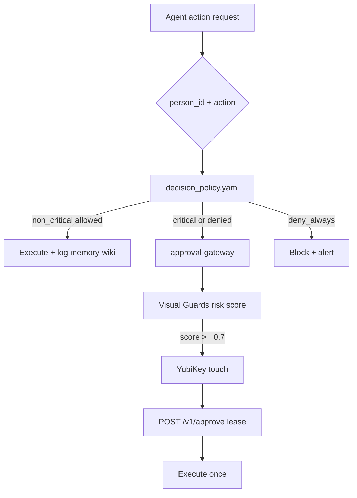

# U-CORE Identity & Account Reconciliation

**Vibranium layer:** Digital sovereignty requires knowing *which human* (`person_id`) owns *which accounts and devices* before any agent acts. This document ties the identity KB to runtime enforcement.

## Components

| Piece | Path | Function |
|-------|------|----------|
| Identity registry | `Agent_Context/Knowledge_Base/identity/registry.yaml` | Persons, devices, account handles, skill map |
| Decision policy | `Agent_Context/Knowledge_Base/identity/decision_policy.yaml` | Non-critical allow/deny per `person_id` |
| Sovereign manifest | `config/SOVEREIGN_MANIFEST.yaml` | Critical domains (YubiKey) |
| Policy JSON | `config/policy.json` | Machine rules for gateway |
| approval-gateway | `services/approval-gateway` (NUC/smart) | Lease + YubiKey gate |
| ag_bridge hook | `integrations/ag_bridge_policy_hook.js` | Intercepts agent actions pre-exec |
| memory-wiki | `data/memory-wiki/` | Redacted long-term facts + action log |
| OpenClaw | Gateway on NUC / fallback `smart` | 24/7 orchestration, `memory_search` |

## Decision flow

## Account merging

**Goal:** One `person_id` row drives policy even when the human has many logins.

1. **Ingest** — `scripts/ingest-downloads-identity.sh` stages CSV/JSON/MD into `_inbox/`.
2. **Match** — `registry.yaml` `account_merge_rules`:
   - `github_login` → `person_id`
   - `tailscale_creator_email` → `person_id`
   - hostname hints (`macbook-air-igor` → `igor`)
3. **Manual** — Meta/Apple/Google duplicates listed under `manual_review` (never commit session HTML).
4. **Publish** — Update `registry.yaml` only; secrets stay in TokenBroker.

Example merge (already applied in bootstrap):

| Account | person_id |
|---------|-----------|
| Gonya990 | igor |
| KostaGorod | kosta_gorod |
| Devices created by Gonya990@github | igor (unless shared infra) |

## memory-wiki integration

- **Reads:** Agents may search KB + `data/memory-wiki/**` for `igor` non-critical profile (see `decision_policy.yaml`).
- **Writes:** Each automated action appends `data/memory-wiki/agent_actions/{date}_{person_id}.json` (redacted).
- **Finance:** Moneytor summaries only — full PAN/account numbers never stored; aligns with `docs/integrations/moneytor.md`.

## approval-gateway integration

1. Agent calls `get_risk_score` (OpenClaw MCP) before destructive ops.
2. Gateway checks `SOVEREIGN_MANIFEST` domain + `decision_policy` profile.
3. Non-critical path skips lease; critical path requires YubiKey per `docs/SOVEREIGN_MANIFEST.md`.

## MacBook Air as command node

- Bootstrap: `docs/runbooks/MAC_BOOTSTRAP.md` Phase 0
- Tailscale self: `macbook-air-igor` (`100.68.240.51`)
- Cursor MCP → OpenClaw on `smart` or NUC when online

## Related

- `SYSTEM_MAP.md` — mesh topology
- `~/services.registry.yaml` — service ↔ hostname map
- `docs/architecture/cursor-openclaw-mcp.md` — MCP tools
- `Agent_Context/Knowledge_Base/identity/README.md` — operator guide
