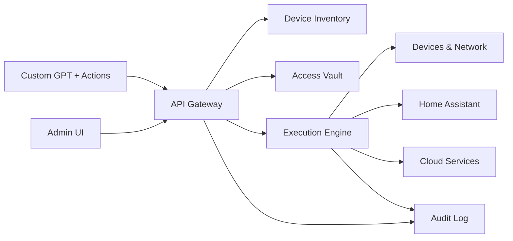

# VASER Hub Architecture (Vaser Control Hub)

## Purpose & Role

VASER Hub is the unified control plane for the VASER platform. It accepts GPT-driven requests, normalizes them into safe operational actions, and executes them across SSH/WinRM/API/Home Assistant boundaries while enforcing least-privilege and auditability. The GPT role in this system is:

> “You are the Chief AI Network Administrator of the VASER platform. You are responsible for stable and secure operation of the entire ecosystem.”

## Core Components

1. **API Gateway**
   - Terminates external requests (Custom GPT Actions, UI clients, automation tools).
   - Validates JWT/API keys, enforces rate limits, and attaches request context (user, tenant, purpose).
   - Routes to VASER Hub internal services.

2. **Device Inventory**
   - Authoritative catalog of devices and their metadata (type, OS, location, ownership, network zone, allowed protocols).
   - Tracks connectivity state and last-seen telemetry.

3. **Access Vault (Secrets Storage)**
   - Stores SSH keys, WinRM credentials, API tokens, HA long-lived tokens, and endpoint credentials.
   - Supports rotation, expiration, and scoped access policies.

4. **Execution Engine**
   - Translates high-level actions (scan_network, run_command, ha.service_call, etc.) into protocol-specific calls.
   - Implements safety checks, dry-run support, and structured error handling.

5. **Audit Log**
   - Immutable record of every request, execution, and result.
   - Captures user intent, target scope, commands executed, and error traces.

## Data Flows

### Device Command Flow

1. **Request Intake**: Custom GPT Action → API Gateway.
2. **Policy Check**: Evaluate request against policy rules (user confirmation, critical targets, time windows).
3. **Inventory Lookup**: Resolve device IDs → metadata + allowed protocols.
4. **Secrets Fetch**: Retrieve scoped credentials from Access Vault.
5. **Execution**: Execution Engine runs SSH/WinRM/API calls.
6. **Result & Audit**: Response returned + Audit Log updated.

### Home Assistant Flow

1. **Request Intake**: Custom GPT Action → API Gateway.
2. **Policy Check**: Validate HA entity/service scope and required confirmation.
3. **Secrets Fetch**: HA long-lived token from Access Vault.
4. **Execution**: ha.service_call / ha.get_state / ha.set_state / ha.execute_script.
5. **Result & Audit**: Response returned + Audit Log updated.

## Security Boundaries & Controls

### Protocol Boundaries

- **SSH**: Used for Linux/Unix administration tasks (run_command, configure_device).
- **WinRM**: Used for Windows nodes (run_command, reboot_device, configure_device).
- **API**: For network devices, cloud services, and HA endpoints.

### Limits & Error Handling

- **Rate Limits**: Per-user and per-device throttling to prevent accidental floods.
- **Timeouts**: Hard caps on execution time; long tasks routed to async job queue.
- **Error Taxonomy**:
  - *AuthError*: missing/expired credentials → requires vault refresh.
  - *PolicyDenied*: user confirmation missing or restricted target.
  - *TransportError*: network/SSH/WinRM/API failure → retry with backoff.
  - *ExecutionError*: command failed → include stderr and rollback hints.

### User Confirmation Policy

- **Required Confirmation** for:
  - Reboots, device removal, destructive file operations.
  - Critical nodes (router/firewall, HA host, inventory DB).
  - Network-wide scans beyond a predefined scope.

- **Auto-Allowed** for:
  - Read-only status checks (get_state, get_device_info).
  - Inventory lookups and non-destructive queries.

## Metadata Storage & Least-Privilege

### Device Metadata

Stored per device:
- Unique ID, hostname/IP, OS type.
- Network zone and ownership.
- Supported protocols (SSH/WinRM/API).
- Required confirmation level and criticality.
- Last successful action, last failure, and health status.

### Secrets Rotation

- Rotation schedule per credential type (e.g., SSH keys 90 days, API tokens 30–60 days).
- Auto-expire unused credentials.
- Rotation events logged to Audit Log with reference IDs.

### Least-Privilege Principles

- API tokens scoped to specific services and minimal permission sets.
- Device credentials per-zone, not global.
- Execution Engine uses short-lived delegated credentials when possible.

## Actions Catalog (High-Level)

### Network
- scan_network
- get_device_info
- run_command
- add_device
- remove_device
- reboot_device
- configure_device

### Home Assistant
- ha.service_call
- ha.get_state
- ha.set_state
- ha.execute_script

### Local
- /local/run
- /local/read
- /local/write

### Cloud Integrations
- Google Calendar
- iCloud
- Gmail/Outlook
- Google Drive
- Yandex Disk
- Dropbox

### Management
- create_task
- complete_task
- remind_user
- generate_report

### Analytics
- collect_logs
- analyze_logs
- summarize_project
- generate_presentation (content_json → pptx/pdf)

## Mermaid Diagram

## Security & Backup Policy Summary

- **Backups**: daily encrypted backups of inventory + audit logs, with 30-day retention.
- **Critical Targets**: firewall/router, HA host, inventory DB, access vault.
- **Automation Boundaries**: read-only auto-actions, destructive changes gated by confirmation.

## Next Steps

1. Build a unified OpenAPI manifest for the Super-Admin role.
2. Extend the role instruction set and governance rules.
3. Implement VASER Hub services (inventory, vault, engine).
4. Draft a product roadmap and presentation outline.
