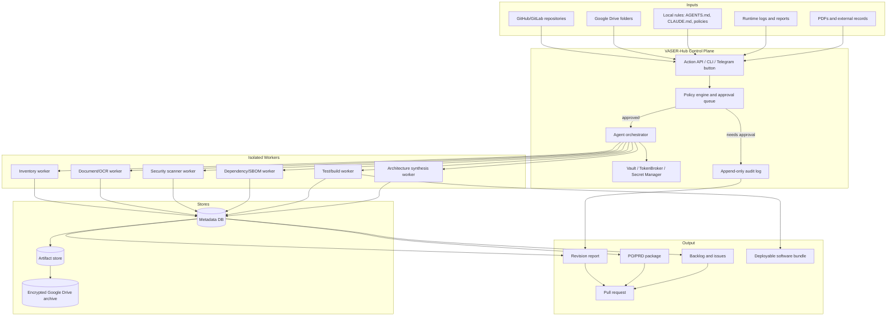

# One-Button Sovereign PO Architecture

## Goal

Turn the current Unified System repositories, Google Drive records, local rules, and audit tooling into a repeatable "one-button" flow that produces a PO-ready software/product package:

- verified repository and document inventory;
- security and dependency baseline;
- architecture and threat model;
- backlog and implementation plan;
- deploy/test evidence;
- human approval checkpoints for risky actions.

The design extends the existing VASER-Hub concept: a policy-controlled orchestration layer that can ingest facts, run tools, enforce local rules, and emit a signed package.

## Target architecture



## Core components

### 1. Action entry point

Supported triggers:

- CLI: `make po`
- GitHub Actions: manual `workflow_dispatch`
- Telegram command: `/po build`
- Dashboard button: `Build PO package`

Every trigger creates a `request_id` and records:

- actor;
- source branch;
- selected repositories/folders;
- local ruleset version;
- scan profile;
- approval state.

### 2. Policy engine

Use the existing VASER-Hub policy model as the gatekeeper.

Policy examples:

```yaml
version: 1
actions:
  repo.audit:
    approval: none
    allowed_paths:
      - Projects/
      - Scripts/
      - docs/
      - Reports/
  secrets.rotate:
    approval: required
    approvers:
      - owner
  google_drive.read:
    approval: none
    scopes:
      - https://www.googleapis.com/auth/drive.readonly
  google_drive.write_archive:
    approval: required
  deploy.production:
    approval: required
    require_green_checks: true
```

Store policy in `docs/policies/local_rules.yaml` or `Agent_Context/Knowledge_Base/Policies/local_rules.yaml`. The policy file becomes the single local-rules input for agents and one-button runs.

### 3. Vault and credentials

Recommended hierarchy:

1. Google Secret Manager for cloud deployments.
2. GitHub Actions secrets for CI-only tokens.
3. Local encrypted vault/TokenBroker for workstation-only tokens.
4. `.env.example` and templates in git, never live `.env*`.

Minimum secret names:

```text
GOOGLE_DRIVE_CLIENT_ID
GOOGLE_DRIVE_CLIENT_SECRET
GOOGLE_DRIVE_REFRESH_TOKEN
GCP_PROJECT_ID
FIREBASE_PROJECT_ID
GITHUB_TOKEN_READONLY
GITLAB_TOKEN_READONLY
TELEGRAM_BOT_TOKEN
OPENAI_API_KEY
GEMINI_API_KEY
LINEAR_API_KEY
HA_URL
HA_TOKEN
```

Rules:

- Workers receive short-lived scoped tokens.
- Secret values never appear in logs.
- Scanner reports use redaction.
- Rotation events are written to the audit log with secret name only.

### 4. Google Drive ingestion

Purpose:

- store source records that should not live in git;
- classify documents;
- archive generated PO packages and evidence;
- optionally mirror sanitized metadata back into the repo.

Configuration:

```yaml
google_drive:
  root_folder_id: "<drive-folder-id>"
  archive_folder: "Unified_System/PO_Archives"
  intake_folder: "Unified_System/Intake"
  export_folder: "Unified_System/Exports"
  scopes:
    - drive.readonly
  write_archive_requires_approval: true
  classification_labels:
    - public
    - internal
    - confidential
    - secret
    - pii
    - finance
    - legal
    - operations
```

Processing flow:

1. List files by folder and modified time.
2. Download to an encrypted temp workspace.
3. Extract text with:
   - `markitdown` for Office/PDF when text exists;
   - `pypdf` for text PDFs;
   - OCR worker for scanned documents;
   - password-protected queue for manual unlock.
4. Classify and redact.
5. Save metadata only in git:

```json
{
  "drive_file_id": "redacted",
  "title": "Vibranium presentation",
  "classification": ["internal", "product"],
  "extraction_status": "ok",
  "hash": "sha256:...",
  "source_date": "2026-05-15"
}
```

### 5. Repository inventory and SBOM

Tools:

- `git submodule status --recursive`
- `rg`/Glob manifest discovery
- `npm audit`
- `pip-audit`
- `govulncheck`
- `trivy fs`
- `syft` for SBOM generation
- `grype` or Trivy for SBOM vulnerability scan

Output:

- `artifacts/inventory/repositories.json`
- `artifacts/sbom/*.cyclonedx.json`
- `artifacts/scans/*.json`
- summarized report in `Reports/`

### 6. Security scan worker

Tools:

- `gitleaks dir --redact`
- `gitleaks detect --redact`
- `bandit`
- `semgrep`
- `firebase emulators:exec` for rules tests
- `npm audit --audit-level=high`
- `pip-audit`
- `govulncheck`
- `trivy fs --scanners vuln,secret,misconfig`

Minimum blocking thresholds:

```yaml
quality_gates:
  secrets:
    current_tree_findings: 0
    history_findings_allowed_with_rotation_record: true
  dependencies:
    critical: 0
    high_allowed_only_with_ticket: true
  firestore_rules:
    emulator_tests_required: true
  containers:
    critical: 0
    high_allowed_only_with_exception: true
  python_static:
    high: 0
```

### 7. Audit log

Use append-only JSON Lines:

```json
{"ts":"2026-05-15T08:55:00Z","request_id":"po-...","actor":"agent","action":"scan.gitleaks.dir","result":"failed_gate","summary":{"findings":110}}
```

Store locations:

- local run: `Reports/audit_logs/YYYY-MM-DD/<request_id>.jsonl`
- cloud run: GCS or Google Drive archive;
- optional dashboard: Firestore collection with strict service-account-only writes.

### 8. PO package generator

Inputs:

- inventory report;
- security report;
- document facts;
- local rules;
- architecture templates;
- backlog templates;
- acceptance criteria.

Outputs:

```text
PO_Package_<request_id>/
  00_EXECUTIVE_SUMMARY.md
  01_PRODUCT_PRD.md
  02_ARCHITECTURE.md
  03_THREAT_MODEL.md
  04_IMPLEMENTATION_PLAN.md
  05_BACKLOG.csv
  06_RISK_REGISTER.md
  07_COMPLIANCE_AND_DATA_CLASSIFICATION.md
  08_SCAN_EVIDENCE.md
  09_DEPLOYMENT_RUNBOOK.md
  sbom/
  scan-results/
```

## Step-by-step implementation plan

### Step 1 - Clean and freeze the baseline

Tools:

- `gitleaks`
- GitHub secret scanning
- Google Secret Manager
- `.gitignore`

Actions:

1. Rotate all current and historical secrets identified in `Reports/full_system_revision_2026-05-15.md`.
2. Remove tracked live `.env*`, OAuth credentials, sessions, and generated `.next` artifacts.
3. Add `.env*`, `.next/`, cache folders, tokens, sessions, and service-account JSON files to `.gitignore`.
4. Add a baseline audit log with rotated secret names only.

Acceptance:

- `gitleaks dir --redact` returns zero current-tree secret findings, or every finding is a documented false positive with rule allowlist.

### Step 2 - Create local rules as machine-readable policy

Tools:

- YAML policy file
- VASER-Hub policy engine
- CI schema validation

Actions:

1. Create `docs/policies/local_rules.yaml`.
2. Convert human rules from `AGENTS.md`, `CLAUDE.md`, and security docs into enforceable policies:
   - allowed paths;
   - forbidden secret paths;
   - approvals;
   - scanner gates;
   - data classification.
3. Add JSON Schema/YAML validation.

Acceptance:

- `make policy-check` validates all local rules before a PO build.

### Step 3 - Add Google Drive connector

Tools:

- Google Drive API
- OAuth Desktop/App or service account with domain delegation where applicable
- Secret Manager/TokenBroker
- `markitdown`, `pypdf`, OCR worker

Actions:

1. Configure a read-only Drive OAuth client.
2. Store credentials in Secret Manager or TokenBroker.
3. Add a connector that lists folders, hashes files, extracts text, and writes sanitized metadata.
4. Add manual queue handling for password-protected or image-only PDFs.

Acceptance:

- One test folder can be inventoried.
- Extracted metadata excludes raw secrets/PII.
- Archive writes require approval.

### Step 4 - Build scan orchestrator

Tools:

- `make`
- Docker Compose or GitHub Actions
- `gitleaks`, `npm audit`, `pip-audit`, `bandit`, `govulncheck`, `trivy`, `syft`

Actions:

1. Add `tools/po_runner/` with a Python CLI:

```bash
python -m tools.po_runner build --profile full
```

2. Implement scanner adapters with normalized JSON output.
3. Add redaction and maximum log-size controls.
4. Add scanner timeouts and per-subproject isolation.

Acceptance:

- `make po-audit` produces an inventory, scan summary, and audit log from a clean checkout.

### Step 5 - Add one-button entry points

Tools:

- Makefile
- GitHub Actions `workflow_dispatch`
- Telegram bot command
- Dashboard button

Actions:

1. Add:

```makefile
po:
	python -m tools.po_runner build --profile full
```

2. Add `.github/workflows/po-package.yml` with manual inputs:
   - profile: quick/full/release;
   - include_google_drive: true/false;
   - create_pr: true/false.
3. Add Telegram `/po build` command that calls the same runner in approved environments.
4. Add dashboard button that triggers the workflow via GitHub API or VASER-Hub.

Acceptance:

- One button produces a draft PR or artifact bundle without manual command chaining.

### Step 6 - Generate PO/PRD/backlog package

Tools:

- Markdown templates
- CSV backlog template
- Mermaid diagrams
- Linear/GitHub Issues integration

Actions:

1. Create templates for PRD, architecture, threat model, risk register, and backlog.
2. Convert findings into backlog rows:
   - title;
   - subsystem;
   - severity;
   - acceptance criteria;
   - tool evidence;
   - dependency/risk.
3. Optionally create Linear/GitHub issues after human approval.

Acceptance:

- Every high/critical finding maps to an actionable backlog item.
- Every architecture claim maps to a control or measurement.

### Step 7 - Deployment and release package

Tools:

- Firebase CLI/emulators
- Docker Buildx
- Trivy
- GitHub Actions
- GKE/Cloud Run/App Hosting

Actions:

1. Add deployment profiles:
   - `local`: Docker Compose + emulators;
   - `staging`: Firebase/GKE staging project;
   - `production`: approval required.
2. Generate SBOM and provenance for each image.
3. Archive release evidence to Google Drive.

Acceptance:

- Release cannot proceed unless security gates pass or approved exceptions exist.

## One-button command contract

Minimum CLI:

```bash
make po
```

Equivalent explicit command:

```bash
python -m tools.po_runner build \
  --profile full \
  --repo-root /workspace \
  --include-submodules \
  --include-google-drive \
  --local-rules docs/policies/local_rules.yaml \
  --output Reports/po_packages/latest
```

Expected result:

1. Initialize/update submodules.
2. Inventory repo, manifests, Firebase, Docker, K8s, CI, and docs.
3. Pull Google Drive metadata and approved document text.
4. Run scanners.
5. Enforce local rules.
6. Generate PO package and audit log.
7. Create/update a draft PR with the generated report.
8. Archive artifacts to Google Drive after approval.

## Configuration checklist

### Repository

- [ ] `.gitignore` excludes local secrets and generated artifacts.
- [ ] `docs/policies/local_rules.yaml` exists and validates.
- [ ] `Makefile` has `po`, `po-audit`, `policy-check`, and `po-package` targets.
- [ ] `.github/workflows/po-package.yml` exists.
- [ ] Scanner configs exist for gitleaks, Semgrep/Bandit, Trivy, and dependency audits.

### Google Cloud / Firebase

- [ ] Firestore rules are collection-specific and tested.
- [ ] Secret Manager contains runtime tokens.
- [ ] Google Drive OAuth/Service account is read-only by default.
- [ ] Workload Identity replaces service-account JSON mounts.
- [ ] Firebase emulators run in CI for rules tests.

### Local machine / Cloud Agent image

- [ ] `uv`
- [ ] `ruff`
- [ ] `pytest`
- [ ] `node`/`npm`
- [ ] `go >= 1.25.10`
- [ ] `gitleaks`
- [ ] `trivy`
- [ ] `pip-audit`
- [ ] `bandit`
- [ ] `govulncheck`
- [ ] `syft`
- [ ] `python3.12-venv`

### Runtime governance

- [ ] `OAUTHLIB_INSECURE_TRANSPORT` is local-only.
- [ ] Production images are pinned by digest.
- [ ] Remote command execution uses allowlists and approval gates.
- [ ] Audit log is append-only and redacted.
- [ ] PO package generation never prints secret values.

## Technical risks

| Risk | Impact | Control |
| --- | --- | --- |
| Secret history cannot be fully purged from forks/clones | Compromised tokens remain usable if not rotated | Rotate/revoke first; history rewrite only as secondary cleanup. |
| Google Drive contains mixed personal, finance, and product docs | Incorrect classification or leakage | Classify before synthesis; archive raw docs outside git; metadata-only in repo. |
| Legacy AI/video dependencies require old Python/CUDA stacks | Scans/builds fail in modern CI | Containerize legacy workers and scan in matching images. |
| Generated artifacts pollute scans | False positives and leaked metadata | Remove from git and rebuild in CI. |
| Pitch claims exceed implemented controls | Product/compliance overpromise | Threat model and acceptance tests must map every claim to an implemented control. |

## First release target

The first usable version should be conservative:

- read-only repository and Google Drive inventory;
- redacted scanners;
- local rules validation;
- generated PO package;
- draft PR output;
- no production deployment or secret rotation automation without approval.

After that, add controlled write actions: issue creation, Drive archive upload, staging deployment, then production promotion.
