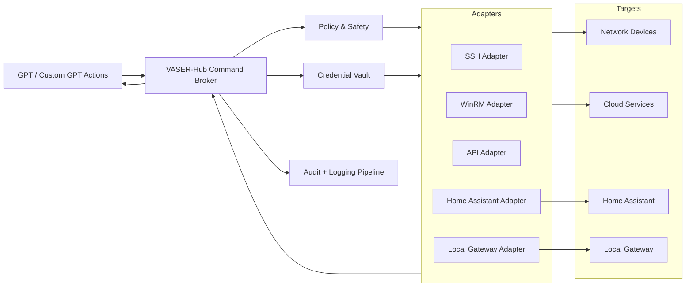

# VASER-Hub Architecture

## Overview
VASER-Hub (also referenced as VASER-Router / Vaser Control Hub) is the centralized command-and-control layer that securely brokers GPT-originated intents to network devices, Home Assistant, local gateways, and cloud services. It enforces authentication and authorization, stores secrets, emits audit trails, and applies safety policies for critical actions.

## Components
### 1) Command Broker
- **Role**: Normalizes and validates incoming GPT actions, applies policy, and routes to adapters.
- **Responsibilities**:
  - Schema validation for action payloads (OpenAPI contracts).
  - Policy checks for critical actions (confirmation requirements).
  - Rate limiting and concurrency control.
  - Dispatching to adapters with correlation IDs.

### 2) Credential Vault
- **Role**: Centralized secure storage for secrets.
- **Contents**:
  - SSH keys, WinRM credentials, API tokens, Home Assistant long-lived tokens.
  - Cloud service OAuth tokens (Google Calendar, Gmail, Drive, iCloud, Yandex Disk, Dropbox).
- **Controls**:
  - Encryption at rest and in transit.
  - Scoped secrets per adapter and per device.
  - Rotation policies and audit access logs.

### 3) Adapters
- **SSH Adapter**: Executes remote commands on Linux/Unix hosts with per-device policies.
- **WinRM Adapter**: Runs remote commands and configuration on Windows nodes.
- **API Adapter**: Calls device/vendor APIs (routers, IoT hubs, NAS, etc.).
- **Home Assistant Adapter**: Handles `ha.service_call`, `ha.get_state`, `ha.set_state`, `ha.execute_script`.
- **Local Gateway Adapter**: Wraps `/local/run`, `/local/read`, `/local/write`, `/local/reminder`.

### 4) Policy & Safety Layer
- **Role**: Enforces critical-operation safeguards.
- **Examples**:
  - Require user confirmation for destructive or high-impact actions (reboot, remove_device, network-wide changes).
  - Enforce allowlists/denylists for endpoints and commands.
  - Validate target device tags (production vs. lab).

### 5) Observability & Audit Pipeline
- **Role**: Captures activity logs, security events, and outcomes.
- **Outputs**:
  - Structured audit events (JSON) per action.
  - Execution logs for adapters.
  - Metrics for success/failure rates and latency.

## Data Flow
1. **GPT** emits an action (e.g., `scan_network`, `run_command`, `ha.service_call`).
2. **VASER-Hub Command Broker** validates payloads and policy requirements.
3. **Credential Vault** provides scoped secrets to the adapter.
4. **Adapters** execute the action on devices/services.
5. **Devices/Services** return responses to adapters.
6. **VASER-Hub** aggregates results and returns to GPT; audit logs are emitted.

## AuthN/AuthZ and Secret Storage
- **Authentication (AuthN)**
  - GPT actions are authenticated via API key or OAuth in the Custom GPT/OpenAPI integration.
  - Internal service-to-service authentication uses mTLS or signed tokens.
- **Authorization (AuthZ)**
  - RBAC/ABAC policies determine whether an action can target a device or API.
  - Critical actions require explicit confirmation or elevated role.
  - Device tags and environment labels enforce separation (prod/lab/guest).
- **Secret Storage**
  - Secrets stored in the Credential Vault with envelope encryption.
  - Secrets are never exposed to GPT; only scoped tokens are passed to adapters.
  - Access is logged and tied to correlation IDs.

## Audit, Logging, and Retention
- **Audit events**: action name, requester, target, timestamp, policy decision, outcome.
- **Execution logs**: adapter stdout/stderr, device response summaries.
- **Retention**:
  - Hot storage: 30-90 days for operational troubleshooting.
  - Cold storage: 1-3 years for compliance and forensic analysis.
- **Reporting**: periodic summaries for project analytics and system health.

## Failure Modes & Fallback Behavior
- **Adapter failure**: retry with exponential backoff; fallback to alternative adapter when possible (e.g., API -> SSH).
- **Credential errors**: fail closed, prompt for re-authentication or rotation; do not retry indefinitely.
- **Device unreachable**: mark as degraded; queue action for later or notify user.
- **Policy denial**: require user confirmation or deny with explanation.
- **Partial success**: return per-target results; continue with safe targets.
- **Observability outage**: buffer logs locally and flush when pipeline recovers.

## Security Policy Highlights
- **User confirmation required** for: `remove_device`, `reboot_device`, mass `configure_device`, destructive commands.
- **Automation allowed** for: monitoring, safe read operations, routine backups.
- **Backups**: configuration snapshots before any high-risk change.

## Roadmap Alignment
- **OpenAPI manifest** consolidates actions for network, Home Assistant, local gateway, cloud apps, management, analytics.
- **Role instruction** formalizes GPT as the “Chief AI Network Administrator” with scoped privileges.
- **Productization** includes standardized reports, presentations, and a scalable onboarding flow.
