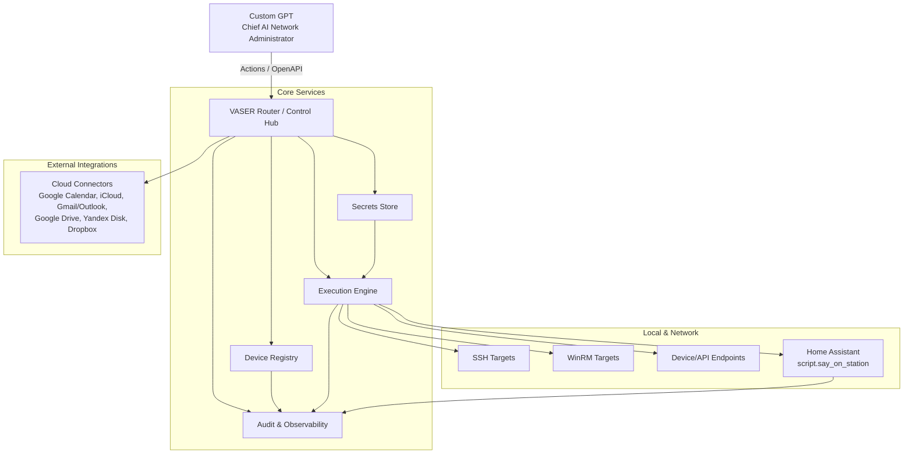

# VASER Hub Architecture (VASER Router / Control Hub)

## Purpose & Role
VASER Hub (a.k.a. **VASER Router / Vaser Control Hub**) is the centralized control plane for the platform. It receives instructions from GPT, validates intent and policy, resolves device credentials and endpoints, dispatches execution via secure protocols, and records all actions for audit and analytics.

**GPT Role:** “You are the Chief AI Network Administrator of the VASER platform, responsible for stable and secure operation of the entire ecosystem.”

## Terminology Alignment with SYSTEM_MAP.md
To avoid drift, the following terms map directly to the workspace structure in `SYSTEM_MAP.md`:

| Architecture Term | SYSTEM_MAP Term | Location | Notes |
| --- | --- | --- | --- |
| VASER Hub documentation | Docs | `docs/architecture/` | Lives in the documentation tree. |
| AI Core / GPT Brain | AI Bot | `Projects/AI_Core/` | Primary GPT logic and instruction set. |
| Execution scripts & automation | Scripts | `Scripts/` | Orchestration and integrations. |
| Audit trails & reports | Reports | `Reports/` | System status, audit logs. |
| System state/config | Infra | `Infra/` | HA states, setup guides. |
| Local data stores | Data | `Data/` | SQLite DBs and local caches. |

## Component Diagram

## API Summary (Actions & Protocols)
### Command/Network Management Actions
- **scan_network**: Discover devices on LAN.
- **get_device_info**: Fetch device metadata, OS, services.
- **run_command**: Execute via SSH/WinRM/API.
- **add_device / remove_device**: Lifecycle management in registry.
- **reboot_device / configure_device**: Operational control.

### Home Assistant Actions
- **ha.service_call**: Invoke HA services.
- **ha.get_state / ha.set_state**: State control.
- **ha.execute_script**: Run HA scripts (e.g., `script.say_on_station`).

### Local Python Gateway (Existing)
- **/local/run, /local/read, /local/write, /local/reminder**: Local execution, file IO, reminders.

### Cloud Integrations (Planned Actions)
- **Google Calendar, iCloud, Gmail/Outlook, Google Drive, Yandex Disk, Dropbox**.

### Management & Analytics Actions
- **create_task / complete_task / remind_user**
- **generate_report**
- **collect_logs / analyze_logs / summarize_project**
- **generate_presentation(content_json) → pptx/pdf**

### Protocols & Transports
- **SSH**: Primary Linux/Unix device access.
- **WinRM**: Windows device management.
- **REST/HTTP API**: Device APIs and services.
- **Home Assistant**: Service/State API + script execution.

## Data Flows
### Command Execution Flow
1. **GPT → VASER Hub**: Command intent via Actions/OpenAPI.
2. **Policy Gate**: Validate against security policy (critical/privileged actions).
3. **Device Resolution**: Registry lookup for device identity, endpoint, and capabilities.
4. **Credential Fetch**: Secrets Store returns scoped credentials/tokens.
5. **Execution**: Execution Engine runs via SSH/WinRM/API/HA.
6. **Response**: Results normalized and returned to GPT.
7. **Audit**: All actions logged with actor, target, command, status.

### Audit & Analytics Flow
1. **Execution Engine → Audit Store**: Structured event records.
2. **Analytics**: `collect_logs`, `analyze_logs`, `summarize_project`.
3. **Reporting**: `generate_report`, dashboards, and summaries.
4. **Presentation**: `generate_presentation` builds product/roadmap slides.

## Security Policy (High-Level)
- **User Confirmation Required** for:
  - Destructive actions (remove_device, wipe, factory reset).
  - Privileged actions on critical nodes (core gateway, secrets store).
  - Network-wide changes (mass configuration, bulk reboot).
- **Allowed Automation** for:
  - Read-only monitoring, inventory, status checks.
  - Routine maintenance in pre-approved scopes.
- **Secrets Handling**:
  - Credentials stored only in Secrets Store.
  - Principle of least privilege with scoped tokens.
- **Backups**:
  - Regular backups of registry and audit store.
  - Encrypted storage and retention policies.

## Dependencies & Deployment Topology
### Core Dependencies
- **OpenAPI Manifest**: Single source of truth for Actions used by Custom GPT.
- **Python Gateway**: `/local/run`, `/local/read`, `/local/write`, `/local/reminder`.
- **ngrok Tunnel**: Secure external access to local services.
- **Home Assistant**: Automation bridge and voice scripts.

### Recommended Deployment
- **Control Plane**: VASER Hub + Registry + Secrets Store on a secured host.
- **Execution Layer**: Execution Engine with network access to targets.
- **Audit Store**: Dedicated storage with retention and encryption.
- **Edge/Local**: Home Assistant instance and Python gateway for local tasks.

## Required Additions (from Product Requirements)
- **Custom GPT Actions via OpenAPI** for:
  - Network (scan_network, get_device_info, run_command, add_device, remove_device, reboot_device, configure_device).
  - Home Assistant (ha.service_call, ha.get_state, ha.set_state, ha.execute_script).
  - Local gateway (/local/run, /local/read, /local/write).
  - Cloud integrations (Calendar, Mail, Drives).
  - Management (create_task, complete_task, remind_user, generate_report).
  - Analytics (collect_logs, analyze_logs, summarize_project).
  - Presentation (generate_presentation).

## Next Steps
1. **Unify OpenAPI Manifest** for the Super AI Admin role.
2. **Finalize role instruction set** aligned with security policy.
3. **Document VASER Hub** (this doc) and link from main docs index.
4. **Draft product roadmap** and slide outline for go-to-market.
