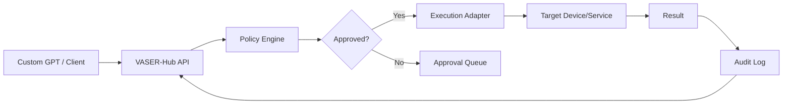
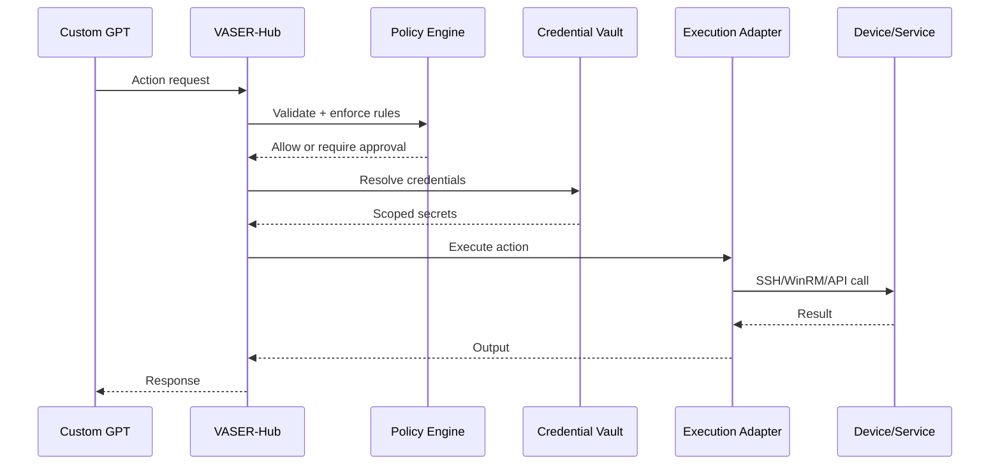

# VASER-Hub Architecture (Vaser Control Hub)

## Purpose
VASER-Hub is the central control plane that receives GPT commands and safely executes them across the VASER ecosystem. It unifies device inventory, credential management, policy enforcement, and audit logging.

## Core Components
1. **Action Router**
   - Accepts incoming OpenAPI action calls.
   - Validates payloads and routes to execution adapters.

2. **Policy Engine**
   - Enforces confirmation requirements and command allowlists.
   - Blocks or requires approval for critical actions.

3. **Credential Vault**
   - Stores SSH keys, API tokens, WinRM credentials, and endpoints.
   - Supports rotation and scoped access per device or service.

4. **Execution Adapters**
   - SSH adapter for Linux/macOS hosts.
   - WinRM adapter for Windows hosts.
   - REST/API adapter for services (Home Assistant, cloud providers, local gateway).

5. **Inventory & Metadata Store**
   - Device registry (IP, hostname, tags, capabilities).
   - Service catalog (Home Assistant entities, cloud integrations).

6. **Telemetry & Audit Log**
   - Captures every action request, approval, execution output, and status.
   - Supports retention policies and export for analysis.

## Data Flow (High-Level)

## Execution Flow (Command Path)

## Operational Notes
- All actions must be tagged with a **request_id** for traceability.
- Sensitive actions (reboot, remove device, config changes) require explicit approval.
- Telemetry and logs feed analytics actions (`collect_logs`, `analyze_logs`).
