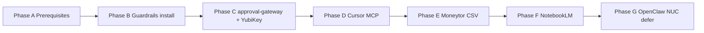

# MacBook — Unified Core Guardrails Bootstrap / Загрузка Mac (Guardrails)

**Цель / Goal:** Bring a fresh Mac (Apple Silicon) to a working **command node** for Vibranium / U-CORE: Tailscale mesh, Cursor + MCP, `approval-gateway`, YubiKey (Sovereign Handshake), read-only Moneytor, NotebookLM knowledge ingest.

**Monorepo:** `~/Documents/Unified_System_Core`  
**Guardrails runtime (used by `start_here.sh`):** `~/unified-core-staging` — keep in sync with monorepo or symlink (see §4).

> **Secrets:** Never commit `.env`, API keys, `webauthn_credentials.json`, Moneytor exports with full PAN, or recovery codes. See `Agent_Context/Knowledge_Base/identity/SENSITIVE_DO_NOT_IMPORT.md`.

---

## Quick checklist (RU) — top actions

See end of document for full **Top 10** list in Russian.

---

## 1. YubiKey — Sovereign Handshake (FIDO2 / WebAuthn)

### 1.1 Official Mac software (download → install → launch)

| Tool | Purpose | Official URL |
|------|---------|----------------|
| **YubiKey Manager** | Firmware, FIDO slot, NFC/USB setup | https://www.yubico.com/support/download/yubikey-manager/ |
| **Yubico Authenticator** | OTP / TOTP (if used alongside FIDO) | https://www.yubico.com/support/download/yubico-authenticator/ |

**Verify after install:** plug key → YubiKey Manager shows device → FIDO2 enabled.

### 1.2 Register with `approval-gateway`

Production credentials file (local MVP store):

```text
~/.config/unified-system/webauthn_credentials.json
```

Override path: `WEBAUTHN_CREDENTIALS_PATH`.

**RP ID (dev):** `WEBAUTHN_RP_ID=localhost` (default in `services/approval-gateway/app/webauthn.py`).

#### Dev-only bypass (never on NUC / production)

```bash
export APPROVAL_DEV_BYPASS=1   # allows approve without registered creds — DEV ONLY
```

With bypass off and empty credentials file, `POST /v1/approve` returns **403** until a credential is registered.

#### Manual dev registration (until UI ships)

Full WebAuthn **registration UI is not wired yet** — track as follow-up. For local dev:

1. Install guardrails venv (`fido2` is in `services/approval-gateway/requirements.txt`).
2. Touch YubiKey in browser at https://webauthn.io/ or use YubiKey Manager to confirm FIDO2 works.
3. **Temporary dev path:** either `APPROVAL_DEV_BYPASS=1` for policy testing, or hand-craft `webauthn_credentials.json` after a proper registration ceremony (production will use encrypted vault).

Example **placeholder** structure (replace with real registration output — do not commit):

```json
[
  {
    "credentialId": "<base64url>",
    "publicKey": "<base64>",
    "signCount": 0,
    "userHandle": "igor"
  }
]
```

#### Test approval flow (after gateway running)

```bash
# 1) Trigger YubiKey lease
curl -s -X POST http://127.0.0.1:8790/v1/execute/check \
  -H 'Content-Type: application/json' \
  -d '{"command":"sudo rm -rf /","intent":"destructive"}' | jq .

# 2) Approve with assertion (dev bypass if no creds)
curl -s -X POST http://127.0.0.1:8790/v1/approve \
  -H 'Content-Type: application/json' \
  -d '{"lease_id":"<from-step-1>","assertion":{"credentialId":"dev","authenticatorData":"x"}}'
```

**Policy reference:** `config/SOVEREIGN_MANIFEST.yaml`, `docs/SOVEREIGN_MANIFEST.md`, `Agent_Context/Knowledge_Base/identity/decision_policy.yaml`.

---

## 2. Mac applications — official URLs only

Order for each app: **download → install → launch → verify**.

| App | URL | Verify |
|-----|-----|--------|
| **Cursor** | https://cursor.com | App opens; open monorepo folder |
| **Tailscale** | https://tailscale.com/download/mac | Menu bar connected; `tailscale ip -4` |
| **Homebrew** (if missing) | https://brew.sh | `brew --version` |
| **Python 3** | `brew install python@3.12` | `python3 --version` |
| **Xcode CLI** (git/build) | `xcode-select --install` | `git --version`; accept license: `sudo xcodebuild -license accept` |
| **step-cli** (optional, NUC PKI later) | https://smallstep.com/docs/step-cli/ | `step version` |

---

## 3. Order of operations (phases)



### Phase A — Prerequisites

| Step | Action | Verify |
|------|--------|--------|
| A1 | Install Tailscale, sign in to tailnet | `tailscale status`; note `tailscale ip -4` |
| A2 | Install Cursor | Open `~/Documents/Unified_System_Core` |
| A3 | Xcode CLI + license (if using git) | `git status` in monorepo |
| A4 | Optional: Homebrew + Python 3 | `brew list python@3.12` |
| A5 | Optional identity exports in Downloads | See Phase 0 in §5 |

### Phase B — Clone / repo + guardrails install

Repo expected at:

```bash
cd ~/Documents/Unified_System_Core
```

Align `~/unified-core-staging` with monorepo (required for `~/start_here.sh guardrails`):

```bash
# If staging is empty or stale — symlink to monorepo (one-time)
ln -sfn ~/Documents/Unified_System_Core ~/unified-core-staging
```

Install Python deps:

```bash
cd ~/Documents/Unified_System_Core
chmod +x scripts/install-guardrails.sh scripts/import-notebooklm.sh
./scripts/install-guardrails.sh
```

**Verify:**

```bash
ls services/approval-gateway services/policy-engine services/openclaw-mcp-bridge config/policy.json
test -x .venv/bin/uvicorn && echo "venv ok"
```

### Phase C — `approval-gateway` + YubiKey

**Download → install → launch → verify**

```bash
# From home (uses ~/unified-core-staging)
cd ~
./start_here.sh guardrails install
./start_here.sh guardrails start --port 8790
```

In another terminal:

```bash
curl -s http://127.0.0.1:8790/health
# {"status":"ok","service":"approval-gateway"}
```

Register YubiKey per §1. For dev without registration: `export APPROVAL_DEV_BYPASS=1` in the shell that starts uvicorn.

**Monorepo-equivalent (no start_here):**

```bash
cd ~/Documents/Unified_System_Core
source .venv/bin/activate
export PYTHONPATH="$PWD/services/policy-engine"
uvicorn app.main:app --app-dir services/approval-gateway --host 127.0.0.1 --port 8790
```

### Phase D — Cursor MCP

**File:** `.cursor/mcp.json` (project-local).

1. Ensure `approval-gateway` is running on `127.0.0.1:8790`.
2. Reload MCP in Cursor (Settings → MCP).
3. Confirm `unified-openclaw` server uses monorepo venv python and bridge path.

Example env in `mcp.json`:

```json
"env": {
  "APPROVAL_GATEWAY_URL": "http://127.0.0.1:8790",
  "OPENCLAW_BASE_URL": ""
}
```

**Verify:** Cursor MCP panel shows `unified-openclaw` connected; tool `get_risk_score` hits gateway.

**Doc:** `docs/architecture/cursor-openclaw-mcp.md`

### Phase E — Moneytor (read-only)

**Do not** ingest GitHub org JSON as finance data. Use **Moneytor app export (CSV)**.

1. In [Moneytor](https://moneytor.co.il/) app: export transactions (Premium CSV if available).
2. Save to e.g. `~/Downloads/moneytor-export.csv` (no commit).
3. Ingest summaries only:

```bash
export MONEYTOR_CSV_EXPORT=~/Downloads/moneytor-export.csv
cd ~
./start_here.sh guardrails finance-sync
```

Or from monorepo:

```bash
cd ~/Documents/Unified_System_Core
source .venv/bin/activate
export MONEYTOR_CSV_EXPORT=~/Downloads/moneytor-export.csv
cd services/finance-tracker
python3 -m finance_tracker.tracker --since-days 30
```

**Verify:** new files under `data/memory-wiki/finance_tx_*.json` (redacted summaries).

**Doc:** `docs/integrations/moneytor.md`

### Phase F — NotebookLM import

**Target paths:**

```text
Agent_Context/Knowledge_Base/notebooklm/_inbox/    # staging
Agent_Context/Knowledge_Base/notebooklm/curated/ # after human review
```

**Sources:** `~/Desktop/NotebookLM`, `~/Downloads/*NotebookLM*`

```bash
cd ~/Documents/Unified_System_Core
chmod +x scripts/import-notebooklm.sh
./scripts/import-notebooklm.sh --dry-run
./scripts/import-notebooklm.sh
```

Promote reviewed `.md` from `_inbox/` to `curated/`. Do not commit secrets or full account numbers.

### Phase G — Remote OpenClaw (NUC / smart) — defer

Mac is the **command node**; 24/7 gateway runs on Linux mesh node.

**Defer install to NUC.** Entry script:

```bash
# On smart / NUC (Linux), not Mac:
bash infra/openclaw/install-openclaw.sh
```

**Doc:** `docs/architecture/cursor-openclaw-mcp.md` — SSH MCP to `smart.ayu-altair.ts.net` when gateway is up.

---

## 4. Terminal commands reference (`start_here.sh`)

Wrapper at home:

```bash
~/start_here.sh          # → run_here.py
```

| Command | Description |
|---------|-------------|
| `./start_here.sh doctor` | Tooling / project folders sanity |
| `./start_here.sh tailscale status` | Mesh status |
| `./start_here.sh guardrails install` | `scripts/install-guardrails.sh` in `~/unified-core-staging` |
| `./start_here.sh guardrails start --port 8790` | `approval-gateway` |
| `./start_here.sh guardrails finance-sync` | Moneytor CSV → memory-wiki |
| `./start_here.sh guardrails monitor` | monitoring-bridge doctor |
| `./start_here.sh test guardrails` | pytest in staging |
| `./start_here.sh status` | `services.registry.yaml` health checks |

**From monorepo directly:**

```bash
REPO=~/Documents/Unified_System_Core
cd "$REPO"
./scripts/install-guardrails.sh
./scripts/ingest-downloads-identity.sh --dry-run   # Phase 0 identity
./scripts/import-notebooklm.sh
source .venv/bin/activate
curl -s http://127.0.0.1:8790/health
```

---

## 5. Phase 0 — Identity audit (optional, recommended)

Before autonomous agents on this Mac:

```bash
cd ~/Documents/Unified_System_Core
./scripts/ingest-downloads-identity.sh --dry-run
./scripts/ingest-downloads-identity.sh
```

Review `Agent_Context/Knowledge_Base/identity/_inbox/` → merge into `identity/registry.yaml`.  
Read `identity/SENSITIVE_DO_NOT_IMPORT.md`.

---

## 6. Verification script (quick)

Run after Phase B–C:

```bash
REPO=~/Documents/Unified_System_Core
cd "$REPO"

echo "== Guardrails files =="
ls -d services/approval-gateway services/policy-engine services/openclaw-mcp-bridge
ls config/policy.json config/SOVEREIGN_MANIFEST.yaml

echo "== Health =="
curl -sf http://127.0.0.1:8790/health && echo || echo "Start gateway: ./start_here.sh guardrails start"

echo "== Git clean of secrets =="
git status --short Agent_Context/Knowledge_Base/identity/_inbox 2>/dev/null || true
```

**Do not** `git add` `~/.config/unified-system/`, `.env`, or `~/Downloads/*.csv`.

---

## 7. Ports & services

| Service | Port | Host |
|---------|------|------|
| approval-gateway | **8790** | Mac localhost |
| OpenClaw gateway | 18789 | NUC (deferred) |

See `docs/runbooks/service_ports.md` for legacy app ports.

---

## 8. Troubleshooting

| Symptom | Fix |
|---------|-----|
| `start_here.sh guardrails install` not found | `ln -sfn ~/Documents/Unified_System_Core ~/unified-core-staging` |
| `curl` health fails | Start uvicorn; check port 8790 not in use |
| MCP `unified-openclaw` errors | `approval-gateway` up; fix python path in `.cursor/mcp.json` |
| Approve always 403 | Register YubiKey creds or dev-only `APPROVAL_DEV_BYPASS=1` |
| Moneytor empty wiki | Set `MONEYTOR_CSV_EXPORT` to real CSV path |

---

## 9. See also

- `docs/architecture/IDENTITY_UCORE.md`
- `docs/SOVEREIGN_MANIFEST.md`
- `SYSTEM_MAP.md`
- `docs/runbooks/pki-rotation.md` (YubiKey + step-ca on NUC)
- `docs/integrations/chrome-devtools-mcp.md`

---

## Top 10 — чеклист для пользователя (RU)

1. Установить **Tailscale** и войти в tailnet; проверить `tailscale ip -4`.
2. Установить **Cursor** с https://cursor.com; открыть монорепо `Unified_System_Core`.
3. При необходимости: **Homebrew**, **Python 3**, **Xcode CLI** (`xcode-select --install`).
4. Синхронизировать guardrails: `ln -sfn ~/Documents/Unified_System_Core ~/unified-core-staging`.
5. Выполнить `./scripts/install-guardrails.sh` (или `./start_here.sh guardrails install`).
6. Запустить gateway: `./start_here.sh guardrails start` → `curl http://127.0.0.1:8790/health`.
7. Настроить **YubiKey** (Manager + Authenticator); зарегистрировать в `~/.config/unified-system/webauthn_credentials.json` (или `APPROVAL_DEV_BYPASS=1` только для dev).
8. Включить **Cursor MCP** (`.cursor/mcp.json`), перезагрузить MCP при работающем gateway.
9. **Moneytor:** экспорт CSV из приложения moneytor.co.il → `MONEYTOR_CSV_EXPORT` → `guardrails finance-sync` (не JSON из GitHub).
10. **NotebookLM:** `./scripts/import-notebooklm.sh` → проверить `_inbox`, перенести в `curated`; OpenClaw на NUC — позже (`infra/openclaw/install-openclaw.sh`).
