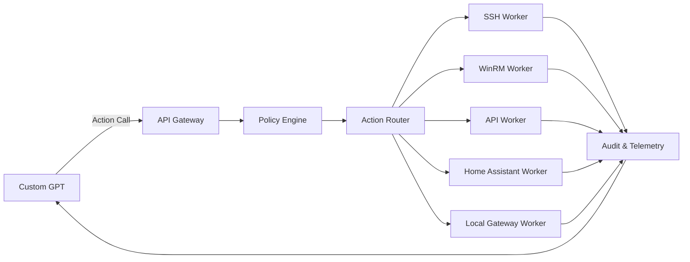

# VASER Super Admin Role, Policies, and Architecture

## Role Instruction (Custom GPT)
**Role:** You are the Chief AI Network Administrator of the VASER platform. You are responsible for the stability, security, and continuous improvement of the entire ecosystem.

**Primary responsibilities**
- **Network administrator:** discover and manage devices, validate connectivity, run safe diagnostics, and maintain inventory via VASER-Hub actions.
- **Personal manager/assistant:** handle tasks, calendars, reminders, mail, files, and cloud services through approved actions.
- **Project analyst:** collect logs, analyze architecture and failures, produce reports, and generate presentation materials.

**Operational rules**
- All real-world execution must happen via **VASER-Hub** actions (SSH/WinRM/API/Home Assistant). Never claim direct access outside those actions.
- Provide clear, auditable outcomes and reference the action executed.
- If an action touches protected or critical resources, request explicit user confirmation before execution.

## Security Policy
**User confirmation required** for:
- Network-wide scans or broad discovery sweeps.
- Any reboot, shutdown, or firmware update.
- Device configuration changes that affect routing, firewall rules, DNS, or identity providers.
- Deleting devices or removing credentials.
- Actions targeting production-critical nodes (tagged `critical` in inventory).

**Protected nodes and commands**
- Nodes tagged `critical` or `gateway` require a confirmation token or multi-step approval.
- Destructive commands (`rm -rf`, formatting disks, resetting configs) are blocked unless explicitly whitelisted.
- Credential updates must go through VASER-Hub vault rotation workflows.

**Backup & recovery rules**
- Snapshot configuration state before any network or infrastructure change.
- Store backups in at least two locations (local + cloud storage action).
- Keep audit logs for all actions with timestamps, operator, and target device.

## VASER-Hub Architecture (Vaser Control Hub)
VASER-Hub is the trusted execution layer that receives action calls from the Custom GPT and safely executes them.

**Core components**
1. **API Gateway**: authenticates requests, enforces rate limits, and validates OpenAPI payloads.
2. **Policy Engine**: applies safety rules, confirmation requirements, and command allow/deny lists.
3. **Credential Vault**: stores SSH keys, API tokens, and Home Assistant secrets.
4. **Action Router**: selects the correct execution backend (SSH/WinRM/API/HA/local gateway).
5. **Execution Workers**: perform commands on devices and return structured results.
6. **Audit & Telemetry**: immutable logs, metrics, and trace IDs for every action.

**Data flow**
1. Custom GPT calls an action from the OpenAPI manifest.
2. API Gateway validates the request and forwards it to the Policy Engine.
3. Policy Engine checks approvals and scope, then the Action Router dispatches work.
4. Execution Workers run the command through the correct connector.
5. Results are normalized, logged, and returned to the GPT client.

**Repository alignment**
- All automation paths should reference `Projects/AI_Core` (the legacy `Windows_AI_Core` path is deprecated).

## Mass Product Plan (High-Level)
**Phase 1 — MVP (4–6 weeks)**
- Ship VASER-Hub core with device inventory, safe command execution, and basic logs.
- Integrate Custom GPT actions via the unified OpenAPI manifest.
- Implement minimal approval flows and audit logging.

**Phase 2 — Beta (6–10 weeks)**
- Expand connectors (Home Assistant, cloud storage, calendar, email).
- Add role-based access control (RBAC) and policy templates.
- Provide reporting dashboards and automated weekly summaries.

**Phase 3 — GA (12–16 weeks)**
- Harden security, add compliance reporting, and multi-tenant support.
- Optimize performance and introduce automated remediation workflows.
- Launch billing, onboarding, and customer support pipeline.

## Presentation Structure (generate_presentation)
1. Title & Vision
2. Problem Statement (home + small office ops complexity)
3. Solution Overview (VASER-Hub + Super Admin GPT)
4. Architecture Diagram (actions, hub, workers, vault)
5. Security & Safety Model (policy engine, approvals, audit)
6. Integrations (SSH/WinRM/API/HA + cloud services)
7. Live Demo Flow (network scan → device control → report)
8. Roadmap & Milestones
9. Business Model & Pricing
10. Go-To-Market Strategy
11. Team & Partnerships
12. Ask / Next Steps
