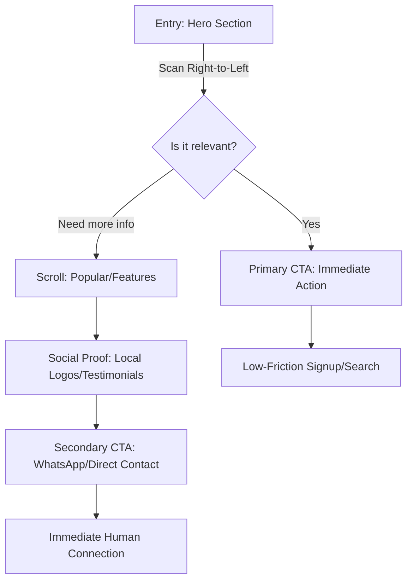

# Minimalist Israeli Flow & CTA Strategy

To maintain a premium aesthetic while serving the "We Got This" persona, the flow must be **fast, frictionless, and information-dense** without being cluttered.

## 1. The "First 3 Seconds" Information Hierarchy
Israeli users are notoriously impatient. They want to know three things immediately:
1.  **What is this?** (Clear value prop)
2.  **Is it for me?** (Target audience/Local relevance)
3.  **Can I trust you?** (Social proof/Local presence)

### The Minimalist Hero Structure:
- **Right (RTL):** Bold Headline (The "Fixer" promise) + 1-line subtext.
- **Center/Left:** A single, high-impact visual (the animated cards).
- **Below Text:** One primary CTA + One secondary "Trust" line (e.g., "500+ Israeli companies already joined").

## 2. The "We Got This" User Flow

## 3. CTA Design: Minimalist & High-Impact

### Primary CTA: The "Action" Button
- **Design**: Solid color (vibrant but premium, e.g., deep indigo or electric blue), rounded corners, subtle shadow.
- **Copy**: **"אני בפנים"** (I'm in) or **"בואו נתחיל"** (Let's start).
- **Animation**: A subtle "pulse" or "glow" every 5 seconds to draw the eye without being annoying.

### Secondary CTA: The "Trust" Button
- **Design**: Ghost button (outline only) or simple text link with an icon.
- **Copy**: **"איך זה עובד?"** (How does it work?) or **"דברו איתנו"** (Talk to us).
- **Placement**: Right next to the primary CTA or as a floating WhatsApp icon in the bottom-left (RTL).

## 4. Information Users Want (In Order)

1.  **Price/Value**: Don't hide the cost. Even if it's "Free to start," say it clearly.
2.  **Speed**: "Set up in 2 minutes." "Response in under an hour."
3.  **Local Support**: "Support in Hebrew." "Israeli-based team."
4.  **Simplicity**: "No credit card required." "One-click integration."

## 5. Aesthetic Minimalism Tips
- **Whitespace**: Use generous padding to let the Hebrew typography breathe.
- **Micro-interactions**: Use the "Card Fanning" animation to reveal information *only when needed*, keeping the initial view clean.
- **Iconography**: Use thin-stroke, modern icons. Avoid generic, bulky clip-art.

---
*Flow Strategy by Antigravity.*
