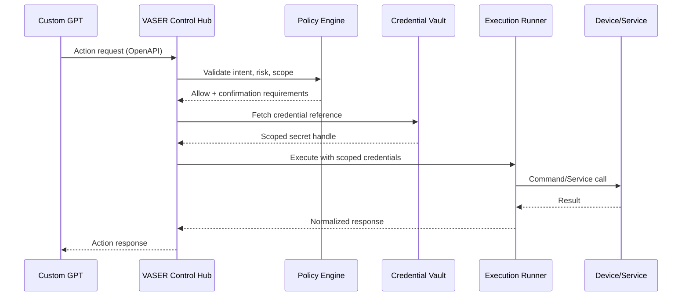

# VASER Control Hub Architecture

## Purpose
VASER Control Hub is the single control plane for all device and service operations. It validates policy, holds credentials, and executes actions on behalf of the GPT assistant.

## High-Level Components
- **Action Gateway**: Receives OpenAPI requests from Custom GPT actions.
- **Policy Engine**: Enforces confirmation rules, scopes, and risk controls.
- **Credential Vault**: Stores SSH keys, API tokens, and endpoint metadata.
- **Execution Runners**:
  - SSH/WinRM runner for host commands.
  - API runner for device and SaaS calls.
  - Home Assistant runner for HA operations.
- **Inventory Service**: Device registry, tags, ownership, and status.
- **Observability Stack**: Logs, metrics, and audit trails.

## Data Flow

## Security Model
- All secrets are stored in the vault and referenced by IDs.
- Every action is logged with actor, timestamp, and scope.
- Sensitive actions require user confirmation before execution.
- Least-privilege credentials are mandatory for cloud providers.

## Deployment Targets
- **On-prem hub** for local network control.
- **Remote hub** for cloud operations and external access.
- **Edge agents** for sites behind NAT or zero-trust segments.

## Audit & Monitoring
- Action logs are immutable and searchable.
- Alerts trigger on failed logins, repeated failures, or policy violations.
- Daily summary reports are generated for operational visibility.
